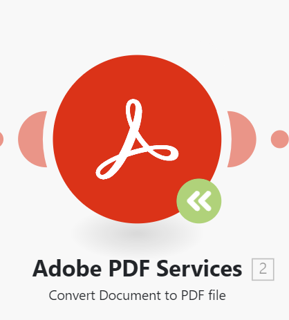

# Update a module to a new verison in an [!DNL Adobe Workfront Fusion] scenario

>[!IMPORTANT]
>
>The Adobe Workfront Fusion documentation has moved to a new location. 
>
>The information in this article can now be found in the article:
>
>* [Update a module to a new version](https://experienceleague.adobe.com/docs/workfront-fusion/using/manage-scenarios/update-module-to-new-version.html?lang=en)
>
>Please update any bookmarks.
>
>This article is no longer being updated, and will be removed in the near future.

Because the applications that Workfront Fusion connects to may update or release new version, it is occasionally necessary for Fusion to release updated modules for those applications. 

If you see a green Upgrade module icon on a module in a scenario, Workfront Fusion has released a new version of that module. 

You can update the module without creating a new scenario.

1. Click the **Upgrade module** icon  on the module you want to upgrade to a new version.
1. Click **Show me new modules**.
1. Select the new module that matches the existing module.
1. Configure the module with the same settings as the existing module.
1. Connect the new module to the scenario in the same place as the existing module.
1. Delete the old module.
