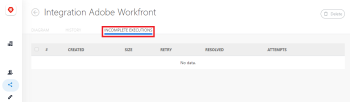

# View and resolve incomplete executions in Adobe Workfront Fusion

The Incomplete executions folder stores scenario executions that were not successfully finalized due to an error. Each stored incomplete execution can be resolved either manually or automatically.

>[!NOTE]
>
>By default the storing of incomplete executions is disabled. To enable it, enable the Allow storing incomplete executions option in the scenario advanced settings.
>
>For more information about scenario settings, see [The scenario settings panel in Adobe Workfront Fusion](../../workfront-fusion/scenarios/scenario-settings-panel.md).

## Access requirements

You must have the following access to use the functionality in this article:

<table> 
 <col> 
 <col> 
 <tbody> 
  <tr> 
   <td role="rowheader">Adobe Workfront plan*</td> 
   <td> 
Pro or higher
 </td> 
  </tr> 
  <tr data-mc-conditions=""> 
   <td role="rowheader">Adobe Workfront license*</td> 
   <td> 
Plan, Work
 </td> 
  </tr> 
  <tr> 
   <td role="rowheader">Adobe Workfront Fusion license**</td> 
   <td> 
Workfront Fusion for Work Automation and Integration 
  </td> 
  </tr> 
  <tr> 
   <td role="rowheader">Product</td> 
   <td>Your organization must purchase Adobe Workfront Fusion as well as Adobe Workfront to use functionality described in this article.</td> 
  </tr> <!--
   <tr data-mc-conditions="QuicksilverOrClassic.Draft mode"> 
    <td role="rowheader">Access level configurations*</td> 
    <td> <!--
      
You must be a Workfront Fusion administrator for your organization.

     --> <!--
      
You must be a Workfront Fusion administrator for your team.

     --> </td> 
   </tr>
  --> 
 </tbody> 
</table>

&#42;To find out what plan, license type, or access you have, contact your Workfront administrator.

&#42;&#42;For information on Adobe Workfront Fusion licenses, see [Adobe Workfront Fusion licenses](../../workfront-fusion/get-started/license-automation-vs-integration.md)

## View incomplete executions

If a module encounters an error during its operation, a new incomplete execution is added to the Incomplete executions folder. Each incomplete execution contains the scenario's blueprint and all the bundles that can be mapped into the failed module. The list of incomplete executions can be opened by clicking on the Incomplete Executions tab on the scenario detail page:

For more information, see [Errors resulting into incomplete executions](#errors-resulting-into-incomplete-executions).

>[!NOTE]
>
>The current size limit of the unresolved incomplete executions folder per organization is 500 MB. If your organization exceeds this limit, you may see the following error: 
>
>"There is NOT ENOUGH SPACE to add a bundle to the IEQ. The reason is: Too many incomplete executions."
>
>For more information, see [Enable data loss](../../workfront-fusion/scenarios/scenario-settings-panel.md#enable) in [The scenario settings panel in Adobe Workfront Fusion](../../workfront-fusion/scenarios/scenario-settings-panel.md).

## Access requirements

You must have the following access to use the functionality in this article:

<table> 
 <col> 
 <col> 
 <tbody> 
  <tr> 
   <td role="rowheader">Adobe Workfront plan*</td> 
   <td> 
Pro or higher
 </td> 
  </tr> 
  <tr data-mc-conditions=""> 
   <td role="rowheader">Adobe Workfront license*</td> 
   <td> 
Plan, Work
 </td> 
  </tr> 
  <tr> 
   <td role="rowheader">Adobe Workfront Fusion license**</td> 
   <td> 
Workfront Fusion for Work Automation and Integration 
  </td> 
  </tr> 
  <tr> 
   <td role="rowheader">Product</td> 
   <td>Your organization must purchase Adobe Workfront Fusion as well as Adobe Workfront to use functionality described in this article.</td> 
  </tr> <!--
   <tr data-mc-conditions="QuicksilverOrClassic.Draft mode"> 
    <td role="rowheader">Access level configurations*</td> 
    <td> <!--
      
You must be a Workfront Fusion administrator for your organization.

     --> <!--
      
You must be a Workfront Fusion administrator for your team.

     --> </td> 
   </tr>
  --> 
 </tbody> 
</table>

&#42;To find out what plan, license type, or access you have, contact your Workfront administrator.

&#42;&#42;For information on Adobe Workfront Fusion licenses, see [Adobe Workfront Fusion licenses](../../workfront-fusion/get-started/license-automation-vs-integration.md)

## Resolve incomplete executions

When a new incomplete execution is stored, you can resolve it as follows:

1. Click the **Incomplete Executions** tab.
1. Locate the incomplete execution you would like to resolve and click **Detail**.

   <!--
   
add screenshot when this works

   -->

   If you want to see the log of all module's operations before you attempt to resolve the incomplete execution, you can resolve the incomplete execution from the History folder:

1. Click the **History** tab.
1. Locate the scenario's failed execution log and click **Details**.
1. Open the module's log where all the module's operations are shown.
1. Locate the failed operation and click **Resolve**:

   

## Options related to incomplete executions

The following options in the Scenario settings panel determine if and how the incomplete executions are stored:

* Allow storing incomplete executions
* Sequential processing
* Enable data loss

For more information about these options, see [The scenario settings panel in Adobe Workfront Fusion](../../workfront-fusion/scenarios/scenario-settings-panel.md).

## Errors resulting into incomplete executions {#errors-resulting-into-incomplete-executions}

There are several categories of errors which result into storing of incomplete executions. These may include:

* Validation errors arising from incomplete or erroneous data, mostly because of a missing item that is expected in order to successfully process all data going through a module.
* Errors occurring from the final destination's unavailability because of temporary or long term connection failure (for example, during connection to email or remote FTP server).

If an error occurs on the first module in the scenario, the execution stops immediately and no incomplete execution is stored.

If an error occurs on any other module and there is no error handler route attached, one of the following occurs:

* If the error type is ConnectionError, RateLimitError, OutOfSpaceError or ModuleTimeoutError, an incomplete execution record wit auto-retry is stored.
* If the error type is DataError, InvalidConfigurationError, InvalidAccessTokenError, UnexpectedError, MaxFileSizeExceededError or MaxResultsExceededError, an incomplete execution record without auto-retry is stored.
* If the error type is anything other than the above, the execution fails.

