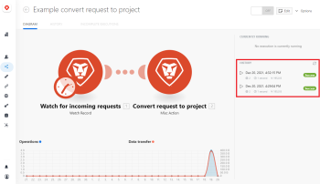

# View a scenario's execution history in [!DNL Adobe Workfront Fusion]

You can display information about all the runs for a scenario, or you can search all executions of the scenario for specific data.

A scenario's execution history displays all of a scenario's executions for the last 30 days.

## Access requirements

You must have the following access to use the functionality in this article:

<table style="table-layout:auto">  
 <col> 
 <col> 
 <tbody> 
  <tr> 
    <td role="rowheader">[!DNL Adobe Workfront] plan*</td> 
   <td> 
[!DNL Pro] or higher
 </td> 
  </tr> 
  <tr data-mc-conditions=""> 
   <td role="rowheader">[!DNL Adobe Workfront] license*</td> 
   <td> 
[!UICONTROL Plan], [!UICONTROL Work]
 </td> 
  </tr> 
  <tr> 
   <td role="rowheader">[!UICONTROL Adobe Workfront Fusion] license**</td> 
  <td>
   
Current license requirement: No [!DNL Workfront Fusion] license requirement.

   
Or

   
Legacy license requirement: [!UICONTROL [!DNL Workfront Fusion] for Work Automation and Integration],  [!UICONTROL [!DNL Workfront Fusion] for Work Automation]

   </td>  
  </tr> 
  <tr> 
   <td role="rowheader">Product</td> 
   <td>
   
Current product requirement: If you have the [!UICONTROL Select] or [!UICONTROL Prime] [!DNL Adobe Workfront] Plan, your organization must purchase [!DNL Adobe Workfront Fusion] as well as [!DNL Adobe Workfront] to use functionality described in this article. [!DNL Workfront Fusion] is included in the [!UICONTROL Ultimate] [!DNL Workfront] plan.

   
Or

   
Legacy product requirement: Your organization must purchase [!DNL Adobe Workfront Fusion] as well as [!DNL Adobe Workfront] to use functionality described in this article.

   </td> 
  </tr> 
 </tbody> 
</table>

To find out what plan, license type, or access you have, contact your [!DNL Workfront] administrator.

For information on [!DNL Adobe Workfront Fusion] licenses, see [[!DNL Adobe Workfront Fusion] licenses](../../workfront-fusion/get-started/license-automation-vs-integration.md).

## View all executions of a scenario

### View scenario execution history on the [!UICONTROL Scenario Detail] page

1. Click the **[!UICONTROL Scenario]** tab in the left panel, then click the scenario.

   Or

   If you are working on the scenario in the Scenario editor, click the left arrow  near the upper-left corner of the window.

1. View the information in the list on the right.

   

   You can also click to see a full-page view of this information. The full-page view allows you to filter the history to view specific executions.

   The following details are listed for every execution of the scenario:

   * Date when the run was **[!UICONTROL Started]**
   * **[!UICONTROL Status]** (success or failed)
   * Run **[!UICONTROL Duration]**
   * Number of **[!UICONTROL Operations]**
   * Size of **[!UICONTROL Data Transfer]**
   * Link to **[!UICONTROL Details]**

### View scenario execution history on the [!UICONTROL History] tab

The [!UICONTROL History] tab shows more detail than is available on the [!UICONTROL Scenario detail] page. You can also filter and sort the executions on the [!UICONTROL History] tab.

1. Click the **[!UICONTROL Scenario]** tab in the left panel, then click the scenario.

   Or

   If you are working on the scenario in the Scenario editor, click the left arrow  near the upper-left corner of the window.

1. Click the **[!UICONTROL History]** tab near the upper-left corner of the page
1. (Optional) For detailed information about a selected scenario run, including which bundles were processed, click the **[!UICONTROL Details]** link.

   For more information on processing bundles, see [Scenario execution flow in [!DNL Adobe Workfront Fusion]](../../workfront-fusion/scenarios/scenario-execution-flow.md).

   >[!NOTE]
   >
   >The [!UICONTROL details] link is visible only if the execution has details available.

## Filter the scenario execution history

You can filter the execution history to view only executions with the specified values.

1. Open the full-page history for a scenario as described in [View scenario execution history on the [!UICONTROL History] tab](#view-scenario-execution-history-on-the-history-tab) in this article.
1. Click the [!UICONTROL filter] icon  in the header of the column you want to filter by.
1. In the [!UICONTROL filter] dialog, enter the values that you want to filter by.
1. Click **[!UICONTROL Save]**.

The filter icon is orange in columns with a currently active filter.

## Sort the scenario execution history

You can sort the scenario execution history.

1. Open the full-page history for a scenario as described in [View scenario execution history on the [!UICONTROL History] tab](#view-scenario-execution-history-on-the-history-tab) in this article.
1. Click the [!UICONTROL Sort] icon in the header of the column you want to filter by.
1. Optional: To reverse the order of the sort, click the [!UICONTROL Sort] icon again.

## Search all executions of a scenario

1. Click the **[!UICONTROL Scenario]** icon  in the left panel, then click the scenario.

   Or

   If you are working on the scenario in the Scenario editor, click the left arrow  near the upper-left corner of the window.

1. Click the **[!UICONTROL History]** tab near the upper-left corner of the screen.
1. Click **[!UICONTROL Fulltext search]** at the top of the list of executions.

   Or

   Type **Ctrl+Shift+F** (Windows) or **Cmd+Shift+F** (Mac)
The [!UICONTROL Search in history] window opens.

1. (Optional) To search for executions that contain specific text, enter the text in the search bar of the **[!UICONTROL Search in history]** window.

   To search for exact text, surround the text with double quotation marks ("example").

   >[!INFO]
   >
   >**Example:** If you want to find the execution that created a specific project, enter the project ID into the [!UICONTROL Fulltext search] bar.
   >
   >"625ef2ef0006036bd1794b6e52d737c5"

1. (Optional) To limit your search by date range, select the beginning and ending dates of your desired search in the [!UICONTROL By date range] area.

   >[!NOTE]
   >
   >* Executions are available only for the previous 30 days.
   >
   >* [!DNL Workfront Fusion] stores webhook payloads for 30 days. Accessing a webhook payload more than 30 days after it was created results in the error "[!UICONTROL Failed to read file from storage.]"

1. (Optional) To limit your search by status, select the desired status in the **[!UICONTROL By status]** dropdown.

   Available statuses are:

   * [!UICONTROL All]

   * [!UICONTROL Error]

   * [!UICONTROL Warning]

   * [!UICONTROL Success]

1. (Optional) Change the order that results display in the **[!UICONTROL Sort by dates]** dropdown.

1. (Optional) To copy a scenario execution ID, click the **[!UICONTROL Copy execution ID]** icon  in the row of the desired execution

1. (Optional) Click on a result of the [!UICONTROL Fulltext search] to examine the scenario module output bundle that contains the information.
