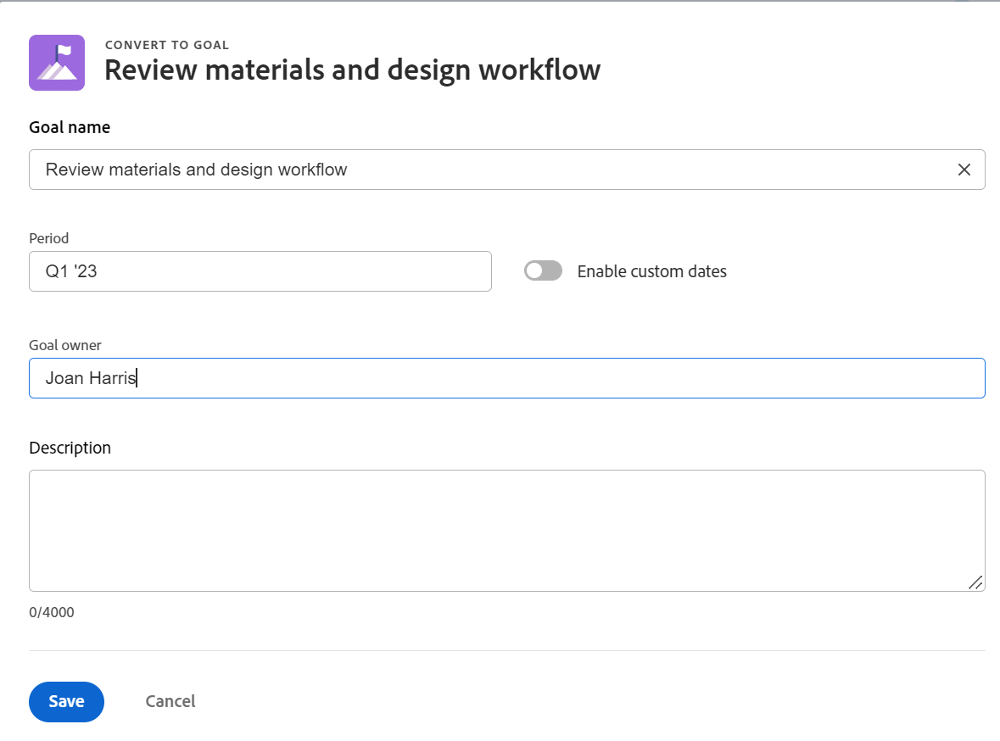

# Align goals by converting results and activities to goals

You can manually align two goals or you can convert the results and activities of an existing goal to another goal. The converted result or activity becomes the child goal of the original goal. 
For information about manually aligning two goals, see [Align goals by connecting them in Adobe Workfront Goals](../../workfront-goals/goal-alignment/align-goals-by-connecting-them.md).

## Access requirements

<table style="table-layout:auto">
 <col>
 </col>
 <col>
 </col>
 <tbody>
  <tr>
   <td role="rowheader">Adobe Workfront plan*</td>
   <td>
   
New plan: Select or higher

   Or
   
Current plan: Pro or higher

   
   </td>
  </tr>
  <tr>
   <td role="rowheader">Adobe Workfront license*</td>
   <td>
   
Current license: Contributor or higher

   Or
   
Legacy license: Request or higher
 
For more information, see <a href="../../administration-and-setup/add-users/access-levels-and-object-permissions/wf-licenses.md" class="MCXref xref">Adobe Workfront licenses overview</a>.
 </td>
  </tr>
  <tr>
   <td role="rowheader">Product*</td>
   <td>
   
 New product requirement, one of the following: 

<ul>
<li>A Select or Prime Adobe Workfront plan and an additional Adobe Workfront Goals license.</li>
<li>An Ultimate Workfront plan which includes Workfront Goals by default. </li></ul>
   
Or

   
Current product requirement: A Workfront plan and an additional license for Adobe Workfront Goals. 
 
For information, see <a href="../../workfront-goals/goal-management/access-needed-for-wf-goals.md" class="MCXref xref">Requirements to use Workfront Goals</a>. 
 </td>
  </tr>
  <tr>
   <td role="rowheader">Access level</td>
   <td> 
Edit access to Goals
 </td>
  </tr>
  <tr data-mc-conditions="">
   <td role="rowheader">Object permissions</td>
   <td>
    

     
View or higher permissions to the goal to view it

     
Manage permissions to the goal to edit it

     
For information about sharing goals, see <a href="../../workfront-goals/workfront-goals-settings/share-a-goal.md" class="MCXref xref">Share a goal in Workfront Goals</a>. 

    
 </td>
  </tr>
<tr>
   <td role="rowheader">
Layout template
</td>
   <td> 
All users, including Workfront administrators,  must be assigned a layout template that includes the Goals area in the Main Menu. 
  
</td>
  </tr>
 </tbody>
</table>

*For more information, see [Access requirements in Workfront documentation](/help/quicksilver/administration-and-setup/add-users/access-levels-and-object-permissions/access-level-requirements-in-documentation.md). 

## Prerequisites

You must have the following before you can start:

* An existing goal with existing results and activities.

  For information about creating goals, see [Create goals in Adobe Workfront Goals](../../workfront-goals/goal-management/create-goals.md).

>[!IMPORTANT]
>
>A goal can have up to 1000 progress indicators.

   <!--drafted for goal redesign: At PRODUCTION: update the sentence above to remove Production/ Preview references-->

## Considerations when converting results and activities into goals

Sometimes, a result or an activity may have a larger scope than anticipated and it would make more sense that they would become goals. You can convert results and activities of an existing goal to a new goal. This is a bottom-up approach to aligning goals.

Consider the following when converting results and activities to goals:

* The converted result or activity becomes the child goal of the original goal, and the two goals become aligned.
* The newly created goal becomes the single progress indicator for the original goal, if there are no additional results or activities on the original goal. You must add results and activities to the child goal to be able to track progress on it. 
* Converting a result or activity to a goal is irreversible. Once converted, the new child goal can never become a result or activity for the parent goal again. 

## Convert a result or activity to a goal

<!--
Converting results and activities differs depending on what environment you use. 

### Convert a result or activity to a goal in the Production environment

1. Go to a goal that has a result or an activity that you want to convert to a goal.
1. Click the name of the goal to open the **Goal Details** panel.
1. Expand the **Results** or **Activities** right-pointing arrows to see a list of results or activities for the goal. 

1. Click the **gear icon**  to the right of the result or activity name that you want to convert, then click **Convert into a Goal**.

   

1. (Optional) Remove the name of the original activity or result owner from the **Goal Owner** field and replace it with another user, team, group, or your organization's name. By default, Workfront selects the owner of the result or the activity as the goal owner. 
1. Click **Convert**. The activity or result displays as an aligned goal in the Goal Details panel of the original goal and the original activity or result is removed from the original goal and transferred to the second goal. By default, the new goal has the same name as the original converted result or activity. 
1. (Optional) Click the name of the new goal to open the **Goal Details** panel and edit the name of the goal. For information about editing any information for an existing goal, see [Edit goals in Adobe Workfront Goals](../../workfront-goals/goal-management/edit-goals.md).
-->

1. Go to a goal that has a result or an activity that you want to convert to a goal.
1. From the goal's page, click **Progress indicators** in the left panel. 
1. Select a result or activity in the list of progress indicators, then click the **Convert to goal** icon  at the top of the progress indicator list. The Convert to goal box opens. 

    
1. Update the following information:
    * **Goal name**: By default, the new goal has the same name as the original result or activity.
    * **Period**: By default, the new goal's period is the current quarter. You can select the **Enable custom dates** setting to define a custom time period for the new goal.
    * **Goal owner**: By default, the new goal owner is the owner of the original result or activity.
    * **Description**: Add more information about the new goal. 
1. Click **Save**
  
    The result or activity is now converted to a child goal of the original goal. It is listed as a goal in the Progress indicators list of the original goal.

