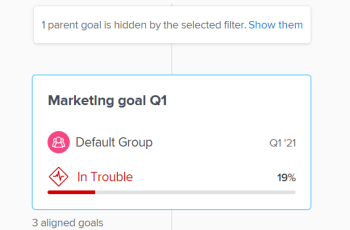
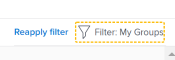

# Navigate the Goal Alignment section in Adobe Workfront Goals

Use the Goal Alignment section to display a holistic view of goal alignment across the entire organization in a flowchart. Aligned goals display on cards that interconnect in a hierarchical tree.

For information about goal alignment and how to achieve it, also see the following articles:

* [Goal alignment overview in Adobe Workfront Goals](../../workfront-goals/goal-alignment/goal-alignment-overview.md) 
* [Align goals by connecting them in Adobe Workfront Goals](../../workfront-goals/goal-alignment/align-goals-by-connecting-them.md)

## Access requirements

You must have the following to perform the activities described in this article:

<table style="table-layout:auto">
 <col>
 </col>
 <col>
 </col>
 <tbody>
 <tr>
 <td role="rowheader">Adobe Workfront plan*</td>
 <td>
 
New plan: Select or higher

 Or
 
Current plan: Pro or higher

 
 </td>
 </tr>
 <tr>
 <td role="rowheader">Adobe Workfront license*</td>
 <td>
 
New license: Contributor or higher

 Or
 
Current license: Request or higher
  </td>
 </tr>
 <tr>
 <td role="rowheader">Product*</td>
 <td>
 
 New product requirement, one of the following: 

<ul>
<li>A Select or Prime Adobe Workfront plan and an additional Adobe Workfront Goals license.</li>
<li>An Ultimate Workfront plan which includes Workfront Goals by default. </li></ul>
 
Or

 
Current product requirement: A Workfront plan and an additional license for Adobe Workfront Goals. 
 
For information, see <a href="../../workfront-goals/goal-management/access-needed-for-wf-goals.md" class="MCXref xref">Requirements to use Workfront Goals</a>. 
 </td>
 </tr>
 <tr>
 <td role="rowheader">Access level</td>
 <td> 
Edit access to Goals
 </td>
 </tr>
 <tr data-mc-conditions="">
 <td role="rowheader">Object permissions</td>
 <td>
 

 
View or higher permissions to the goal to view it

 
Manage permissions to the goal to edit it

 
For information about sharing goals, see <a href="../../workfront-goals/workfront-goals-settings/share-a-goal.md" class="MCXref xref">Share a goal in Workfront Goals</a>. 

 
 </td>
 </tr>
<tr>
<td role="rowheader">
Layout template
</td>
<td> 
All users, including Workfront administrators,  must be assigned a layout template that includes the Goals area in the Main Menu. 
  
</td>
</tr>
 </tbody>
</table>

*For more information, see [Access requirements in Workfront documentation](/help/quicksilver/administration-and-setup/add-users/access-levels-and-object-permissions/access-level-requirements-in-documentation.md).

## Navigate the Goal Alignment section

1. Click the **Main Menu** icon  in the upper-right corner of your screen, then click **Goals**. 
   <!-- Add this when Shell is available to all: or (if available), click the **Main Menu** icon  in the upper-left corner)
   -->
1. Click **Goal Alignment** in the left panel.
1. Use the filters in the upper-right corner of the alignment chart to select only goals that are important to you. For information about using filters in Workfront Goals, see [Filter information in Adobe Workfront Goals](../../workfront-goals/goal-management/filter-information-wf-goals.md).

   The goals that match your filters display in the alignment chart on cards.

   The following information displays on a goal card:

   <table style="table-layout:auto"> 
    <col> 
    <col> 
    <tbody> 
     <tr> 
      <td role="rowheader">Time period dates </td> 
      <td> 
This is the period for which the goal is open. The goal must be achieved by the end date of the period. Workfront Goals calculates progress on the goal based on the duration of the goal's period and the current date.
 </td> 
     </tr> 
     <tr> 
      <td role="rowheader">Progress indicators</td> 
      <td>The number of progress indicators for the goal. Progress indicators can be aligned goals, results, or activities. </td> 
     </tr> 
     <tr> 
      <td role="rowheader">Owner name</td> 
      <td>The name of the user, team, group, or the organization designated as the goal&nbsp;Owner. </td> 
     </tr> 
     <tr> 
      <td role="rowheader">Goal name</td> 
      <td>The name of the goal. </td> 
     </tr> 
     <tr> 
      <td role="rowheader">Goal Progress bar and Progress</td> 
      <td> 
The goal progress indicates how much of the goal has currently been achieved. This is an automatic calculation of the average of the progress of all aligned goals, results, and activities for the goal based on the time elapsed since the start of the goal's time period. For information about calculating progress on goals, see <a href="../../workfront-goals/goal-management/calculate-goal-progress.md" class="MCXref xref">Overview of goal progress and condition in Adobe Workfront Goals</a>. 
 
       
 
        
The actual progress of the goal by the current date.&nbsp;The following progress values and colors indicate how likely the goal is to being achieved on time: 
 
        <ul> 
         <li>On Target (green indicator): the goal is on time and will be achieved on time.</li> 
         <li> At Risk (yellow indicator):&nbsp;the goal runs behind and might not be achieved on time.</li> 
         <li> In&nbsp;Trouble (red indicator): the goal is in danger of not being achieved on time. </li> 
        </ul> 
       
 </td> 
     </tr> <!--
      <tr data-mc-conditions="QuicksilverOrClassic.Draft mode"> 
       <td role="rowheader">Updated on date </td> 
       <td> 
The date when the goal was last updated
 
(NOTE: drafted because I think this was removed with the alignment chart redesign - 21.1) 
 </td> 
      </tr>
     --> 
     <tr> 
      <td role="rowheader">Status</td> 
      <td>Goals in all statuses display in the Goal Alignment section. </td> 
     </tr> 
    </tbody> 
   </table>

   Goals that are aligned to other goals display the number of aligned goals under the goal card.

   

1. Click the **downward-pointing arrow** icon under a goal to further expand and view the children goals.

   

   >[!TIP]
   >
   >Goals that have children goals aligned to them display the number of aligned goals under their respective cards.

1. (Conditional) If the current filter excludes some of the goals that participate in an alignment, a warning message displays to indicate that not all goals display.

   

1. Click&nbsp;**Show them** to display the goals currently eliminated by the filter.

   Notice the following changes in the alignment chart:

   * Connected goals previously eliminated by the filter now display in the alignment chart. 
   * The filter in the upper-right corner is outlined in yellow to indicate that it is currently not applied.

     

     A Reapply filter link displays to the left of the filter name.

1. (Optional) Click **Reapply filter** to return to the original results and display the goal hierarchy.
1. (Optional) Hover over the progress indicator to understand where the goal progress should be for the current day.

   

   The following information displays:

   <table style="table-layout:auto"> 
    <col> 
    <col> 
    <tbody> 
     <tr> 
      <td role="rowheader">As of today</td> 
      <td>The progress status is always current. </td> 
     </tr> 
     <tr> 
      <td role="rowheader">Actual </td> 
      <td>The actual progress (a percentage) of the goal by the current date as calculated by taking into account all the progress indicators on the goal. Goal progress indicators are aligned goals, activities, and results. </td> 
     </tr> 
     <tr> 
      <td role="rowheader">Expected</td> 
      <td> 
The expected progress (a percentage) of the goal by the current date assuming that you will achieve the goal on time.
 </td> 
     </tr> 
    </tbody> 
   </table>

1. Click a goal card to open the goal page. For information about editing existing goals, see [Edit goals in Adobe Workfront Goals](../../workfront-goals/goal-management/edit-goals.md). For information about updating progress for goals, see [Update goal progress in Adobe Workfront Goals](../../workfront-goals/goal-review-and-workfront-goals-sections/check-in-goals.md).

1. Click the the upward-pointing arrow of the current-level goal to return to the previous level in the hierarchy of the chart.

   Or

   (Optional) Click **Exit goal hierarchy** to display the cards of all the goals that match the current filter, without displaying their connection to each other.

