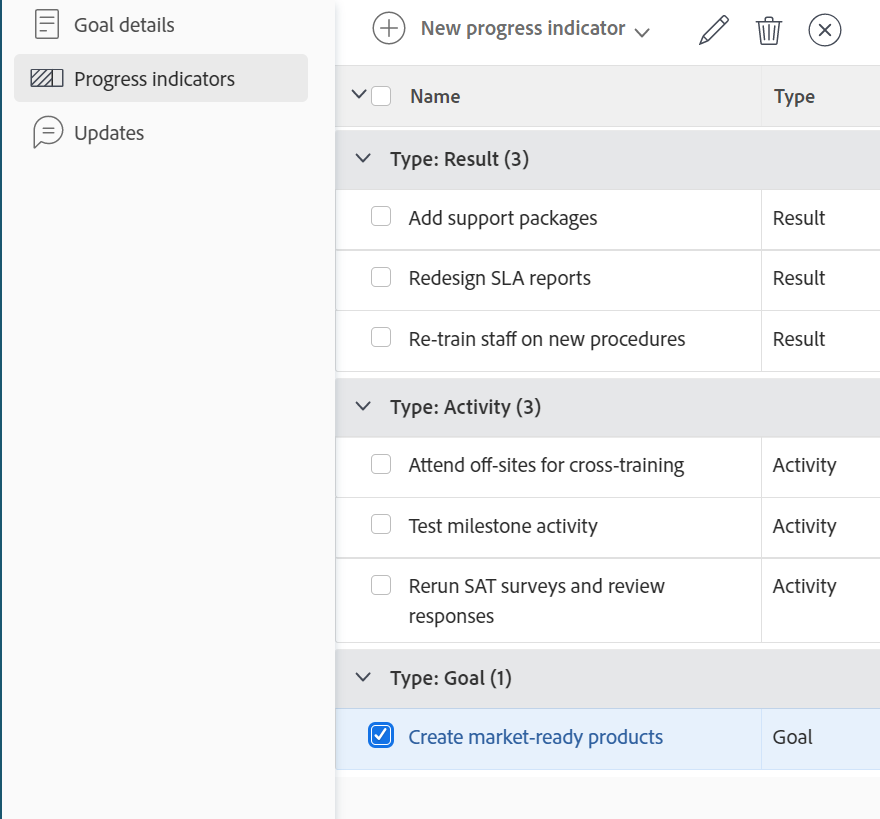

# Remove goal alignment in Adobe Workfront Goals

You can remove the alignment between two goals if it no longer makes sense for them to be connected.

For information about aligning goals, see the following articles:

* [Align goals by connecting them in Adobe Workfront Goals](../../workfront-goals/goal-alignment/align-goals-by-connecting-them.md) 
* [Align goals by converting results and activities to goals](../../workfront-goals/goal-alignment/align-goals-by-converting-results-activities.md)

## Access requirements

You must have the following:

<table style="table-layout:auto">
 <col>
 </col>
 <col>
 </col>
 <tbody>
  <tr>
   <td role="rowheader">Adobe Workfront plan*</td>
   <td>
   
New plan: Select or higher

   Or
   
Current plan: Pro or higher

   
   </td>
  </tr>
  <tr>
   <td role="rowheader">Adobe Workfront license*</td>
   <td>
   
New license: Contributor or higher

   Or
   
Current license: Request or higher
 </td>
  </tr>
  <tr>
   <td role="rowheader">Product*</td>
   <td>
   
 New product requirement, one of the following: 

<ul>
<li>A Select or Prime Adobe Workfront plan and an additional Adobe Workfront Goals license.</li>
<li>An Ultimate Workfront plan which includes Workfront Goals by default. </li></ul>
   
Or

   
Current product requirement: A Workfront plan and an additional license for Adobe Workfront Goals. 
 
For information, see <a href="../../workfront-goals/goal-management/access-needed-for-wf-goals.md" class="MCXref xref">Requirements to use Workfront Goals</a>. 
 </td>
  </tr>
  <tr>
   <td role="rowheader">Access level</td>
   <td> 
Edit access to Goals
 </td>
  </tr>
  <tr data-mc-conditions="">
   <td role="rowheader">Object permissions</td>
   <td>
    
View or higher permissions to the goal to view it

     
Manage permissions to the goal to edit it

     
For information about sharing goals, see <a href="../../workfront-goals/workfront-goals-settings/share-a-goal.md" class="MCXref xref">Share a goal in Workfront Goals</a>. 

    </td>
  </tr>
   <td role="rowheader">
Layout template
</td>
   <td> 
All users, including Workfront administrators,  must be assigned a layout template that includes the Goals area in the Main Menu. 
  
</td>
  </tr>
 </tbody>
</table>

*For more information, see [Access requirements in Workfront documentation](/help/quicksilver/administration-and-setup/add-users/access-levels-and-object-permissions/access-level-requirements-in-documentation.md). 

## Prerequisites

You must have the following before you can start:

* A parent goal that has at least one child goal associated with it. Children goals are the goal's progress indicators.

## Considerations about removing goal alignment

Consider the following when removing alignment between two goals:

* The parent goal must have another goal, activity, or result associated with it to be able to stay Active.
* You cannot remove an aligned child goal from a parent goal if it is the only progress indicator of the parent goal. 
* The child goal becomes a standalone goal when you remove its alignment to the parent goal.

## Remove goal alignment

<!--
Removing goal alignment differs depending on which environment you use.

### Remove goal alignment in the Production environment

1. Go to a child goal aligned to a parent goal. 
1. Click the goal name to open the **Goal Details** panel. 
1. Click the **gear icon**  next to the parent goal, then click **Remove alignment**.

   

   The goal becomes a standalone goal and its progress no longer influences the progress of the original parent goal. 

1. (Optional) Click **Undo** in the lower-left corner of the screen if you want to revert this change and keep the goals aligned. 
1. (Optional) Add activities and results to either goals to indicate their progress. For information about adding activities and results, see the following articles:

   * [Add activities to goals in Adobe Workfront Goals](../../workfront-goals/results-and-activities/add-activities-to-goals.md) 
   * [Add results to goals in Adobe Workfront Goals](../../workfront-goals/results-and-activities/add-results-to-goals.md)
-->

1. Access the **Goals** area in Workfront and click the name of a goal to open the goal's page. 
1. From the goal's page of a parent goal, click **Progress Indicators** in the left panel.

   
   
1. In the **Type: Goal** grouping, select a goal, then click the **Disconnect** icon  at the top of the list.

   The Disconnect box displays. 

1. Click **Disconnect** to disconnect the selected goal from its parent. 

   The goal becomes a standalone goal and it is no longer listed as a progress indicator of the original goal. The progress of the disconnected goal no longer influences the progress of the original goal.
   
   A success message displays in the upper-right corner of the page to confirm that the goal was disconnected. 