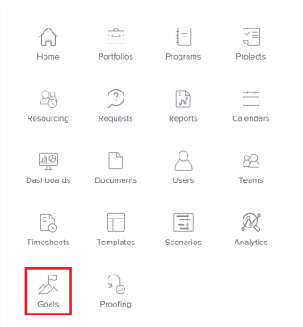

# Access and open goals in Adobe Workfront Goals

This article describes how you can find and manage goals in Adobe Workfront.

## Access requirements

You must have the following to perform the activities described in this article:

<table cellspacing="0"> 
 <col> 
 </col> 
 <col> 
 </col> 
 <tbody> 
  <tr> 
   <td role="rowheader">Adobe Workfront plan*</td> 
   <td> 
Pro or higher
 </td> 
  </tr> 
  <tr> 
   <td role="rowheader">Adobe Workfront license*</td> 
   <td> 
Request or higher
 
For more information, see <a href="../../administration-and-setup/add-users/access-levels-and-object-permissions/wf-licenses.md" class="MCXref xref">Adobe Workfront licenses overview</a>.
 </td> 
  </tr> 
  <tr> 
   <td role="rowheader">Product</td> 
   <td> 
You must purchase an additional license for the Adobe Workfront Goals to access functionality described in this article. 
 
For information, see <a href="../../workfront-goals/goal-management/access-needed-for-wf-goals.md" class="MCXref xref">Requirements to use Adobe Workfront Goals</a>. 
 </td> 
  </tr> 
  <tr> 
   <td role="rowheader">Access level*</td> 
   <td> 
Edit access to Goals
 
Note:  
If you still don't have access, ask your Workfront administrator if they set additional restrictions in your access level. For information on how a Workfront administrator can change your access level, see:
 
     <ul> 
      <li> 
<a href="../../administration-and-setup/add-users/configure-and-grant-access/create-modify-access-levels.md" class="MCXref xref">Create or modify custom access levels</a> 
 </li> 
      <li> 
<a href="../../administration-and-setup/add-users/configure-and-grant-access/grant-access-goals.md" class="MCXref xref">Grant access to Adobe Workfront Goals</a> 
 </li> 
     </ul> 
 </td> 
  </tr> 
  <tr data-mc-conditions=""> 
   <td role="rowheader">Object permissions</td> 
   <td> 
    
 
     
View or higher permissions to the goal to view it
 
     
Manage permissions to the goal to edit it
 
     
For information about sharing goals, see <a href="../../workfront-goals/workfront-goals-settings/share-a-goal.md" class="MCXref xref">Share a goal in Adobe Workfront Goals</a>. 
 
    
 </td> 
  </tr> 
 </tbody> 
</table>

&#42;To find out what plan, license type, or access you have, contact your Workfront administrator.

## Prerequisites

You must have the following before you can start:

* A Layout Template that includes the Goals area in the Main&nbsp;Menu.

## Access Workfront Goals

1. Click the **Main Menu** icon  > **Goals** in the upper-right corner.

   

   The Goal List displays.

   >[!IMPORTANT]
   >
   >When you have the correct access to Workfront Goals, you can view goals they you or anyone else created in the Goal List, by default.

1. (Optional) Click the name of a goal to open or edit it.

   Or

   Click **Add Goal** in the upper-right corner to add a new goal.

   For information about creating goals, see [Create goals in Adobe Workfront Goals](../../workfront-goals/goal-management/create-goals.md).

## Open and manage individual goals

You must access an individual goal to perform the following actions as you manage your goals:

* Edit it
* Add a result or activity to it
* Edit results and activities associated with it
* Activate it
* Deactivate it
* Delete it
* Align it
* Convert results or activities to other goals
* Update it by checking in on it

To access an individual goal in Workfront Goals:

1. Click the **Main Menu** icon  > **Goals** in the upper-right corner of Workfront.

   The Goal List displays by default. 

1. Click the name of a goal in the list to access it

   Or

   Click one of the following options in the left panel:

   * Goal Alignment
   * Check-in 
   * Pulse

   >[!NOTE]
   >
   >Depending on what action you want to perform on the individual goal, you might choose to select different sections every time. For information about the differences between the Workfront Goals sections, see [Overview of the Adobe Workfront Goals sections](../../workfront-goals/goal-review-and-workfront-goals-sections/overview-of-wf-goals-sections.md).

1. Click the name of a goal in the Goal List or Check-in or Pulse sections, or in a card on the Goal Alignment section.&nbsp;

   The Goal Details panel displays on the right. You can update the goal, its results, and activities in the Goal Details panel when you have access to manage it. For information about updating goals using the Goal&nbsp;Details panel, see [Update goals in the Goal Details panel in Adobe Workfront Goals](../../workfront-goals/goal-management/update-goals-in-goal-details-panel.md).

