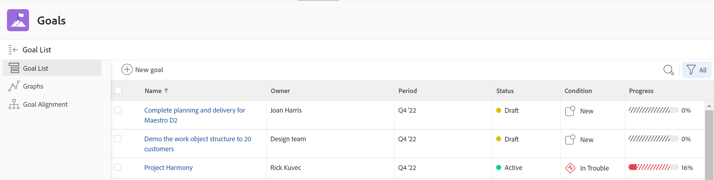

# Access and open goals in Adobe Workfront Goals

This article describes how you can find and manage strategic goals in Adobe Workfront.

## Access requirements

You must have the following to perform the activities described in this article:

<table style="table-layout:auto"> 
 <col> 
 </col> 
 <col> 
 </col> 
 <tbody> 
  <tr> 
   <td role="rowheader">Adobe Workfront plan*</td> 
   <td> 
   
For the new plan and license structure:
  <ul><li>An Ultimate plan </li>
  Or
  <li>An additional license for Adobe Workfront Goals for the Prime or Select Adobe Workfront plans. </li></ul> 

For the current plan and license structure: 
<ul><li> A Pro or higher </li>
  <li>An Adobe Workfront Goals license in addition to a Workfront license.</li></ul>

   </td> 
  </tr> 
  <tr> 
   <td role="rowheader">Adobe Workfront license*</td> 
   <td> 
   
New license: Contributor or higher

   Or
   
Current license: Request or higher
 
For more information, see <a href="../../administration-and-setup/add-users/access-levels-and-object-permissions/wf-licenses.md" class="MCXref xref">Adobe Workfront licenses overview</a>.
 </td> 
  </tr> 
  <tr>
 <td role="rowheader">Product*</td>
 <td>
 
 New product requirement, one of the following: 

<ul>
<li>A Select or Prime Adobe Workfront plan and an additional Adobe Workfront Goals license.</li>
<li>An Ultimate Workfront plan which includes Workfront Goals by default. </li></ul>
 
Or

 
Current product requirement: A Workfront plan and an additional license for Adobe Workfront Goals. 
 
For information, see <a href="../../workfront-goals/goal-management/access-needed-for-wf-goals.md" class="MCXref xref">Requirements to use Workfront Goals</a>. 
 </td>
 </tr>
 <tr>
 <td role="rowheader">Access level</td>
 <td> 
Edit access to Goals
 </td>
 </tr>
  <tr> 
   <td role="rowheader">Access level</td> 
   <td> 
Edit access to Goals
 </td> 
  </tr> 
  <tr data-mc-conditions=""> 
   <td role="rowheader">Object permissions</td> 
   <td> 
    
 
     
View or higher permissions to the goal to view it
 
     
Manage permissions to the goal to edit it
 
     
For information about sharing goals, see <a href="../../workfront-goals/workfront-goals-settings/share-a-goal.md" class="MCXref xref">Share a goal in Workfront Goals</a>. 
 
    
 </td> 
  </tr> 
  <tr>
   <td role="rowheader">
Layout template
</td>
   <td> 
All users, including Workfront administrators,  must be assigned a layout template that includes the Goals area in the Main Menu. 
  
</td>
  </tr>
 </tbody> 
</table>

*For more information, see [Access requirements in Workfront documentation](/help/quicksilver/administration-and-setup/add-users/access-levels-and-object-permissions/access-level-requirements-in-documentation.md). 

## Access Workfront Goals

1. Click the **Main Menu** icon  in the upper-right corner, then click **Goals**.

   <!-- drafted for Shell release: Add this when Shell is available to all: or (if available), click the **Main Menu** icon  in the upper-left corner)
   -->

      The Goal List displays.

   
   >[!IMPORTANT]
   >
   >   When you have the correct access to Workfront Goals, you can view goals that you or anyone else created in the Goal List, by default.    
   
   <!--   
   (NOTE: This might change when sharing is in place; right now, with sharing in place, they can VIEW all goals in the system but they cannot EDIT the ones others created!)
   -->

1. (Optional) Click the name of a goal to open or edit it.

   Or

   Click **New goal** to add a new goal.

   For information about creating goals, see [Create goals in Adobe Workfront Goals](../../workfront-goals/goal-management/create-goals.md).

## Open and manage individual goals

You must access an individual goal to perform the following actions as you manage your goals:

* Edit it
* Add a result or activity to it
* Edit results and activities associated with it
* Activate it
* Deactivate it
* Delete it
* Align it to another goal
* Convert results or activities to other goals
* Update it
<!--
Accessing goals differs depending on what environment you use.

To access an individual goal in the Production environment:

1. Click the **Main Menu** icon  in the upper-right corner of Workfront, then click **Goals** .

     (!--drafted for Shell release: Add this when Shell is available to all: or (if available), click the **Main Menu** icon  in the upper-left corner)
   --)

   The Goal List displays by default. 

1. Click the name of a goal in the list 

   Or

   Click one of the options below in the left panel, then click the name of a goal to access it:

   * Goal Alignment
   * Check-in 
   * Pulse 

   >[!NOTE]
   >
   >Depending on what action you want to perform on the individual goal, you might choose to select different sections every time. For information about the differences between the Workfront Goals sections, see [Overview of the Adobe Workfront Goals sections](../../workfront-goals/goal-review-and-workfront-goals-sections/overview-of-wf-goals-sections.md).

   The Goal Details panel displays on the right. You can update the goal, its results, and activities in the Goal Details panel when you have access to manage it. For information about updating goals using the Goal Details panel, see [Update goals in the Goal details section in Adobe Workfront Goals](../../workfront-goals/goal-management/update-goals-in-goal-details-panel.md).
-->

To access an individual goal: 

1. Click the **Main Menu** icon  in the upper-right corner of Workfront, then click **Goals** .
The Goal List displays by default. 

1. Click the name of a goal in the list. 
The goal's page displays. 

1. Click the **More** menu  to the right of the goal name to further edit or share the goal. 
1. Click **Goal details** in the left panel to edit information about the goal. For more information, see [Update goals in the Goal details section in Adobe Workfront Goals](../goal-management/update-goals-in-goal-details-panel.md). 

