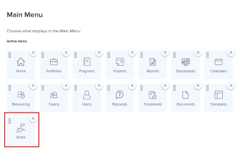

# Requirements to use Workfront Goals

Your Adobe Workfront administrator must ensure all of the following conditions are met before you can access Adobe Workfront Goals:

<!--drafted for P&P - replace the first bullet with this one when licensing changes: 
* Your company must purchase the correct Adobe Worfront plan or Adobe Workfront Goal license. For information, see the section [Obtain Workfront Goals organization access](#obtain-workfront-goals-organization-access)in this article.-->

* Your organization must purchase the correct license for Workfront Goals. For information, see the section [Obtain Workfront Goals organization access](#obtain-workfront-goals-organization-access)in this article.

* Assign you the correct type of Workfront license. For information about assigning license types and access levels, see the section [Update license types and access level settings](#update-license-types-and-access-level-settings) in this article.

>[!NOTE]
>
>Users with an External license type cannot access Workfront Goals.

* Give you access to Goals in your access level. For information, see [Grant access to Adobe Workfront Goals](../../administration-and-setup/add-users/configure-and-grant-access/grant-access-goals.md)  

* Assign you Layout Template that includes the Goals area in the Main Menu.

  >[!NOTE]
  >
  >All users, including Workfront administrators,  must be assigned a layout template that includes the Goals area in the Main Menu. 

  For information see the section [Add Workfront Goals to a layout template](#add-workfront-goals-to-a-layout-template) in this article. 

* If you must modify goals that you did not create yourself, the goal creator must share the goals with you and give you Manage permissions to them.

  For information, see the section [Share individual goals with other users](#share-individual-goals-with-other-users) in this article.

## Obtain Workfront Goals organization access {#obtain-workfront-goals-organization-access}

<!--drafted for P&P release: 

If your company has a current Workfront plan, you must have one of the following:

* An Ultimate Workfront plan. Workfront Goals are included in this plan. 
* A Select or higher Workfront plan and a separate Workfront Goals license. -->

<!-- drafted for P&P - add this to the sentence below at release: 

If your company has a legacy Workfront plan, -->

Your organization must purchase an additional license, in addition to the Workfront license, for your users to be able to access Workfront Goals. After your organization purchases the additional license, Workfront enables Workfront Goals for your account. For information about purchasing a license for Workfront Goals contact your Workfront account manager.

## Update license types and access level settings  {#update-license-types-and-access-level-settings}

<!--drafted for P&P release: 
If your company has the current access level model, your Workfront administrator must grant you one of the following Workfront license types to access Workfront Goals: 

* Contributor
* Light
* Standard-->

<!--drafted for P&P release: add this to the first sentence: 
If your company has the legacy access level model, -->

Your Workfront administrator, must grant you one of the following Workfront license types to access Workfront Goals:

* Plan
* Work 
* Review
* Request

After your Workfront administrator grants you one of these license types, they must also give you access to Goals in your access level. For information about access to Goals, see [Grant access to Adobe Workfront Goals](../../administration-and-setup/add-users/configure-and-grant-access/grant-access-goals.md).

As a Workfront administrator, you can review the number of Workfront Goals licenses in your system and understand how many are currently enabled. For more information, see [Manage available licenses in your system](../../administration-and-setup/get-started-wf-administration/manage-available-licenses-in-your-system.md).

>[!NOTE]
>
>Workfront allows you to assign more Workfront Goals licenses that you have purchased. However, when you assign more licenses than what your Workfront Goals contract allows, a Workfront account manager will contact you to let you know that you have exceeded your contractual number.

## Add Workfront Goals to a layout template {#add-workfront-goals-to-a-layout-template}

Your Workfront or Group administrator must assign you a Layout Template that includes the Goals area in the Main Menu so you can access Workfront Goals.

Your Workfront administrator or Group administrator can also add the following to your layout template so you can easily access Workfront Goals:

* A pinned tab
* Make the Goals area your landing page

For information about updating the Layout Template see the following articles:

* [Create and manage layout templates](../../administration-and-setup/customize-workfront/use-layout-templates/create-and-manage-layout-templates.md) 
* [Customize the Main Menu using a layout template](../../administration-and-setup/customize-workfront/use-layout-templates/customize-main-menu.md) 
* [Customize pinned pages using a layout template](../../administration-and-setup/customize-workfront/use-layout-templates/customize-pinned-pages.md) 
* [Customize the landing page using a layout template](../../administration-and-setup/customize-workfront/use-layout-templates/customize-landing-page.md) 
* [Assign users to a layout template](../../administration-and-setup/customize-workfront/use-layout-templates/assign-users-to-layout-template.md)

## Share individual goals with other users {#share-individual-goals-with-other-users}

By default, all users that have at least View access to Goals in their access level can view all goals in Workfront. 

Any user with Edit access to Goals can create goals and they automatically gain Manage access to the goals they create. If they must edit other users' goals, someone with Manage permissions to those goals must share with them the goals they did not create. 

For information about sharing goals with users and giving them Manage permissions, see [Share a goal in Workfront Goals](../../workfront-goals/workfront-goals-settings/share-a-goal.md).
