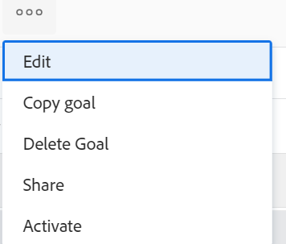

# Activate goals in Adobe Workfront Goals

When you create a goal, Adobe Workfront Goals saves it with a status of Draft. Drafted goals are not part of goal management.

To keep track of how close you are to achieving a goal by updating its progress, you must activate it. This changes its status to Active. 

For information about creating a goal, see [Create goals in Adobe Workfront Goals](../../workfront-goals/goal-management/create-goals.md).

>[!IMPORTANT]
>
>You must activate a goal before you can update the progress of its results and activities.

## Access requirements

You must have the following:

<table style="table-layout:auto">
<col>
</col>
<col>
</col>
<tbody>
 <tr>
 <td role="rowheader">Adobe Workfront plan</td>
 <td>
 
Any

 
 </td>
 </tr>
 <tr>
 <td role="rowheader">Adobe Workfront license*</td>
 <td>
 
New license: Contributor or higher

 Or
 
Current license: Request or higher
 
For more information, see <a href="../../administration-and-setup/add-users/access-levels-and-object-permissions/wf-licenses.md" class="MCXref xref">Adobe Workfront licenses overview</a>.
 </td>
 </tr>
 <tr>
 <td role="rowheader">Product*</td>
 <td>
 
 New product requirement, one of the following: 

<ul>
<li>A Select or Prime Adobe Workfront plan and an additional Adobe Workfront Goals license.</li>
<li>An Ultimate Workfront plan which includes Workfront Goals by default. </li></ul>
 
Or

 
Current product requirement: A Workfront plan and an additional license for Adobe Workfront Goals. 
 
For information, see <a href="../../workfront-goals/goal-management/access-needed-for-wf-goals.md" class="MCXref xref">Requirements to use Workfront Goals</a>. 
 </td>
 </tr>
 <tr>
 <td role="rowheader">Access level</td>
 <td> 
Edit access to Goals
 </td>
 </tr>
 <tr data-mc-conditions="">
 <td role="rowheader">Object permissions</td>
 <td>
  

  
View or higher permissions to the goal to view it

  
Manage permissions to the goal to edit it

  
For information about sharing goals, see <a href="../../workfront-goals/workfront-goals-settings/share-a-goal.md" class="MCXref xref">Share a goal in Workfront Goals</a>. 

  
 </td>
 </tr>
<tr>
   <td role="rowheader">
Layout template
</td>
   <td> 
All users, including Workfront administrators,  must be assigned a layout template that includes the Goals area in the Main Menu. 
  
</td>
  </tr>
</tbody>
</table>

*For more information, see [Access requirements in Workfront documentation](/help/quicksilver/administration-and-setup/add-users/access-levels-and-object-permissions/access-level-requirements-in-documentation.md). 

## Prerequisites

To activate a goal requires that the goal is associated with a progress indicator like an activity, result, project, or it is aligned to another active goal.

Do at least one of the following to be able to activate a goal:

* Add a Result to the goal

  For information, see [Add results to goals in Adobe Workfront Goals](../../workfront-goals/results-and-activities/add-results-to-goals.md).

* Add an Activity to the goal

  For information, see [Add activities to goals in Adobe Workfront Goals](../../workfront-goals/results-and-activities/add-activities-to-goals.md). 

* Connect a project to the goal

  For information, see [Add projects to goals in Adobe Workfront Goals](../results-and-activities/connect-projects-to-goals-overview.md). 

* Align another goal to the goal you want to activate

  For information , see [Align goals by connecting them in Adobe Workfront Goals](../../workfront-goals/goal-alignment/align-goals-by-connecting-them.md).

## Activate goals

You can activate goals you created or a goal that you have Manage permissions to.

1. Go to a goal that you want to activate. The goal page opens.

1. Click the **More** menu  to the right of the goal name, then click **Activate**.

    
   
    The goal status changes to Active. You can now track progress on the goal and the goal displays in the Check-in section as well as is taken into account in the Graphs sections of Workfront Goals
