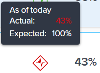
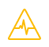
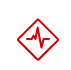

# Overview of goal progress and condition in Adobe Workfront Goals

<!--drafted for P&P release: the note at the top will need to be replaced with this:

Your organization must have the following to use the functionality described in this article:

* For the legacy plan and license structure: 

  * A Pro or higher [Adobe Workfront plan](https://www.workfront.com/plans). 
  * An Adobe Workfront Goals license in addition to a Workfront license.

* For the current plan and license structure:

  * An Ultimate plan 
    
    Or
    
    An additional license for Adobe Workfront Goals for the Prime or Select Adobe Workfront plans. <is there a link we can add here for the plans and what they contain?!>

Contact your Workfront account manager to learn about a Workfront Goals license.

For additional information about access to Workfront Goals, see [Requirements to use Workfront Goals](../../workfront-goals/goal-management/access-needed-for-wf-goals.md).
-->

>[!NOTE]
>
>Your organization must have the following to use the functionality described in this article:
>
>* A Pro or higher [Adobe Workfront plan](https://www.workfront.com/plans). 
>* An Adobe Workfront Goals license in addition to a Workfront license.
>
>Contact your Workfront account manager to learn about a Workfront Goals license.
>For additional information about access to Workfront Goals, see [Requirements to use Workfront Goals](../../workfront-goals/goal-management/access-needed-for-wf-goals.md).

Adobe Workfront calculates goal progress automatically, based on the progress of its progress indicators.

## Prerequisites

You must have the following before you can start:

* A Layout Template that includes the Goals area in the Main Menu.

## Overview of goal progress and threshold

After you activate a goal, Workfront Goals starts calculating its progress and condition and displays the following indicators when you hover over the Progress field: 

|Indicator|Indicator description|
|---|---|
| Actual percent complete |How much of the goal has actually been completed so far. Workfront Goals calculates this value by averaging the percent complete of all progress indicators associated with the goal.  |
| Expected percent complete |How much of the goal should be completed so far in order for the goal to complete on time. Workfront Goals calculates this value by looking at the Duration of the goal and the current moment in time. The goal should display this value at the current time, if it were to complete on time.  |
| Progress  |A label that indicates whether the goal is on target to be completed on time, or if it is at risk or in trouble of not completing.  |



<!--drafted for the redesign: replace the screen shot above with the redesigned one which is white, not black-->

* [Actual percent complete](#actual-percent-complete) 
* [Expected percent complete](#expected-percent-complete) 
* [Progress and condition](#progress)

### Actual percent complete {#actual-percent-complete}

Workfront Goals automatically calculates the actual percent complete of a goal based on the percent complete average of the goal progress indicators.

The following items are considered progress indicators for goals:

* Results

  For information about adding results to goals, see [Add results to goals in Adobe Workfront Goals](../../workfront-goals/results-and-activities/add-results-to-goals.md).

* Activities

  For information about adding activities including projects to goals, see [Add activities to goals in Adobe Workfront Goals](../../workfront-goals/results-and-activities/add-activities-to-goals.md). 

* Aligned children goals

  For information about parent and children goals, see [Align goals by connecting them in Adobe Workfront Goals](../../workfront-goals/goal-alignment/align-goals-by-connecting-them.md).

  Workfront Goals calculates the actual percent complete using the following formula:

  ```
  Actual percent complete of goal = SUM(Percent complete of goal progress indicators)* 100 / Number of progress indicators
  ```

  For example, if a goal has a Result that is 20% complete, a Manual Progress Bar that is 30% complete, a project that is 10% complete and a children goal that is 40% complete, the goal percent complete is 25%.

### Expected percent complete {#expected-percent-complete}

Workfront Goals automatically calculates the expected percent complete of a goal based on the total number of days in the duration of the goal as well as on the number of days that have passed since the goal start date.

Workfront Goals calculates the expected percent complete using the following formula:

```
Expected percent complete of goal = Number of days since the goal start date * 100/ Number of days in the goal duration
```

For example, if a goal is due to complete in 90 days, and today is the 45th day of that duration, then the Expected percent complete is 50%.

### Progress and condition {#progress}

Workfront Goals calculates a progress percentage and assigns a progress label to goals, based on what percentage from the Expected percent complete has been achieved at the current moment in time. The color of the goal percent complete bar changes to indicate the progress of the goal. 

The goal's Condition is also updated, accordingly, to indicate whether the goal is on target to complete on time, or it's lagging behind. 

Workfront Goals calculates the progress percentage of a goal using the following formula:

```
Goal progress percentage = Actual percent complete * 100 / Expected percent complete
```

For example, if the Expected percent complete is 53% at the current time and the Actual percent complete is 30%, the Goal progress percent complete is 56%. Workfront Goals labels this goal with a Condition of "In Trouble."

The following chart illustrates the relationship between the condition labels and the progress percentage:


The table below lists the goal condition labels and the goal progress percentages associated with each label.

>[!TIP]
>
>Goal condition labels match Workfront project Condition name and color.

<table style="table-layout:auto"> 
 <col> 
 <col> 
 <col> 
 <col> 
 <tbody> 
  <tr> 
   <td><b>Goal progress name</b></td> 
   <td><b>Goal progress definition</b></td> 
   <td><b>Goal progress percentage</b></td> 
   <td><b>Color of percent complete bar</b></td> 
   <td><b>Condition indicator icon</b></td> 
  </tr> 
  <tr> 
   <td>New</td> 
   <td> <p>The goal is newly created and it is not recording progress yet. A goal progress displays as New until someone updates its progress for the first time. </p> <p>For information about updating goal progress, see <a href="../../workfront-goals/goal-review-and-workfront-goals-sections/check-in-goals.md" class="MCXref xref">Update goal progress in Adobe Workfront Goals</a>.</p> </td> 
   <td>No percentage</td> 
   <td>No bar</td> 
   <td></td>
  </tr> 
  <tr> 
   <td> <p><span>On Target</span> </p> </td> 
   <td>The goal is performing as expected and there is a great likelihood that it will complete on time. </td> 
   <td>90-100%</td> 
   <td>Green</td> 
    <td></td>
  </tr> 
  <tr> 
   <td> <p><span>At Risk</span> </p> </td> 
   <td>The goal is lagging but it might still be possible to complete it on time. </td> 
   <td>70-89.99%</td> 
   <td>Yellow</td>
   <td></td> 
  </tr> 
  <tr> 
   <td> <p><span>In Trouble</span> </p> </td> 
   <td> <p>It is very likely that the goal will not complete on time. </p> </td> 
   <td>0-69.99%</td> 
   <td>Red</td> 
   <td></td> 
  </tr> 
 </tbody> 
</table>