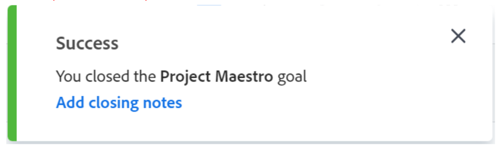
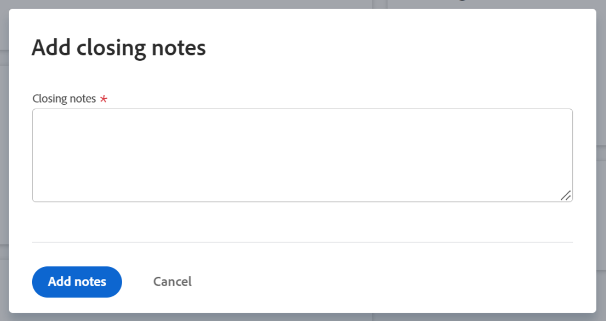

# Close and reopen goals in Adobe Workfront Goals

You can close a goal when you want to indicate the following:

* The goal is done, either because you achieved it, or because the time period elapsed.
* You are no longer working on it nor do you plan to do so in the immediate future.

You can reopen goals that have been closed when they become relevant again. 

## Access requirements

You must have the following:

<table style="table-layout:auto">
<col>
</col>
<col>
</col>
<tbody>
 <tr> 
   <td role="rowheader">Adobe Workfront plan*</td> 
   <td> 
   
For the new plan and license structure:
  <ul><li>An Ultimate plan </li></ul>
   

For the current plan and license structure: 
<ul><li> A Pro or higher </li>
  <li>An Adobe Workfront Goals license in addition to a Workfront license.</li></ul>

   </td> 
  </tr>
 <tr>
 <tr>
 <td role="rowheader">Adobe Workfront license*</td>
 <td>
 
New license: Contributor or higher

 Or
 
Current license: Request or higher
 
For more information, see <a href="../../administration-and-setup/add-users/access-levels-and-object-permissions/wf-licenses.md" class="MCXref xref">Adobe Workfront licenses overview</a>.
 </td>
 </tr>
 <tr>
 <td role="rowheader">Product*</td>
 <td>
 
 New product requirement, one of the following: 

<ul>
<li>A Select or Prime Adobe Workfront plan and an additional Adobe Workfront Goals license.</li>
<li>An Ultimate Workfront plan which includes Workfront Goals by default. </li></ul>
 
Or

 
Current product requirement: A Workfront plan and an additional license for Adobe Workfront Goals. 
 
For information, see <a href="../../workfront-goals/goal-management/access-needed-for-wf-goals.md" class="MCXref xref">Requirements to use Workfront Goals</a>. 
 </td>
 </tr>
 <td role="rowheader">Access level</td>
 <td> 
Edit access to Goals
 </td>
 </tr>
 <tr data-mc-conditions="">
 <td role="rowheader">Object permissions</td>
 <td>
  

  
View or higher permissions to the goal to view it

  
Manage permissions to the goal to edit it

  
For information about sharing goals, see <a href="../../workfront-goals/workfront-goals-settings/share-a-goal.md" class="MCXref xref">Share a goal in Workfront Goals</a>. 

  
 </td>
 </tr>
<tr>
   <td role="rowheader">
Layout template
</td>
   <td> 
All users, including Workfront administrators,  must be assigned a layout template that includes the Goals area in the Main Menu. 
  
</td>
  </tr>
</tbody>
</table>

*For more information, see [Access requirements in Workfront documentation](/help/quicksilver/administration-and-setup/add-users/access-levels-and-object-permissions/access-level-requirements-in-documentation.md). 

## Considerations when closing or reopening goals

* You must have access to Edit Goals in your access level before you can close and reopen goals. For information about granting access to Goals, see [Grant access to Adobe Workfront Goals](../../administration-and-setup/add-users/configure-and-grant-access/grant-access-goals.md).
* You can close only active goals. You cannot close goals that are in the status of Draft. 

   For information about goal statuses, see [Goal status overview in Adobe Workfront Goals](../../workfront-goals/goal-management/goal-status-overview.md).

* Closing goals locks in its progress and allows you to rate how well you did in accomplishing it.

  >[!CAUTION]
  >
  >When closing a goal that has active contributing goals, its progress changes after closing to indicate the progress of the contributing active goals. For information about aligning goals, see [Align goals by connecting them in Adobe Workfront Goals](../../workfront-goals/goal-alignment/align-goals-by-connecting-them.md).

* Update the goal's progress indicators before you close the goal to ensure the goal closes with an accurate progress value. If all progress indicators have been achieved then the goal percent complete should be 100% and your goal has been achieved. For information about updating your goals, see [Update goal progress in Adobe Workfront Goals](../../workfront-goals/goal-review-and-workfront-goals-sections/check-in-goals.md).
* Leave any final comments as an update to the goals that you close. For information about adding comments to goals, see [Manage goal comments in Adobe Workfront Goals](../../workfront-goals/goal-management/manage-goal-comments.md). 
* You can no longer update the progress of results and activities on a goal you close. 
* You can reopen a closed goal if you want to continue working on it. 
* If the goal has not been achieved, consider copying most of its information to the next time period (quarter or year). This is a great option for goals that are the same from one time period to the next or goals that you may still need to work on achieving in the next timeframe. For information about copying goals, see [Copy goals in Adobe Workfront Goals](../../workfront-goals/goal-management/copy-goals.md). You can also update the time period on the goal instead of copying it to another period.
* Workfront deletes the comments of a closed goal when you reopen it. If you must keep the comments, we recommend copying the closed goal including any results associated with it, rather than reopening it. 

## Close goals

<!--
Closing goals differs depending on what environment you use. 

### Close goals in the Production environment

1. Click the **Main Menu** icon  > **Goals** in the upper-right corner.

   (!-- Add this when Shell is available to all: or (if available), click the **Main Menu** icon  in the upper-left corner)
   --)

   The Goal List opens. 

1. (Optional) Modify your filters to display only goals that are active.

   For information about filtering information in Workfront Goals, see [Filter information in Adobe Workfront Goals](../../workfront-goals/goal-management/filter-information-wf-goals.md). 

1. Click an active goal.

   The Goal Details panel displays on the right. 

1. (Optional and recommended) Click the **Updates** tab and add an update in the **Comment here** field about the reason you are closing the goal, then click **Post**. 

1. Click the **More icon**  to the right of the goal name, then click **Close** > **Close Goal**.

   This closes the goal and saves the current progress on the goal and its results and activities.

   >[!IMPORTANT]
   >
   >If the goal has contributing goals that are still active, the progress of the goal continues to update based on the progress of the aligned goals.
   >
   >
   >   >
   >

1. (Optional) Modify your filters again to display only closed goals. The goals you closed display on the screen.
-->

1. Click the **Main Menu** icon  > **Goals** in the upper-right corner. 

   The Goal List opens. 

   <!-- Add this when Shell is available to all: or (if available), click the **Main Menu** icon  in the upper-left corner)
   -->

1. (Optional) Modify your filters to display only goals that are active. 

   For information about filtering information in Workfront Goals, see [Filter information in Adobe Workfront Goals](../goal-management/filter-information-wf-goals.md).
1. Click an active goal. 

   The goal page opens. 
   
      
1. Click the **More** menu  to the right of the goal name, then click **Close**.  

   The goal closes and you receive a confirmation in the upper-right corner of the screen. 

   

1. (Optional) In the confirmation box, click **Add closing notes** to add comments about this goal and why you need to close it. 
1. Add closing notes, then click **Add notes**.

   

   The comments display in the Goal details section of the goal's page, in the Closing notes area. 

   >[!NOTE]
   >
   >Workfront deletes the closing notes if you later reopen a closed goal. 

## Reopen goals

You can reopen closed goals if you decide that they have become relevant again and that you need to continue updating their progress.

<!--
Reopening goals differs depending on what environment you use.

### Reopen goals in the Production environment

1. Click the **Main Menu** icon  > **Goals** in the upper-right corner.

   (!-- Add this when Shell is available to all: or (if available), click the **Main Menu** icon  in the upper-left corner)
   --)

   The Goal List opens. 

1. (Optional) Modify your filters to display only goals that are closed.

   For information about filtering information in Workfront Goals, see [Filter information in Adobe Workfront Goals](../../workfront-goals/goal-management/filter-information-wf-goals.md).

1. Click a closed goal.

   This opens the Goal Details panel on the right. 

1. Click the **More icon**  to the right of the goal name, then click **Reopen** > **Reopen**.

   This reopens the goal and places it in a status of Active. The progress of the goal is recalculated starting with the current date. 

1. (Optional) Modify your filters again to display only active goals. The goals you opened display on the screen.

-->

1. Click the **Main Menu** icon > **Goals** in the upper-right corner. 

   The Goal List opens.

   <!-- Add this when Shell is available to all: or (if available), click the **Main Menu** icon  in the upper-left corner)
   -->

1. (Optional) Modify your filters to display only goals that are closed. 

   For information about filtering information in Workfront Goals, see [Filter information in Adobe Workfront Goals](../goal-management/filter-information-wf-goals.md).
1. Click the name of a closed goal. 
   
   The goal page opens.
1. Click the **More** menu  to the right of the goal name, then **Reopen** > **Reopen**. 

   The following things occur: 
   * The goal is now open and it has a status of Active. 
   * The progress of the goal is recalculated starting with the current date.
   * Any closing notes are deleted from the Goal details page. Deleted closing notes cannot be recovered.  

1. (Optional) Modify your filters again to display only active goals.

   The goals you opened display on the screen.

