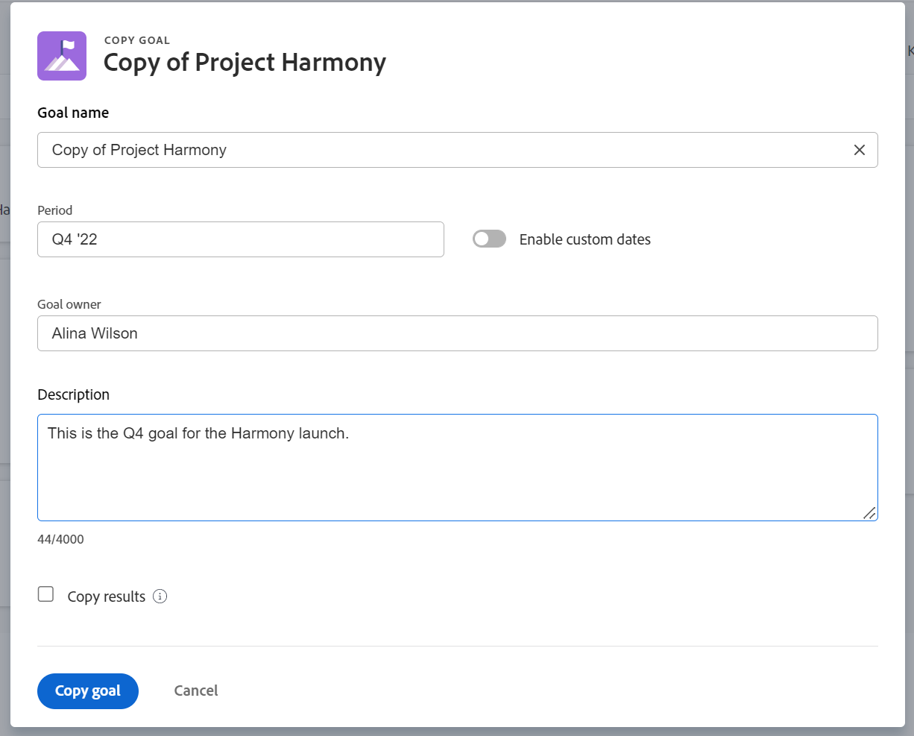

# Copy goals in Adobe Workfront Goals

You can copy goals in Adobe Workfront Goals to create a goal. Some of the original goal information transfers to the new goal.

## Access requirements

You must have the following:

<table style="table-layout:auto">
<col>
</col>
<col>
</col>
<tbody>
 <tr> 
   <td role="rowheader">Adobe Workfront plan*</td> 
   <td> 
   
For the new plan and license structure:
  <ul><li>An Ultimate plan </li>
  Or
  <li>An additional license for Adobe Workfront Goals for the Prime or Select Adobe Workfront plans. </li></ul> 

For the current plan and license structure: 
<ul><li> A Pro or higher </li>
  <li>An Adobe Workfront Goals license in addition to a Workfront license.</li></ul>

   </td> 
  </tr>
 <tr>
 <tr>
 <td role="rowheader">Adobe Workfront license*</td>
 <td>
 
New license: Contributor or higher

 Or
 
Current license: Request or higher
 
For more information, see <a href="../../administration-and-setup/add-users/access-levels-and-object-permissions/wf-licenses.md" class="MCXref xref">Adobe Workfront licenses overview</a>.
 </td>
 </tr>
 <tr>
 <td role="rowheader">Product*</td>
 <td>
 
 New product requirement, one of the following: 

<ul>
<li>A Select or Prime Adobe Workfront plan and an additional Adobe Workfront Goals license.</li>
<li>An Ultimate Workfront plan which includes Workfront Goals by default. </li></ul>
 
Or

 
Current product requirement: A Workfront plan and an additional license for Adobe Workfront Goals. 
 
For information, see <a href="../../workfront-goals/goal-management/access-needed-for-wf-goals.md" class="MCXref xref">Requirements to use Workfront Goals</a>. 
 </td>
 </tr>
 <tr>
 <td role="rowheader">Access level</td>
 <td> 
Edit access to Goals
 </td>
 </tr>
 <tr data-mc-conditions="">
 <td role="rowheader">Object permissions</td>
 <td>
  

  
View or higher permissions to the goal to view it

  
Manage permissions to the goal to edit it

  
For information about sharing goals, see <a href="../../workfront-goals/workfront-goals-settings/share-a-goal.md" class="MCXref xref">Share a goal in Workfront Goals</a>. 

  
 </td>
 </tr>
<tr>
   <td role="rowheader">
Layout template
</td>
   <td> 
All users, including Workfront administrators,  must be assigned a layout template that includes the Goals area in the Main Menu. 
  
</td>
  </tr>
</tbody>
</table>

*For more information, see [Access requirements in Workfront documentation](/help/quicksilver/administration-and-setup/add-users/access-levels-and-object-permissions/access-level-requirements-in-documentation.md). 

## Considerations for copying goals

You must have access to Edit Goals in your access level before you can copy goals. For information about granting access to Goals, see [Grant access to Adobe Workfront Goals](../../administration-and-setup/add-users/configure-and-grant-access/grant-access-goals.md).

Some of the reasons you might want to copy an existing goal are:

* At the end of a time period (quarter or year), when you want to recreate the same goal for the next period.
* At the end of a time period, when the goal cannot be completed, and you want to work on it for another time period.
* When multiple team members have similar goals and you might need to create one for each one of them.

>[!TIP]
>
>You can copy a goal in any status. For information about goal statuses, see [Goal status overview in Adobe Workfront Goals](../../workfront-goals/goal-management/goal-status-overview.md).

Consider the following when copying goals:

* All information about the goal is also copied to the new goal. 
* You can select to copy the results of an existing goal. The name of the results transfer to the new goal, but the current progress of the results on the existing goal does not copy to the new goal. The copied results are assigned to the same owner, by default.

  >[!NOTE]
  >
  >If the original owner was deleted or deactivated from Workfront, the new result is assigned to the logged in user.

* You cannot copy the activities of a goal when you copy the goal.

## Copy goals

<!--
Copying goals differs depending on what environment you use. 

To copy goals in the Production environment:

1. Go to a goal and click it to open the Goal Details panel.

   For information about accessing an individual goal, see the "Access individual goals" section in [Access and open goals in Adobe Workfront Goals](../../workfront-goals/goal-management/access-goals-in-wf-goals.md).

   This opens the Goal Details panel.

1. Click the **More icon** , then click **Copy**. 

1. Update any of the following information for the copied goal:

   | Field |Description  |
   |---|---|
   | New Goal |The name of the new goal. The default is the name of the original goal.  |
   | Period |The time period during which you want to achieve the goal. Select a time period from the drop-down menu or click **Define custom dates** to indicate a custom time period. By default, the Period is always the current quarter. |
   | Owner |The owner of the goal. It can be a user, team, group, or a company. The default is the owner of the original goal.  |
   | Description |Additional information about the goal.  |

1. (Conditional) Select **Copy results** if the original goal had results added to it and you want to copy them to the new goal. This duplicates the original results to the new goal. The results of the copied goal have the same owner, names and measured values as the results of the original goal.

   >[!TIP]
   >
   >* The progress of the original result does not transfer to the copied goal. 
   >* If the original owner was deleted or deactivated from Workfront, the new result is assigned to the logged in user.

1. Click **Save**.

   The copied goal is saved with a status of Draft and displays in the Goal Details panel.

   >[!IMPORTANT]
   >
   >If you have not copied the results from the original goal, you must first associate the new goal with a progress indicator before you can activate it and start working towards achieving it. 
   >
   >Do at least one of the following to be able to activate a goal: 
   >   
   >* Add a Result
   >   
   >  For information about adding results, see [Add results to goals in Adobe Workfront Goals](../../workfront-goals/results-and-activities/add-results-to-goals.md).
   >   
   >* Add an Activity
   >   
   >  For information about adding activities, see [Add activities to goals in Adobe Workfront Goals](../../workfront-goals/results-and-activities/add-activities-to-goals.md). 
   >   
   >* Align another goal to it
   >   
   >  For information about aligning goals, see [Align goals by connecting them in Adobe Workfront Goals](../../workfront-goals/goal-alignment/align-goals-by-connecting-them.md).
   >
   > For information about activating a goal, see [Activate goals in Adobe Workfront Goals](../goal-management/activate-goals.md). 

1. Click the **X** icon in the upper-right of the Goal Details panel to close it.

   The copied goal displays in the following sections:

   * Goal List 
   * Check-in (after it is activated)
   * Goal Alignment section (after it is activated) 
   * Pulse
(!--drafted - this was important when we could not update the goal timeframe in the past but we can do that now - not needed
1. (Optional and conditional) If you have copied a goal that was not achieved in a previous time period to continue working on it in the following time period, do the following:

   1. Go to the original goal in the Goal List, Check-in page, or Pulse section and comment on the goal, to indicate that this goal was copied to another, more current goal. For information about commenting on a goal, see [Manage goal comments in Adobe Workfront Goals](../../workfront-goals/goal-management/manage-goal-comments.md).
   1. Close the original goal, to preserve the progress in its original time period. For information about closing goals, see [Close and reopen goals in Adobe Workfront Goals](../../workfront-goals/goal-management/close-and-reopen-goals.md). 
   1. Update the the **Initial** value of the new Result to match the **End At** value of the previous result, so that your new goal progress will start calculating from the point you achieved in the previous period.
   
-->

1. Go to a goal and click the **More** menu , then click **Copy Goal**.  

   

1. Update the following information for the copied goal:
    * **Goal name**: The name of the new goal. The default name for the copied goal is "Copy of &lt;original goal>".
    * **Period**: The time period during which you want to achieve the goal. Select a time period from the drop-down menu 

      Or
   
      Select **Enable custom dates** to specify custom dates for the goal's **Start** and **End dates**. The Enable custom dates setting is disabled by default.  
   
      >[!TIP]
      >
      >   Deselecting Enable custom dates reverts to the original goal's time period. 
      
      * **Goal owner**: The owner of the goal. It can be a user, team, group, or a company. The default is the owner of the original goal. 
      * **Description**: Additional information about the goal.
      * **Copy results**: Select this option if you want to transfer the results from the current goal to the copied goal. This duplicates the original results and attaches them to the copied goal. The results of the copied goal have the same owner, names, and measured values as the results of the original goal. 

         >[!NOTE]
         >
         >* The progress of the original result does not transfer to the copied goal.
         >* If the original owner was deleted or deactivated from Workfront, the new result is assigned to the logged in user.

1. Click **Copy goal**. 

   A goal similar to the original one is created and it is in a status of Draft.  
 
   >[!NOTE]
   >
   >If you have not copied the results from the original goal, you must first associate the new goal with a progress indicator before you can activate it and start working towards achieving it.
   >For information about associating goals with progress indicators, see the following articles: 
   >* [Add results to goals in Adobe Workfront Goals](../results-and-activities/add-results-to-goals.md)
   >* [Add activities to goals in Adobe Workfront Goals](../results-and-activities/add-activities-to-goals.md)
   >* [Align goals by connecting them in Adobe Workfront Goals](../goal-alignment/align-goals-by-connecting-them.md)
   >
   >For information about activating goals, see [Activate goals](../goal-management/activate-goals.md). 

