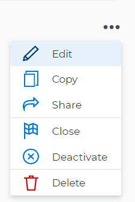
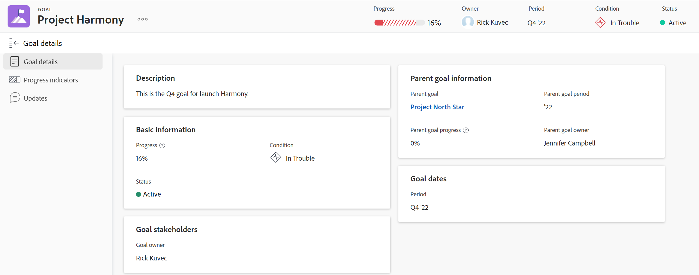

# Edit goals in Adobe Workfront Goals

You can edit existing goals from any time period and in any status.

## Access requirements

You must have the following:

<table style="table-layout:auto">
<col>
</col>
<col>
</col>
<tbody>
 <tr> 
   <td role="rowheader">Adobe Workfront plan*</td> 
   <td> 
   
For the new plan and license structure:
  <ul><li>An Ultimate plan </li></ul>
   

For the current plan and license structure: 
<ul><li> A Pro or higher </li>
  <li>An Adobe Workfront Goals license in addition to a Workfront license.</li></ul>

   </td> 
  </tr>
 <tr>
 <td role="rowheader">Adobe Workfront license*</td>
 <td>
 
New license: Contributor or higher

 Or
 
Current license: Request or higher
 
For more information, see <a href="../../administration-and-setup/add-users/access-levels-and-object-permissions/wf-licenses.md" class="MCXref xref">Adobe Workfront licenses overview</a>.
 </td>
 </tr>
 <tr>
 <td role="rowheader">Product*</td>
 <td>
 
 New product requirement, one of the following: 

<ul>
<li>A Select or Prime Adobe Workfront plan and an additional Adobe Workfront Goals license.</li>
<li>An Ultimate Workfront plan which includes Workfront Goals by default. </li></ul>
 
Or

 
Current product requirement: A Workfront plan and an additional license for Adobe Workfront Goals. 
 
For information, see <a href="../../workfront-goals/goal-management/access-needed-for-wf-goals.md" class="MCXref xref">Requirements to use Workfront Goals</a>. 
 </td>
 </tr>
 <tr>
 <td role="rowheader">Access level</td>
 <td> 
Edit access to Goals
 </td>
 </tr>
 <tr data-mc-conditions="">
 <td role="rowheader">Object permissions</td>
 <td>
  

  
View or higher permissions to the goal to view it

  
Manage permissions to the goal to edit it

  
For information about sharing goals, see <a href="../../workfront-goals/workfront-goals-settings/share-a-goal.md" class="MCXref xref">Share a goal in Workfront Goals</a>. 

  
 </td>
 </tr>
 <tr>
   <td role="rowheader">
Layout template
</td>
   <td> 
All users, including Workfront administrators,  must be assigned a layout template that includes the Goals area in the Main Menu. 
  
</td>
  </tr>
</tbody>
</table>

*For more information, see [Access requirements in Workfront documentation](/help/quicksilver/administration-and-setup/add-users/access-levels-and-object-permissions/access-level-requirements-in-documentation.md). 

## Considerations about editing goals

* You cannot edit goals with a status of Closed. 
* You can edit goals from any time period.

  You can edit the following information for a past goal:

  * Name
  * Time period
  * Status

    >[!TIP]
    >
    >If the goal is Closed, reopening it recalculates the Progress percent complete. You cannot edit a closed goal.

  * Description
  * Results and activities

## Edit goals

<!--
Editing goals differs depending on what environment you use.

### Edit goals in the Production environment

1. Go to a goal that you want to edit and click the goal name to open the **Goal Details** panel. 
1. Click the **More icon** , then click **Edit**.

   

1. Update the name of the goal in the **Goal** field. 
1. Select a time period when the goal should be completed.

   Select from the following predefined options:

   * The current year
   * The quarters of the current year
   * The next two years
   * The quarters of the next two years

   Or

   Click **Define custom dates** to select a custom time frame. 

1. (Conditional) Select a start and an end date for your goal, if you clicked **Define custom dates**.

   
   
(NOTE: these fields don't yet have a name) 

   

   >[!CAUTION]
   >
   >You cannot create a goal with custom dates in the past.

1. (Optional) Click **Reset custom dates** to return to the predefined options.

   >[!TIP]
   >
   >We recommend that everyone in your organization selects the same time frames for similar goals or goals that are aligned. This provides better alignment between goals and ensures that everyone's work supports your larger organization-wide strategy.

1. Click the **Owner** field and select a new owner for the goal, if you want to indicate someone else as the owner of the goal. 
1. (Conditional) Start typing the name of a user, team, group, or the name of your organization in the **Owner** field, then select it when it displays in the list. You can have only one owner for a goal. 
1. Update the **Description** of the goal, then click **Save**.

-->

1. Click the **Main Menu** icon , then click **Goals**.  
A list of goals displays.
1. Click a goal.  
   The goal page displays. 

   

1. Do one of the following to edit information for the goal:
    * Click fields that display in the goal header to update them. Not all fields in the header are editable. 
    * Click the **More icon**  to the right of the goal name, then click **Edit**. 
    * Click **Goal details** in the left panel and click the **Edit icon**  in the upper-right corner, then click **Edit all**. Start updating fields in the Goal details section. 
    
      >[!IMPORTANT]
      >
      >Not all fields that display in the areas mentioned above can be edited. Workfront calculates some of the fields and they are read-only. 

1. (Conditional) Depending on what you selected in the previous step, update the following information about the goal:

   * Update the following information in the goal header, then press Enter to save your changes:
      * **Goal name**: Click the name of the goal and start typing a new name.
      * **Owner**: Click the name of the owner, and start typing the name of a user, team, group, or your company, then select it when it displays in the list. You can have only one owner for a goal. 
   * Update the following information in the Edit Goal box, then click **Save**: 
      * **Goal name**
      * **Period**: Click to update the time period for the goal  
         Or  
         Select **Enable custom dates** to specify dates for the goal's **Start** and **End dates**. 

         >[!TIP]
         >
         >Deselect **Enable custom dates** to return to the original time period for the goal. 

      * **Goal owner**
      * **Description**: Add or update information about the goal. 
   * Update or review information in the Goal details section. For more information, see [Update goals in the Goal details section in Adobe Workfront Goals](../goal-management/update-goals-in-goal-details-panel.md). 

   <!-- (should you update the title here after changing it at production??? - change it to Update goals in the goal Details section)-->

1. (Optional)  Click **Progress Indicators** in the left panel to add results, activities, or projects to the goal. By adding progress indicators, you ensure you can track the goal's progress.
For more information, see the following articles: 
    * [Add activities to goals in Adobe Workfront Goals](../results-and-activities/add-activities-to-goals.md)
    * [Add results to goals in Adobe Workfront Goals](../results-and-activities/add-results-to-goals.md). 
    * [Add projects to goals in Adobe Workfront Goals](../results-and-activities/connect-projects-to-goals-overview.md).
    

