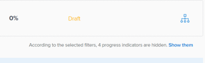

# Filter information in Adobe Workfront Goals

You can view goals that you or anyone else added in Adobe Workfront Goals. For information about creating goals, see [Create goals in Adobe Workfront Goals](../../workfront-goals/goal-management/create-goals.md). When viewing goals, you can filter information in Workfront Goals to view only goals that are important to you.

## Access requirements

You must have the following access to perform the actions described in this article:

<table style="table-layout:auto">
<col>
</col>
<col>
</col>
<tbody>
 <tr> 
   <td role="rowheader">Adobe Workfront plan*</td> 
   <td> 
   
For the new plan and license structure:
  <ul><li>An Ultimate plan </li> </ul>
  

For the current plan and license structure: 
<ul><li> A Pro or higher </li>
  <li>An Adobe Workfront Goals license in addition to a Workfront license.</li></ul>

   </td> 
  </tr>
 <tr>
 <td role="rowheader">Adobe Workfront license*</td>
 <td>
 
New license: Contributor or higher

 Or
 
Current license: Request or higher
 
For more information, see <a href="../../administration-and-setup/add-users/access-levels-and-object-permissions/wf-licenses.md" class="MCXref xref">Adobe Workfront licenses overview</a>.
 </td>
 </tr>
 <tr>
 <td role="rowheader">Product*</td>
 <td>
 
 New product requirement, one of the following: 

<ul>
<li>A Select or Prime Adobe Workfront plan and an additional Adobe Workfront Goals license.</li>
<li>An Ultimate Workfront plan which includes Workfront Goals by default. </li></ul>
 
Or

 
Current product requirement: A Workfront plan and an additional license for Adobe Workfront Goals. 
 
For information, see <a href="../../workfront-goals/goal-management/access-needed-for-wf-goals.md" class="MCXref xref">Requirements to use Workfront Goals</a>. 
 </td>
 </tr>
 <tr>
 <td role="rowheader">Access level</td>
 <td> 
Edit access to Goals
 </td>
 </tr>
 <tr data-mc-conditions="">
 <td role="rowheader">Object permissions</td>
 <td>
  

  
View or higher permissions to the goal to view it

  
Manage permissions to the goal to edit it

  
For information about sharing goals, see <a href="../../workfront-goals/workfront-goals-settings/share-a-goal.md" class="MCXref xref">Share a goal in Workfront Goals</a>. 

  
 </td>
 </tr>
 <tr>
   <td role="rowheader">
Layout template
</td>
   <td> 
All users, including Workfront administrators,  must be assigned a layout template that includes the Goals area in the Main Menu. 
  
</td>
  </tr>
</tbody>
</table>

*For more information, see [Access requirements in Workfront documentation](/help/quicksilver/administration-and-setup/add-users/access-levels-and-object-permissions/access-level-requirements-in-documentation.md). 

## Overview of filters in Workfront Goals

>[!NOTE]
>
>To efficiently find and focus on the right goals, we recommend that you use filters in Workfront Goals. This allows you to display the correct information before you start managing goals that are important to you. By default, Workfront Goals displays all goals in the system. 

You can locate and filter for goals in following sections of the Goals area in Workfront:

* Goal List 
* Graphs
* Goal Alignment

For information about the sections of the Goals area, see [Overview of the Adobe Workfront Goals sections](../../workfront-goals/goal-review-and-workfront-goals-sections/overview-of-wf-goals-sections.md).

>[!IMPORTANT]
>
>You can configure filters for one section and they remain persistent when moving to another section of Workfront Goals.

Consider the following when working with filters in Workfront Goals:

* You can create and apply a filter without saving it, or you can save a filter to reuse at a later time.

  The following scenarios exist:

   * When you save a filter, it becomes the default filter for you every time you log in to Workfront Goals. 
   * When you apply a filter without saving it, you can revert to the original lists by refreshing your page.

* You can only view and apply filters you created. Filters created by other users display only for those users. 
* You cannot share filters you created with other users.

## Apply a quick filter in Workfront Goals

You can use a quick filter in a list of goals to help you locate only items that are important to you. You cannot save quick filters and they are not persistent. Workfront clears the results of a quick filter when you refresh the page.

For more information, see [Apply the quick filter to a list](../../workfront-basics/navigate-workfront/use-lists/apply-quick-filter-list.md). 

## Create and apply a filter in Workfront Goals

The process for creating filters is the same for any section of Workfront Goals.

You can create a filter from scratch or edit one of the built-in filters.

1. Go to the Workfront Goals.

   For information about accessing Workfront Goals, see [Access and open goals in Adobe Workfront Goals](../../workfront-goals/goal-management/access-goals-in-wf-goals.md)

   By default, the Goal List section displays. 

1. Click **Filter** in the upper-right corner of the list.

   

   By default, Workfront applies the **All** filter which displays all goals in your system.

   >[!TIP]
   >
   >You cannot edit or delete the All filter.

1. Do one of the following:

   * Click any of the following predefined filters to display goals only for the following owners:

     <table style="table-layout:auto"> 
      <col> 
      <col> 
      <tbody> 
       <tr> 
        <td>All</td> 
        <td> 
All goals in your system, regardless of who created them, what the time period for them is, or who the owner is. This is the default filter and you cannot edit it. 
 <!--
          
(NOTE: what the ALL filter displays might change; right now, it displays all, regardless of status, period, owner, etc)

         --> </td> 
       </tr> 
       <tr> 
        <td>Personal</td> 
        <td>The goals for which you are the owner.</td> 
       </tr> 
       <tr> 
        <td>My teams</td> 
        <td> 
The goals for which any of your teams is selected as the owner. 
 
<b>TIP</b>
        
        No goals display when you are not assigned to any teams. 
 </td> 
       </tr> 
       <tr> 
        <td>My groups</td> 
        <td>The goals for which any of your groups is selected as the owner. </td> 
       </tr> 
       <tr> 
        <td>Company</td> 
        <td> 
The goals associated with your organization. 
 
<b>TIP</b>
        
In Adobe Workfront Goals, the Company filter displays the goals for which your organization is selected as the owner. 
 
You cannot search for companies using this field. Only your organization who is the owner of your Workfront instance is selected by default. 
 
 </td> 
       </tr> 
      </tbody> 
     </table>

   * Hover over the name of a filter, then click the **Edit** icon  next to its name to customize it and add specific names of users, teams, groups, or the name of your organization, then select it when they appear on the list.

   * Click **New Filter** to create a new filter, then select from the following options to customize the new filter:

     <table style="table-layout:auto"> 
      <col> 
      <col> 
      <tbody> 
       <tr> 
        <td role="rowheader">Period</td> 
        <td>Select a time period in the drop-down menu. You can select multiple time periods. </td> 
       </tr> 
       <tr> 
        <td role="rowheader">Status</td> 
        <td> 
Select a status in the drop-down menu from the following options:
 
         <ul> 
          <li> 
Active
 </li> 
          <li> 
Draft
 </li> 
          <li> 
Inactive
 </li> 
          <li> 
Closed
 </li> 
         </ul> </td> 
       </tr> 
       <tr> 
        <td role="rowheader">Progress</td> 
        <td> 
Select a progress in the drop-down menu from the following options: 
 
         <ul> 
          <li> 
In Trouble
 </li> 
          <li> 
At Risk
 </li> 
          <li> 
On Target
 </li> 
         </ul> </td> 
       </tr> 
       <tr> 
        <td role="rowheader">Owner</td> 
        <td> 
Start typing the name of an owner, then select it when it appears in the list. 
 
You can type the names of users, teams, groups, or the name of your organization or you can select from predefined options. 
 
The following predefined filter options always refer to the user who is currently logged in: 
 
         <ul> 
          <li> 
<strong>Me</strong>: Displays goals where you are the owner.
 </li> 
          <li> 
<strong>My Home Team</strong> and <strong>All My Teams</strong>: Displays goals where either your Home Team or any of your teams are designated as the owner. 
 
Tip: No goals display when you are not assigned to any teams. 
 </li> 
          <li> 
<strong>My Home Group</strong> and <strong>All My Groups</strong>: Displays goals where either your Home Group or any of your groups are designated as the owner.
 </li> 
         </ul> </td> 
       </tr> 
      </tbody> 
     </table>

1. (Optional) Click **Reset** in the lower-right corner of the filter box to clear out all the fields you have selected and start building the filter from scratch. 
1. (Optional) Click **Apply** to apply the filter without saving.

   The filter displays in the **Unsaved** area of the filter builder as **New Filter**.

   You cannot rename an unsaved filter.

   Unsaved filters are removed from the Goals area next time you log out of Workfront and log back in.

   >[!TIP]
   >
   >You can have only one unsaved New Filter at one time.

1. Click **Save** to save the filter to use it later, then add a name for the filter in the **Add filter name** field and click **Done**.

   This saves the filter in the **Saved** section of the filter builder. You can use this filter in the future.

   The last saved and applied filter displays by default next time you log back in to Workfront

1. (Optional) Click the **left-pointing arrow** next to **New Filter** to exit the filter builder and return to the list of filters. 
1. (Optional) Hover over the name of a custom filter, click the **More** menu, then click **Delete**, then **Delete**. This deletes the filter and you cannot recover it.

   >[!TIP]
   >
   >You cannot delete any of the predefined filters.

1. Click the **X icon** in the upper-right corner of the filter builder to close the filter builder.

   The name of the filter currently applied displays to the right of the Filter icon, in the upper-right corner of the goals list.

   The list of goals is filtered by your filter criteria. 

1. (Optional and conditional) When viewing goals in the Goal Alignment section,  click **Show them** if you want to view the filtered out goals.  

   

   The filter name is outlined in yellow to indicate that it is being ignored. 

   

1. (Optional and conditional) Click **Reapply filter** to apply the filter and omit the items you displayed in the previous step.

