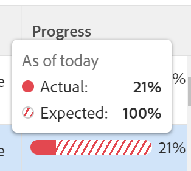
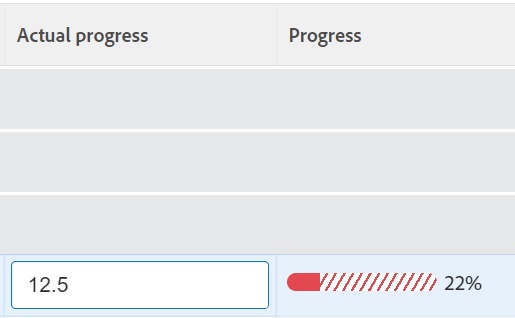

# Review in-trouble goals in&nbsp;Adobe Workfront Goals

<!--

(NOTE: the status of goals in "red" used to be called At Risk. Now, it is "in trouble") 

-->

Goals with a Progress of In Trouble are in danger of not being achieved and are represented by a red progress bar in Adobe Workfront Goals. You should review your goals often and understand why the progress is lagging. For information about goal progress, see [Overview of goal progress and condition in Adobe Workfront Goals](../../workfront-goals/goal-management/calculate-goal-progress.md).

## Access requirements

You must have the following: 

<table style="table-layout:auto">
<col>
</col>
<col>
</col>
<tbody>
 <tr> 
   <td role="rowheader">Adobe Workfront plan*</td> 
   <td> 
   
For the new plan and license structure:
  <ul><li>An Ultimate plan </li></ul>
   

For the current plan and license structure: 
<ul><li> A Pro or higher </li>
  <li>An Adobe Workfront Goals license in addition to a Workfront license.</li></ul>

   </td> 
  </tr>
 <tr>
 <td role="rowheader">Adobe Workfront license*</td>
 <td>
 
New license: Contributor or higher

 Or
 
Current license: Request or higher
 
For more information, see <a href="../../administration-and-setup/add-users/access-levels-and-object-permissions/wf-licenses.md" class="MCXref xref">Adobe Workfront licenses overview</a>.
 </td>
 </tr>
 <tr>
 <td role="rowheader">Product*</td>
 <td>
 
 New product requirement, one of the following: 

<ul>
<li>A Select or Prime Adobe Workfront plan and an additional Adobe Workfront Goals license.</li>
<li>An Ultimate Workfront plan which includes Workfront Goals by default. </li></ul>
 
Or

 
Current product requirement: A Workfront plan and an additional license for Adobe Workfront Goals. 
 
For information, see <a href="../../workfront-goals/goal-management/access-needed-for-wf-goals.md" class="MCXref xref">Requirements to use Workfront Goals</a>. 
 </td>
 </tr>
 <tr>
 <td role="rowheader">Access level</td>
 <td> 
Edit access to Goals
</td>
 </tr>
 <tr data-mc-conditions="">
 <td role="rowheader">Object permissions</td>
 <td>
  

  
View or higher permissions to the goal to view it

  
Manage permissions to the goal to edit it

  
For information about sharing goals, see <a href="../../workfront-goals/workfront-goals-settings/share-a-goal.md" class="MCXref xref">Share a goal in Workfront Goals</a>. 

  
 </td>
 </tr>
 <tr>
   <td role="rowheader">
Layout template
</td>
   <td> 
All users, including Workfront administrators,  must be assigned a layout template that includes the Goals area in the Main Menu. 
  
</td>
  </tr>
</tbody>
</table>

*For more information, see [Access requirements in Workfront documentation](/help/quicksilver/administration-and-setup/add-users/access-levels-and-object-permissions/access-level-requirements-in-documentation.md). 

## Recommendations for preventing goals to reach a progress of In&nbsp;Trouble

Before goals reach a progress of In&nbsp;Trouble, you can monitor them often and adjust their progress when they reach a progress of At Risk. Goals that are at risk are in danger of becoming in trouble.&nbsp;For more information about goal progress, see [Overview of goal progress and condition in Adobe Workfront Goals](../../workfront-goals/goal-management/calculate-goal-progress.md)

Before your goals reach a progress of In Trouble, we recommend the following:

* Review goals that are have a condition of At Risk often that are assigned to you as well as organizational goals that are assigned to your teams, groups, or to your organization which might be affected by the progress of your goals. At-risk goals are in danger of becoming in-trouble goals. The at-risk goals are marked by a yellow progress bar. Use the Goal List to view goals that belong to you, your teams, groups, or your organization. 

## Review in-trouble goals in the Goal List

You can review goals in any section of Workfront Goals.&nbsp;For information about the Workfront Goals sections, see [Overview of the Adobe Workfront Goals sections](../../workfront-goals/goal-review-and-workfront-goals-sections/overview-of-wf-goals-sections.md).

This article describes how to review goals in the Goal List.

1. Click the **Main Menu** icon  > **Goals** in the upper-right corner.

   <!-- Add this when Shell is available to all: or (if available), click the **Main Menu** icon  in the upper-left corner)
   -->

   This opens the Workfront Goals area and the Goal List section displays by default.

1. (Recommended) Adjust the following filters for the Goal List area to review at-risk goals:

   * Click **Company**, then **My Teams**, then **My Groups**, then **Personal** goals in this order to view goals that belong to your organization, your teams, groups, and then your own goals.

     >[!TIP]
     >
     >In Adobe Workfront Goals, the Company filter displays the goals for which your organization is selected as the owner. 
     >
     >
     >You cannot search for companies using this field. Only your organization who is the owner of your Workfront instance is selected by default.

   * For each of the organizational units you select above, click **New Filter** > **Progress** > **In Trouble** >**Apply.**
   * (Optional) Select the time period for which you want to view goals.

     The progress bar indicator displays in red for each goal in the goal list.

     For more information about filtering goals using all other criteria in the right panel, see [Filter information in Adobe Workfront Goals](../../workfront-goals/goal-management/filter-information-wf-goals.md).

1. Hover over the progress bar indicator to see what the actual progress percentage is and what the expected value is for the current day.

   

1. (Optional) Use the filters to find goals that belong to a specific owner.

   In-trouble goals for the selected users display in the goal list.

1. Click a goal name to open the goal page, then click **Progress Indicators** in the left panel. View which progress indicator causes the goal to be behind and update the progress of the indicator inline, in the **Actual progress** column of the Progress indicators list. 

   For information about updating results and activities, see [Update goal progress in Adobe Workfront Goals](../goal-review-and-workfront-goals-sections/check-in-goals.md)

   

   >[!NOTE]
   >
   >You can update only results and activities in the Progress indicators list. You must update the progress indicators of children goals by accessing the goals and you must update the tasks on the connected projects to update the progress of the projects.

