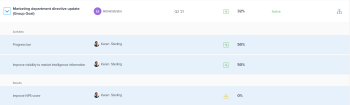

# Review in-trouble goals in&nbsp;Adobe Workfront Goals

Goals with a Progress of In Trouble are in danger of not being achieved and are represented by a red progress bar in Adobe Workfront Goals. You should review your goals often and understand why the progress is lagging. For information about goal progress, see [Calculate goal progress in Adobe Workfront Goals](../../workfront-goals/goal-management/calculate-goal-progress.md).

## Access requirements

You must have the following:

<table cellspacing="0"> 
 <col> 
 <col> 
 <tbody> 
  <tr> 
   <td role="rowheader">Adobe Workfront plan*</td> 
   <td> <p>Pro or higher</p> </td> 
  </tr> 
  <tr> 
   <td role="rowheader">Adobe Workfront license*</td> 
   <td> <p>Request or higher</p> <p>For more information, see <a href="../../administration-and-setup/add-users/access-levels-and-object-permissions/wf-licenses.md" class="MCXref xref">Adobe Workfront licenses overview</a>.</p> </td> 
  </tr> 
  <tr> 
   <td role="rowheader">Product</td> 
   <td> <p>You must purchase an additional license for the Adobe Workfront Goals to access functionality described in this article. </p> <p>For information, see <a href="../../workfront-goals/goal-management/access-needed-for-wf-goals.md" class="MCXref xref">Requirements to use Adobe Workfront Goals</a>. </p> </td> 
  </tr> 
  <tr> 
   <td role="rowheader">Access level configurations*</td> 
   <td> <p>Edit access to Goals or higher</p> <p>Note:   <p>If you still don't have access, ask your Workfront administrator if they set additional restrictions in your access level. For information on how a Workfront administrator can change your access level, see:</p> 
     <ul> 
      <li> <p><a href="../../administration-and-setup/add-users/configure-and-grant-access/create-modify-access-levels.md" class="MCXref xref">Create or modify custom access levels</a> </p> </li> 
      <li> <p><span href="../../administration-and-setup/add-users/configure-and-grant-access/grant-access-goals.md"><a href="../../administration-and-setup/add-users/configure-and-grant-access/grant-access-goals.md" class="MCXref xref">Grant access to Adobe Workfront Goals</a></span> </p> </li> 
     </ul> </p> </td> 
  </tr> 
  <tr data-mc-conditions=""> 
   <td role="rowheader">Object permissions</td> 
   <td> 
    <div> 
     <p>Manage permissions to the goal</p> 
     <p>For information about sharing goals, see <a href="../../workfront-goals/workfront-goals-settings/share-a-goal.md" class="MCXref xref">Share a goal in Adobe Workfront Goals</a>. </p> 
    </div> </td> 
  </tr> 
 </tbody> 
</table>

&#42;To find out what plan, license type, or access you have, contact your Workfront administrator.

## Prerequisites

You must have the following before you can start:

* A Layout Template that includes the Goals area in the Main&nbsp;Menu.

##

## Recommendations for preventing goals to reach a progress of In&nbsp;Trouble

Before goals reach a progress of In&nbsp;Trouble, you can monitor them often and adjust their progress when they reach a progress of At Risk. Goals that are at risk are in danger of becoming in trouble.&nbsp;For more information about goal progress, see [Calculate goal progress in Adobe Workfront Goals](../../workfront-goals/goal-management/calculate-goal-progress.md)

Before your goals reach a progress of In Trouble, we recommend the following:

* Review goals that are have a progress of At Risk often that are assigned to you as well as organizational goals that are assigned to your teams, groups, or to your organization which might be affected by the progress of your goals. At-risk goals are in danger of becoming in-trouble goals. The at-risk goals are marked by a yellow progress bar. Use the Goal List and the Pulse sections to view goals that belong to you, your teams, groups, or your organization. 
* Review at-risk goals in the Check-in section if you want to view just goals where you are the owner and check in on them to update their progress.&nbsp;For information about checking in on goals, see [Check in on goals in Adobe Workfront Goals](../../workfront-goals/goal-review-and-workfront-goals-sections/check-in-goals.md).

## Review in-trouble goals in the Goal List

You can review goals in any section of Workfront Goals.&nbsp;For information about the Workfront Goals sections, see [Overview of the Adobe Workfront Goals sections](../../workfront-goals/goal-review-and-workfront-goals-sections/overview-of-wf-goals-sections.md).

This article describes how to review goals in the Goal List.

1. Click the **Main Menu icon**  in the upper-right corner of your screen, then click **Goals**.

   This opens the Workfront Goals area.

   The Goal List section displays and all goals in the system display by default. 

1. (Recommended) Adjust the following filters for the Goal List area to review at-risk goals:

   * Click **Company**, then **My Teams**, then **My Groups**, then **Personal** goals in this order to view goals that belong to your organization, your teams, groups, and then your own goals.

     >[!TIP]
     >
     >In Adobe Workfront Goals, the Company filter displays the goals for which your organization is selected as the owner. 
     >
     >
     >You cannot search for companies using this field. Only your organization who is the owner of your Workfront instance is selected by default.

   * For each of the organizational units you select above, click **New Filter** > **Progress** > **In Trouble**>**Apply.**
   * (Optional) Select the time period for which you want to view goals.

     The progress bar indicator displays in red for each goal in the goal list.

     For more information about filtering goals using all other criteria in the right panel, see [Filter information in Adobe Workfront Goals](../../workfront-goals/goal-management/filter-information-wf-goals.md).

1. Hover over the progress bar indicator to see what the actual progress percentage is and what the expected value is for the current day.

   

1. (Optional) Use the filters to find goals that belong to a specific owner.

   In-trouble goals for the selected users display in the goal list. 

1. Click ```Expand``` ```goals```to view additional information about the goals and their contributing items. 
1. A list of results, activities, and aligned goals displays under each goal. Now, you can view which contributing item delays the progress of your goal.

   

1. (Optional) Click **Print** to export the list of the in-trouble goals in various formats and share it with others. For information about printing goal lists, see [Print the Goal List in Adobe Workfront Goals](../../workfront-goals/goal-management/print-the-goal-list.md). 
1. Click a **goal name** to open the Goal Details panel, then click **Check in** to update the progress of the Results or Activities associated with the delayed goals. This updates the goals' progress as well. For information about updating the progress of results and activities to check in a goal, see [Check in on goals in Adobe Workfront Goals](../../workfront-goals/goal-review-and-workfront-goals-sections/check-in-goals.md).

