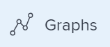
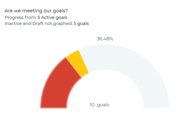
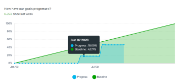

# Review graphs to understand goal progress trends in Adobe Workfront Goals

<!-- drafted mostly for P&P release-->

You can view the overall health of your goals and their progress trend in time in the Graphs section of Adobe Workfront Goals. The charts in this section do not break down the progress of each goal, but instead give you a holistic snapshot of all goals' progress status as well as their progress trend in time during a specified period.

>[!IMPORTANT]
>
>You can see a total count for your goals in the Graphs section for a selected period of time.&nbsp;However, Workfront Goals takes into account only goals with a status of Active and Closed when calculating the overall goal progress status and percent complete.

## Access requirements

You must have the following access to perform the actions described in this article:

<table style="table-layout:auto">
<col>
</col>
<col>
</col>
<tbody>
 <tr> 
   <td role="rowheader">Adobe Workfront plan*</td> 
   <td> 
   
For the new plan and license structure:
  <ul><li>An Ultimate plan </li>
  Or
  <li>An additional license for Adobe Workfront Goals for the Prime or Select Adobe Workfront plans. </li></ul> 

For the current plan and license structure: 
<ul><li> A Pro or higher </li>
  <li>An Adobe Workfront Goals license in addition to a Workfront license.</li></ul>

   </td> 
  </tr>
 <tr>
 <td role="rowheader">Adobe Workfront license*</td>
 <td>
 
New license: Contributor or higher

 Or
 
Current license: Request or higher
 
For more information, see <a href="../../administration-and-setup/add-users/access-levels-and-object-permissions/wf-licenses.md" class="MCXref xref">Adobe Workfront licenses overview</a>.
 </td>
 </tr>
 <tr>
 <td role="rowheader">Product*</td>
 <td>
 
 New product requirement, one of the following: 

<ul>
<li>A Select or Prime Adobe Workfront plan and an additional Adobe Workfront Goals license.</li>
<li>An Ultimate Workfront plan which includes Workfront Goals by default. </li></ul>
 
Or

 
Current product requirement: A Workfront plan and an additional license for Adobe Workfront Goals. 
 
For information, see <a href="../../workfront-goals/goal-management/access-needed-for-wf-goals.md" class="MCXref xref">Requirements to use Workfront Goals</a>. 
 </td>
 </tr>
 <tr>
 <td role="rowheader">
Access level
</td>
 <td> 
Edit access to Goals
 </td>
 </tr>
 <tr data-mc-conditions="">
 <td role="rowheader">Object permissions</td>
 <td>
  

  
View or higher permissions to the goal to view it

  
Manage permissions to the goal to edit it

  
For information about sharing goals, see <a href="../../workfront-goals/workfront-goals-settings/share-a-goal.md" class="MCXref xref">Share a goal in Workfront Goals</a>. 

  
 </td>
 </tr>
 <tr>
   <td role="rowheader">
Layout template
</td>
   <td> 
All users, including Workfront administrators,  must be assigned a layout template that includes the Goals area in the Main Menu. 
  
</td>
  </tr>
</tbody>
</table>

*For more information, see [Access requirements in Workfront documentation](/help/quicksilver/administration-and-setup/add-users/access-levels-and-object-permissions/access-level-requirements-in-documentation.md). 

## Types of graphs in Workfront Goals

The following charts are available in the Graphs section or Workfront Goals: 

<table style="table-layout:auto"> 
 <col> 
 <col> 
 <tbody> 
  <tr> 
   <td role="rowheader">The Goal Health Chart</td> 
   <td> 
A gauge chart that displays the following:
 
    <ul> 
     <li>A total number of goals for the selected period of time. Goals with any status are taken into account. </li> 
     <li>The progress status of goals with a status of Active and Closed.</li> 
    </ul> 
For information about how Workfront Goals calculates progress status, see <a href="../../workfront-goals/goal-management/calculate-goal-progress.md" class="MCXref xref">Overview of goal progress and condition in Adobe Workfront Goals</a>.
 </td> 
  </tr> 
  <tr> 
   <td role="rowheader">The Goal Progress Chart</td> 
   <td> 
A line chart that displays updates made to goals in weekly increments during the goal's duration. The goal progress chart displays the following:
 
    <ul> 
     <li>An average expected and actual percent complete of all&nbsp;active and closed goals in the selected period. The percent complete progress is broken down into weekly increments marked by nodes. </li> 
     <li>The overall average percentage of progress for active and&nbsp;closed goals since the previous week. </li> 
    </ul> 
Tip: The goal progress chart might not display any information when updates are made on the goals outside of the time period selected. 
 </td> 
  </tr> 
 </tbody> 
</table>

## Review goal progress in graphs

1. Click the **Main Menu** icon  > **Goals** in the upper-right corner.

   <!-- Add this when Shell is available to all: or (if available), click the **Main Menu** icon  in the upper-left corner)
   -->

   This opens the Workfront Goals area. 

1. Click **Graphs** in the left panel.

   

   The Graphs section displays.

   By default, the goals displayed in the Graphs section are limited by the following criteria:

   * The filters applied to the Graphs area. 
   * Goals that are in a status of Active and Draft.

1. (Optional) Select the type of information you want to display by updating the filters in the upper-right corner of the Graphs section.

   For more information about filtering goals, see [Filter information in Adobe Workfront Goals](../../workfront-goals/goal-management/filter-information-wf-goals.md).

   >[!TIP]
   >
   >If you selected to display more than one time period, a health chart (gauge) as well as a progress chart (line) displays for each time period.

1. Review the information in the table below when you review the Goal Health Chart.

   

   | Total number of goals |The number at the bottom of the chart indicates the number of all goals in the selected period, in all statuses you selected. |
   |---|---|
   | Average percent complete |At the top of the chart, this number indicates the average percent complete of active and closed goals in the selected time period. |
   | Goals and their progress |The number of goals for each progress status segment, when you hover over the segments of the chart. Only goals in a status of Active or Closed are counted in the segments.  |

   
1. Review the information in the table below when you review the Goal Progress Chart.

   

   <table style="table-layout:auto"> 
    <col> 
    <col> 
    <tbody> 
     <tr> 
      <td>Baseline progress</td> 
      <td>The green slope line indicates the expected overall percent complete average of active and closed goals for the selected time period. All goals within a period are expected to complete, so the baseline progress is always 100% at the end of the period. </td> 
     </tr> 
     <tr> 
      <td>Actual progress</td> 
      <td> 
The blue line indicates the actual overall percent complete average of active and closed goals for the selected time period in weekly increments. Each week during the duration of the goal is marked by a node in the line. 
 </td> 
     </tr> 
    </tbody> 
   </table>

1. Hover a week node in the goal progress chart and review the following:

   * **Week date**: The month, day, and year of the selected week.
   * **Progress**: An average of the actual percent complete of all goals for the selected week.
   * **Baseline**: An average of the expected percent complete of all goals for the selected week.

1. (Optional) Click **Progress** at the bottom of the progress chart to remove the actual overall progress line

   Or

   Click **Baseline** at the bottom of the progress chart to remove the expected progress from the chart.

&nbsp;
