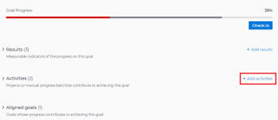
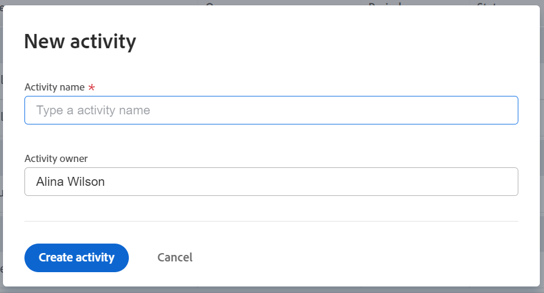

# Add activities to goals in Adobe Workfront Goals

Activities measure the progress of a goal. Without associating results, activities, projects, or aligned goals, you cannot activate a goal and you cannot record progress on it. 

## Access requirements

You must have the following:

<table style="table-layout:auto">
<col>
</col>
<col>
</col>
<tbody>
 <tr> 
   <td role="rowheader">Adobe Workfront plan*</td> 
   <td> 
   
For the new plan and license structure:
  <ul><li>An Ultimate plan </li>
  Or
  <li>An additional license for Adobe Workfront Goals for the Prime or Select Adobe Workfront plans. </li></ul> 

For the current plan and license structure: 
<ul><li> A Pro or higher </li>
  <li>An Adobe Workfront Goals license in addition to a Workfront license.</li></ul>

   </td> 
  </tr>
 <tr>
 <td role="rowheader">Adobe Workfront license*</td>
 <td>
 
New license: Contributor or higher

 Or
 
Current license: Request or higher
 
For more information, see <a href="../../administration-and-setup/add-users/access-levels-and-object-permissions/wf-licenses.md" class="MCXref xref">Adobe Workfront licenses overview</a>.
 </td>
 </tr>
 <tr>
 <td role="rowheader">Product*</td>
 <td>
 
 New product requirement, one of the following: 

<ul>
<li>A Select or Prime Adobe Workfront plan and an additional Adobe Workfront Goals license.</li>
<li>An Ultimate Workfront plan which includes Workfront Goals by default. </li></ul>
 
Or

 
Current product requirement: A Workfront plan and an additional license for Adobe Workfront Goals. 
 
For information, see <a href="../../workfront-goals/goal-management/access-needed-for-wf-goals.md" class="MCXref xref">Requirements to use Workfront Goals</a>. 
 </td>
 </tr>
 <tr>
 <td role="rowheader">Access level*</td>
 <td> 
Edit access to Goals
 </td>
 </tr>
 <tr data-mc-conditions="">
 <td role="rowheader">Object permissions</td>
 <td>
  

  
View or higher permissions to the goal to view it

  
Manage permissions to the goal to edit it

  
For information about sharing goals, see <a href="../../workfront-goals/workfront-goals-settings/share-a-goal.md" class="MCXref xref">Share a goal in Workfront Goals</a>. 

  
 </td>
 </tr>
 <tr>
   <td role="rowheader">
Layout template
</td>
   <td> 
All users, including Workfront administrators,  must be assigned a layout template that includes the Goals area in the Main Menu. 
  
</td>
  </tr>
</tbody>
</table>

*For more information, see [Access requirements in Workfront documentation](/help/quicksilver/administration-and-setup/add-users/access-levels-and-object-permissions/access-level-requirements-in-documentation.md). 

## Prerequisites

You must have an existing goal to add activities to it. 

  For information about creating goals, see [Create goals in Adobe Workfront Goals](../../workfront-goals/goal-management/create-goals.md).

>[!IMPORTANT]
>
>A goal cannot have more than a total of 1000 activities, results, or aligned goals.

For more information about activities, see [Get started with results and activities in Adobe Workfront Goals](../../workfront-goals/results-and-activities/get-started-with-results-and-activities.md).

## Add an activity to a goal

<!--
Adding activities to goals differs depending on which environment you use.

### Add an activity to a goal in the Production environment

1. Go to the goal for which you want to add an activity and click the name to open the **Goal Details** panel.
1. Click **Add activities**.

   

1. From the **Activity Type** drop-down menu, select the type of activity you want to associate with your goal.&nbsp;Select **Manual progress bar** or **Project**. Manual progress bar is the default selection. 
1. (Conditional) Depending on which activity type you selected, do the following:

   1. If you selected **Manual progress bar**:

      1. Start typing a name for your activity in the **Activity** field. 
      1. (Optional) If you want to set the activity owner as someone other than yourself, click your name in the **Owner** field and begin typing the name of the user that you want to assign as the activity owner, then click it when it appears in the drop-down list.

         >[!NOTE]
         >
         >You cannot assign a team or group as an activity owner.

         When you update the progress of an activity, the progress of the goal automatically updates.

   1. If you selected **Project**:

      1. Click the **Connect projects** field.

         Existing projects that you have access to View display in the Connect projects list. Projects that are in a status of Dead do not display in the list. 
      
      1. Click the name of a project to add it as an activity to the goal. You can select several projects at one time.

         Workfront uses the project percent complete of all the attached projects to calculate the progress of the goal.

         For more information about associating projects with goals, see [Add projects to goals in Adobe Workfront Goals](../../workfront-goals/results-and-activities/connect-projects-to-goals-overview.md).

         >[!TIP]
         >
         >   
         >   * The owner of the project becomes the owner of this activity. If the project has no owner, then the activity has no owner. 
         >   * You cannot manually update the progress of a project. Workfront calculates the progress of the project based on the project percent complete. When the project percent complete updates in Workfront this also updates the connected project in Workfront Goals including the percent complete of the goal. 
         >   
         >

1. Click **Save**.

   The activity is saved for the selected goal. After you activate the goal, the progress of the goal automatically updates when you update the progress of an activity or when the percent complete of a project updates. For information about activating a goal, see [Activate goals in Adobe Workfront Goals](../../workfront-goals/goal-management/activate-goals.md).

-->

1. Click the **Main Menu** , then **Goals**. 
1. From the Goal List, click the name of a goal to open the goal's page.
1. Click **Progress indicators** in the left panel.
1. From the New progress indicator drop-down menu, click **Create activity**. 

   The New activity box opens. 

   

1. Enter a name for the activity in the Activity name field. This is a required field. 
1. (Optional) Remove your name from the **Activity owner** field if you want to assign the activity to another user. By default, you are the owner of an activity you create. 

   >[!NOTE]
   >
   >You cannot assign a team, group, or the company as an activity owner.

1. Click **Create activity** to save it and add it to the selected goal. 

   The activity displays in the Progress indicators section of the goal page, under the Activity grouping. 

 
 
 
