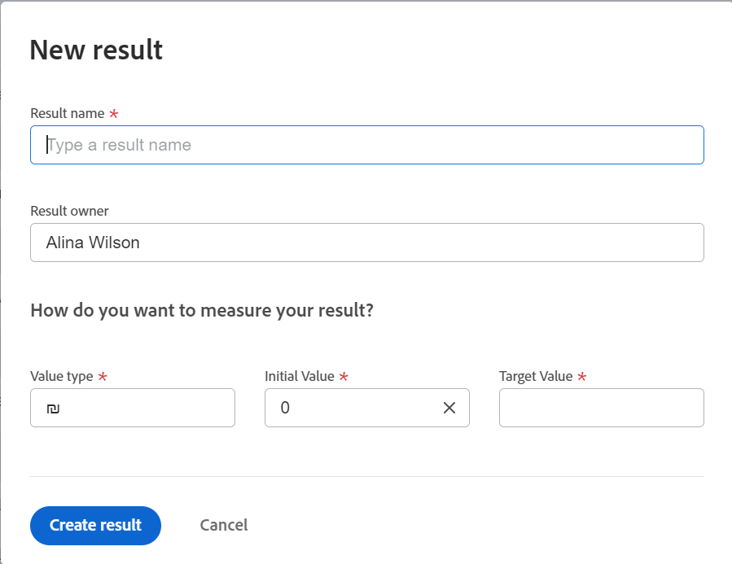

# Add results to goals in Adobe Workfront Goals

<!--drafted for goal redesign: 
The highlighted information on this page refers to functionality not yet generally available. It is available only in the Preview environment. -->

Results measure the progress of a goal. Without associating results, activities, or aligned goals to a goal, you cannot activate the goal and you cannot record progress on it.

## Access requirements

<!--drafted for P&P release: 

<table style="table-layout:auto">
 <col>
 </col>
 <col>
 </col>
 <tbody>
  <tr>
   <td role="rowheader">Adobe Workfront plan*</td>
   <td>
   
Current plan: Select or higher

   Or
   
Legacy plan: Pro or higher

   
   </td>
  </tr>
  <tr>
   <td role="rowheader">Adobe Workfront license*</td>
   <td>
   
Current license: Contributor or higher

   Or
   
Legacy license: Request or higher
 
For more information, see <a href="../../administration-and-setup/add-users/access-levels-and-object-permissions/wf-licenses.md" class="MCXref xref">Adobe Workfront licenses overview</a>.
 </td>
  </tr>
  <tr>
   <td role="rowheader">Product</td>
   <td>
   
 Current product requirement: If you have the Select or Prime Adobe Workfront plan, you must also buy an additional Adobe Workfront Goals license.  Workfront Goals are included in the Ultimate Workfront Plan.

   Or
   
Legacy product requirement: You must purchase an additional license for the Adobe Workfront Goals to access functionality described in this article. 
 
For information, see <a href="../../workfront-goals/goal-management/access-needed-for-wf-goals.md" class="MCXref xref">Requirements to use Workfront Goals</a>. 
 </td>
  </tr>
  <tr>
   <td role="rowheader">Access level*</td>
   <td> 
Edit access to Goals
 
<b>NOTE</b>
If you still don't have access, ask your Workfront administrator if they set additional restrictions in your access level. For information on how a Workfront administrator can change your access level, see:

     <ul>
      <li> 
<a href="../../administration-and-setup/add-users/configure-and-grant-access/create-modify-access-levels.md" class="MCXref xref">Create or modify custom access levels</a> 
 </li>
      <li> 
<a href="../../administration-and-setup/add-users/configure-and-grant-access/grant-access-goals.md" class="MCXref xref">Grant access to Adobe Workfront Goals</a> 
 </li>
     </ul> 
 </td>
  </tr>
  <tr data-mc-conditions="">
   <td role="rowheader">Object permissions</td>
   <td>
    

     
View or higher permissions to the goal to view it

     
Manage permissions to the goal to edit it

     
For information about sharing goals, see <a href="../../workfront-goals/workfront-goals-settings/share-a-goal.md" class="MCXref xref">Share a goal in Workfront Goals</a>. 

    
 </td>
  </tr>
 </tbody>
</table>

-->

You must have the following:

<table style="table-layout:auto"> 
 <col> 
 <col> 
 <tbody> 
  <tr> 
   <td role="rowheader">Adobe Workfront plan*</td> 
   <td> 
Pro or higher
 </td> 
  </tr> 
  <tr> 
   <td role="rowheader">Adobe Workfront license*</td> 
   <td> 
Request or higher
 
For more information, see <a href="../../administration-and-setup/add-users/access-levels-and-object-permissions/wf-licenses.md" class="MCXref xref">Adobe Workfront licenses overview</a>.
 </td> 
  </tr> 
  <tr> 
   <td role="rowheader">Product</td> 
   <td> 
You must purchase an additional license for the Adobe Workfront Goals to access functionality described in this article. 
 
For information, see <a href="../../workfront-goals/goal-management/access-needed-for-wf-goals.md" class="MCXref xref">Requirements to use Workfront Goals</a>. 
 </td> 
  </tr> 
  <tr> 
   <td role="rowheader">Access level configurations*</td> 
   <td> 
Edit access to Goals
 
<b>NOTE</b>
   
   
If you still don't have access, ask your Workfront administrator if they set additional restrictions in your access level. For information on how a Workfront administrator can change your access level, see:
 
     <ul> 
      <li> 
<a href="../../administration-and-setup/add-users/configure-and-grant-access/create-modify-access-levels.md" class="MCXref xref">Create or modify custom access levels</a> 
 </li> 
      <li> 
<a href="../../administration-and-setup/add-users/configure-and-grant-access/grant-access-goals.md" class="MCXref xref">Grant access to Adobe Workfront Goals</a> 
 </li> 
     </ul> 
 </td> 
  </tr> 
  <tr data-mc-conditions=""> 
   <td role="rowheader">Object permissions</td> 
   <td> 
    
 
     
Manage permissions to the goal
 
     
For information about sharing goals, see <a href="../../workfront-goals/workfront-goals-settings/share-a-goal.md" class="MCXref xref">Share a goal in Workfront Goals</a>. 
 
    
 </td> 
  </tr> 
 </tbody> 
</table>

*To find out what plan, license type, or access you have, contact your Workfront administrator.

## Prerequisites

You must have the following before you can start:

* A Layout Template that includes the Goals area in the Main&nbsp;Menu.
* An existing goal.

  For information about creating goals, see [Create goals in Adobe Workfront Goals](../../workfront-goals/goal-management/create-goals.md).

>[!IMPORTANT]
>
>A goal cannot have more than a total of 50 activities, results, or aligned goals.

<!--drafted for goal redesign: replace the one above with this: 

>[!IMPORTANT]
>
>In the production environment, a goal cannot have more than a total of 50 activities, results, or aligned goals.
>In the Preview environment, a goal cannot have more than a total of 1000 activities, results, projects, or aligned goals.
-->

## Add a result to a goal

<!--drafted for goal redesign: 

Adding results to goals differs depending on which environment you use.

### Add a result to a goal in the Production environment

-->

1. Go to the goal for which you want to add a result and click the name to open the **Goal Details** panel.
1. Click **Add results**.

   

1. Start typing the result you want to achieve in the **Result** field. This is the name of the result and it displays wherever the goal displays. 
1. (Optional) If you want to set the Result Owner as someone other than yourself, click your name in the **Owner** field and start typing the name of the user that you want to assign as the owner of the result, then click it when it appears in the drop-down list.

   >[!NOTE]
   >
   >You cannot assign a team or group as a result owner.

1. In the Value drop-down menu, select the type of value that you want to measure your success by.

   

   Select from the following options:

   |Option|Value type|
   |---|---|
   | # |Number value |
   | % |Percentage value |
   |$, CN¥, DKK, KR, Mex$, R, R$, zł, £ , ¥ , &euro; , ₹, ฿, MYR, ₪  |Currency values |

   For example, if you want to increase profit to 8%, and profit is currently at 4%, you can select % as the Measured Value.

   >[!TIP]
   >
   >The result Type is always Metric and cannot be edited.

1. In the Initial field, indicate the value that the result has in the beginning, before any progress on it has been recorded. For example, if you want to increase profit to 8%, and profit is currently at 4%, you can enter 4 as the Starting At value. 
1. In the Target field, indicate the value that the result aims to achieve. For example, if you want to increase profit to 8%, and profit is currently at 4%, you can enter 8 as the Ending At value.
1. Click **Save**.

   The result is saved for the selected goal. The progress of the goal automatically updates when you update the progress of a result.

<!--drafted for goal redesign: 

### Add a result to a goal in the Preview environment

1. Click the Main Menu , then **Goals**. 

1. From the **Goal List**, click the name of a goal to open the goal page.
1. Click **Progress indicators** in the left panel.
1. Expand the **New progress indicator** drop-down menu, then click **Create result**.

   The New result box opens. 

   
   
1. Enter a name for the result in the **Result name** field. This is a required field. 
1. (Optional) Remove your name from the **Result owner** field if you want to assign the result to another user. By default, you are the owner of an activity you create. 
1. In the **How do you want to measure your result?** area, specify the following information:
   * **Value type**: This indicates how you want to measure the progress on the result. You can measure progress numerically, with a percentage value, or using a currency amount. 
   
      Select a value type from the options listed in the following table:

      | Value type                                              | Description      |
      |---------------------------------------------------------|------------------|
      | Number                                                  | Number value     |
      | %                                                       | Percentage value |
      | CN¥,DKK,KR,Mex$, R, R$, zł, £ , ¥ , &euro; , ₹, ฿, MYR, ₪, $ | Currency values  |

   * **Initial Value**: The value that the result has in the beginning, before any progress on it has been recorded.
   * **Target Value**: The value that the result aims to achieve when it is considered completed. 
1. Click **Create result**.
   
   The result displays in the Progress indicators section of the goal page, unde the Result grouping.
   
   After you activate the goal, the progress of the goal automatically updates when you update the progress of a result. For information about activating a goal, see [Activate goals in Adobe Workfront Goals](../goal-management/activate-goals.md). 

-->

