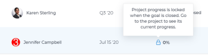

# Add projects to goals in Adobe Workfront Goals

<!--
THIS MIGHT NEED TO BE RENAMED BECAUSE THERE WILL BE OTHER OBJECTS CONNECTED TO GOALS IN THE FUTURE
-->

You can connect projects to goals to indicate how the goal progresses, based on the actual progress of the project. The project becomes a progress indicator for the goal. 

By connecting projects to goals you can tie your organization's strategic planning (goals) to the actual work your people are performing and completing every day (projects). 

>[!IMPORTANT]
>
>Project-level goals created in the Business Case area of a project are not connected to strategic goals created in Workfront Goals. For information about Business Case project goals, see [Create Business Case goals](../../manage-work/projects/define-a-business-case/create-business-case-goals.md).

## Access requirements

You must have the following:

<table style="table-layout:auto">
<col>
</col>
<col>
</col>
<tbody>
 <tr>
 <td role="rowheader">Adobe Workfront plan</td>
 <td>
 
Any

 
 </td>
 </tr>
 <tr>
 <td role="rowheader">Adobe Workfront license*</td>
 <td>
 
New license: Contributor or higher

 Or
 
Current license: Request or higher
 
For more information, see <a href="../../administration-and-setup/add-users/access-levels-and-object-permissions/wf-licenses.md" class="MCXref xref">Adobe Workfront licenses overview</a>.
 </td>
 </tr>
 <tr>
 <td role="rowheader">Product*</td>
 <td>
 
 New product requirement, one of the following: 

<ul>
<li>A Select or Prime Adobe Workfront plan and an additional Adobe Workfront Goals license.</li>
<li>An Ultimate Workfront plan which includes Workfront Goals by default. </li></ul>
 
Or

 
Current product requirement: A Workfront plan and an additional license for Adobe Workfront Goals. 
 
For information, see <a href="../../workfront-goals/goal-management/access-needed-for-wf-goals.md" class="MCXref xref">Requirements to use Workfront Goals</a>. 
 </td>
 </tr>
 <tr>
 <td role="rowheader">Access level</td>
 <td> 
Edit access to Goals
 </td>
 </tr>
 <tr data-mc-conditions="">
 <td role="rowheader">Object permissions</td>
 <td>
  

  
View or higher permissions to the goal to view it

  
Manage permissions to the goal to edit it

  
For information about sharing goals, see <a href="../../workfront-goals/workfront-goals-settings/share-a-goal.md" class="MCXref xref">Share a goal in Workfront Goals</a>. 

  
 </td>
 </tr>
 <tr>
   <td role="rowheader">
Layout template
</td>
   <td> 
All users, including Workfront administrators,  must be assigned a layout template that includes the Goals area in the Main Menu. 
  
</td>
  </tr>
</tbody>
</table>

*For more information, see [Access requirements in Workfront documentation](/help/quicksilver/administration-and-setup/add-users/access-levels-and-object-permissions/access-level-requirements-in-documentation.md). 

## Considerations about connecting projects to goals

* You can add a project that meets the following criteria to a goal:

   * You must have at least permissions to View it.

     >[!NOTE]
     >
     >If you lose your permissions to view the project after you have attached the project to the goal, you can still see project information on the goal, but you can no longer access the project.

   * The project must not be in a status of Dead.

* You can associate multiple projects with a goal.
* You can associate the same project with multiple goals. 
* You cannot manually update the progress of a project from the goal that the project is attached to. Instead, Workfront calculates the percent complete of the project and Workfront Goals calculates the goal progress using this percent complete. This updates the goal in real time after the project percent updates. 
* The project duration can be outside the time period of a goal. If a project lasts longer than the goal's deadline, you can still close your goal and consider it completed, but the goal percent complete will not be 100%. The percent complete of the project no longer updates on the goal. 

<!--this is no longer visible in the new redesigned interface for goals: logged a bug for this: https://experience.adobe.com/#/@adobeinternalworkfront/so:hub-Hub/workfront/issue/63ceb049000080d30022aab9a359f6f1/updates - but confirmed that this will not be brought back at least for now - Jan 2023. 

There is an indication on the goal list that the project no longer updates progress for the goal.

  
-->

* When you delete a project attached to a goal, the project is also deleted from the goal.

  >[!CAUTION]
  >
  >If the goal was active before you deleted the project and there are no other progress indicators on the goal, the goal becomes Inactive.

## Add projects to goals

1. Click the **Main Menu**  (draft this  for Shell: or click the **Main Menu**  in the upper-left corner, if it's available.) , then **Goals**. 
1. From the Goal List, click the name of a goal to open the goal page.
1. Click **Progress indicators** in the left panel.
1. From the **New progress indicator** drop-down menu, click **Add existing project**. 
  
    The Add projects to goal box displays. 
1. (Optional) Update the **View**, **Filter**, or **Grouping** by clicking the respective icons in the upper-right corner of the list to modify the way the list of projects displays. 
1. (Optional) Click the **Search** icon  and start typing the name of a project to quickly find it in the list.
1. Select the projects that you want to add to the goal, then click **Add**. 

    The selected projects are added to the goal and they display in the Progress indicators section of the goal  page, under the **Project** grouping.
    
    After you activate the goal, the progress of the goal automatically updates when the progress of a project updates. For information about activating a goal, see [Activate goals in Adobe Workfront Goals](../goal-management/activate-goals.md).

## Locate project information on goals

The following project information is visible at the goal level in the  Progress indicators section of a goal's page:

<table>
  <tr>
   <td>Project Name
   </td>
   <td>Any changes in the project name also reflect in the connected project.
   </td>
  </tr>
  <tr>
   <td>Project Owner
   </td>
   <td>Any changes in the project owner also reflect in the connected project.
   </td>
  </tr>
    <tr>
   <td>Actual Progress
   </td>
   <td> 
The percent complete of the project. You cannot manually update the project percent complete from the goal. Workfront automatically calculates it based on the percent complete of the tasks. 

   </td>
  </tr>
  <tr>
   <td>Progress
   </td>
   <td>The percent complete of the project represented by a bar. Any change in the percent complete of the project automatically updates the goal progress unless the goal is closed.
   </td>
  </tr>

</table>

## Locate goal information on projects

The following goal information is visible in a project list or report:

| Goal information  |Description  |
|---|---|
| Goals  |A list of all goals that have a project associated with them.  |
| Goal Hierarchy |The hierarchy that a goal belongs to. Only the parents of the goal and the goal display in this field. Children goals do not display.  |
| Number of Linked Goals |The number of goals linked to one project. |
