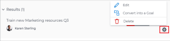
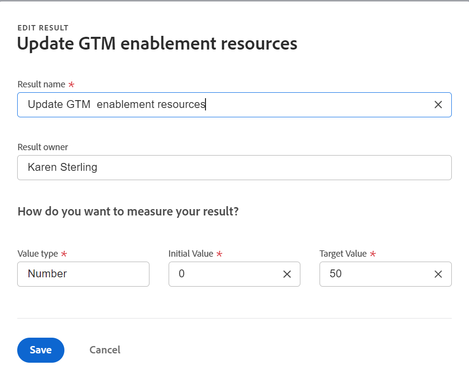
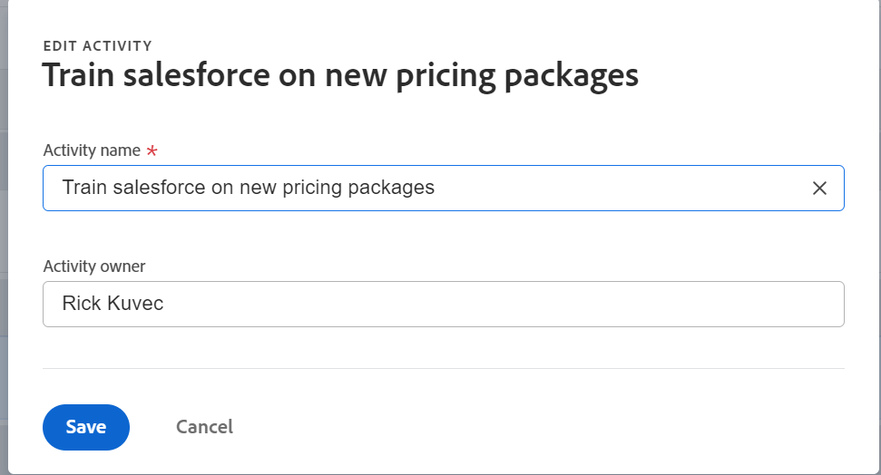

# Edit results and activities in Adobe Workfront Goals

After your Adobe Workfront administrator has granted you the correct access to Adobe Workfront Goals, you can create and edit goals, results, and activities.

For information about creating goals, results and activities, see the following articles:

* [Create goals in Adobe Workfront Goals](../../workfront-goals/goal-management/create-goals.md) 
* [Get started with results and activities in Adobe Workfront Goals](../../workfront-goals/results-and-activities/get-started-with-results-and-activities.md) 
* [Add results to goals in Adobe Workfront Goals](../../workfront-goals/results-and-activities/add-results-to-goals.md) 
* [Add activities to goals in Adobe Workfront Goals](../../workfront-goals/results-and-activities/add-activities-to-goals.md)

## Access requirements

You must have the following:

<table style="table-layout:auto">
<col>
</col>
<col>
</col>
<tbody>
 <tr> 
   <td role="rowheader">Adobe Workfront plan*</td> 
   <td> 
   
For the new plan and license structure:
  <ul><li>An Ultimate plan </li></ul>
   

For the current plan and license structure: 
<ul><li> A Pro or higher </li>
  <li>An Adobe Workfront Goals license in addition to a Workfront license.</li></ul>

   </td> 
  </tr>
 <tr>
 <td role="rowheader">Adobe Workfront license*</td>
 <td>
 
New license: Contributor or higher

 Or
 
Current license: Request or higher
 
For more information, see <a href="../../administration-and-setup/add-users/access-levels-and-object-permissions/wf-licenses.md" class="MCXref xref">Adobe Workfront licenses overview</a>.
 </td>
 </tr>
 <tr>
 <td role="rowheader">Product*</td>
 <td>
 
 New product requirement, one of the following: 

<ul>
<li>A Select or Prime Adobe Workfront plan and an additional Adobe Workfront Goals license.</li>
<li>An Ultimate Workfront plan which includes Workfront Goals by default. </li></ul>
 
Or

 
Current product requirement: A Workfront plan and an additional license for Adobe Workfront Goals. 
 
For information, see <a href="../../workfront-goals/goal-management/access-needed-for-wf-goals.md" class="MCXref xref">Requirements to use Workfront Goals</a>. 
 </td>
 </tr>
 <tr>
 <td role="rowheader">
Access level
</td>
 <td> 
Edit access to Goals
 </td>
 </tr>
 <tr data-mc-conditions="">
 <td role="rowheader">Object permissions</td>
 <td>
  

  
View or higher permissions to the goal to view it

  
Manage permissions to the goal to edit it

  
For information about sharing goals, see <a href="../../workfront-goals/workfront-goals-settings/share-a-goal.md" class="MCXref xref">Share a goal in Workfront Goals</a>. 

  
 </td>
 </tr>
 <tr>
   <td role="rowheader">
Layout template
</td>
   <td> 
All users, including Workfront administrators,  must be assigned a layout template that includes the Goals area in the Main Menu. 
  
</td>
  </tr>
</tbody>
</table>

*For more information, see [Access requirements in Workfront documentation](/help/quicksilver/administration-and-setup/add-users/access-levels-and-object-permissions/access-level-requirements-in-documentation.md).

## Considerations when editing results and activities

<!--
According to Vazgen, access levels will add more considerations.)
-->

* You can edit results and activities that belong to goals you created or to goals that you have permissions to Manage. 
* You cannot edit the progress of projects that are connected to goals as activities from Workfront Goals. Projects progress is updated when tasks in the project are completed. You can remove projects from the goal by disconnecting them. For more information, see the "Disconnect projects" section in the article [Remove results, activities, and projects from goals in Adobe Workfront Goals](../../workfront-goals/results-and-activities/remove-results-activities-from-goals.md).

  >[!NOTE]
  >
  >If the following project information updates at the project level, Workfront Goals automatically updates it at the goal level:
  >
  >   
  >   
  >   * Project owner
  >   * Project name
  >   * Project percent complete
  >   
  >   
  >For information about connecting projects to goals, see [Add projects to goals in Adobe Workfront Goals](../../workfront-goals/results-and-activities/connect-projects-to-goals-overview.md).

* You can delete results and activities from goals when they are no longer relevant to the goal progress. Deleted results and activities cannot be recovered. For information about deleting results and activities, see [Remove results, activities, and projects from goals in Adobe Workfront Goals](../../workfront-goals/results-and-activities/remove-results-activities-from-goals.md).
* You can edit results and activities associated with goals from any time period, including in the past. 
* Editing results and activities updates their settings and does not update their progress. You must update the progress of results and activities. For information about updating progress on goals, results, and activities, see [Update goal progress in Adobe Workfront Goals](../../workfront-goals/goal-review-and-workfront-goals-sections/check-in-goals.md). 

## Edit results

<!--
Editing results differs depending on which environment you use.

### Edit results in the Production environment

1. Go to the goal for which you want to edit a result and click the goal name to open the **Goal Details** panel.
1. Click **Results**.
1. Click the **gear icon**  to the right of the result you want to edit.

   

1. Click **Edit** to edit the following information:

   | Field |Description|
   |---|---|
   | Name |The name of the result. |
   | Owner |The owner of result.  |
   | Value |How you measure the progress of the result. |
   | Initial |The original value of the result. |
   | Target |The desired value when the result is completed. |

1. Click **Save**.
-->

1. Click the **Main Menu** , then **Goals**. 
1. From the Goal List, click the name of a goal to open the goal page.
1. Click **Progress indicators** in the left panel.
1. Select a result in the Progress indicators list and click the **Edit** icon .
   
   The Edit Result box opens. 

   

1. Edit the following information:
    * **Result name**: The name of the result. Use a descriptive name that illustrates what result you need to obtain in order to complete the goal. 
    * **Result owner**: The owner of the result. The owner must be an active Workfront user. 
    * **Value type**: How you measure the progress of the result.
    * **Initial Value**: The original value of the result.
    * **Target Value**: The desired value when the result is completed. 
For more information about result fields, see [Add results to goals](../results-and-activities/add-results-to-goals.md).  
1. Click **Save**.

## Edit activities

<!--
Editing activities differs depending on which environment you use.

### Edit activities in the Production environment

>[!TIP]
>
>You cannot edit the Activity Type after you saved an activity on a goal.

1. Go to the goal for which you want to edit an activity and click the goal name to open the **Goal Details** panel.
1. Click **Activities**.
1. Click the **gear icon**  to the right of the activity you want to edit .

   

1. Click **Edit** to edit the following information:

   | Field |Description |
   |---|---|
   | Name |The name of the activity. |
   | Owner |The owner of activity.  |

1. Click **Save**.
-->

1. Click the **Main Menu** , then **Goals**. 
1. From the Goal List, click the name of a goal to open the goal page.
1. Click **Progress indicators** in the left panel.
1. Select an activity in the Progress indicators list and click the **Edit** icon .

   The Edit Activity box opens.

   

1. Edit the following information:
   * **Activity name**: The name of the activity. Use a descriptive name that illustrates what activity you should perform to indicate that the goal completes. 
    * **Activity owner:** The owner of the activity. The owner must be an active Workfront user.  
For more information about activity fields, see [Add activities to goals](../results-and-activities/add-activities-to-goals.md). 
1. Click **Save**.

