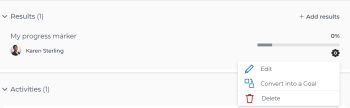
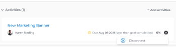

# Remove results, activities, and projects from goals in Adobe Workfront Goals

<!--

(NOTE: the title might change to indicate more than just projects?? Other objects too?)

-->

You can remove results, activities, and projects from goals if they are no longer relevant.

For information about creating goals, and adding results and activities to them, see the following articles:

* [Create goals in Adobe Workfront Goals](../../workfront-goals/goal-management/create-goals.md) 
* [Add activities to goals in Adobe Workfront Goals](../../workfront-goals/results-and-activities/add-activities-to-goals.md) 
* [Add results to goals in Adobe Workfront Goals](../../workfront-goals/results-and-activities/add-results-to-goals.md) 
* [Edit results and activities in Adobe Workfront Goals](../../workfront-goals/results-and-activities/edit-results-and-activities.md)

## Access requirements

You must have the following:

<table style="table-layout:auto"> 
 <col> 
 <col> 
 <tbody> 
  <tr> 
   <td role="rowheader">Adobe Workfront plan*</td> 
   <td> 
Pro or higher
 </td> 
  </tr> 
  <tr> 
   <td role="rowheader">Adobe Workfront license*</td> 
   <td> 
Request or higher
 
For more information, see <a href="../../administration-and-setup/add-users/access-levels-and-object-permissions/wf-licenses.md" class="MCXref xref">Adobe Workfront licenses overview</a>.
 </td> 
  </tr> 
  <tr> 
   <td role="rowheader">Product</td> 
   <td> 
You must purchase an additional license for the Adobe Workfront Goals to access functionality described in this article. 
 
For information, see <a href="../../workfront-goals/goal-management/access-needed-for-wf-goals.md" class="MCXref xref">Requirements to use Workfront Goals</a>. 
 </td> 
  </tr> 
  <tr> 
   <td role="rowheader">Access level configurations*</td> 
   <td> 
Edit access to Goals or higher
 
Note:  
If you still don't have access, ask your Workfront administrator if they set additional restrictions in your access level. For information on how a Workfront administrator can change your access level, see:
 
     <ul> 
      <li> 
<a href="../../administration-and-setup/add-users/configure-and-grant-access/create-modify-access-levels.md" class="MCXref xref">Create or modify custom access levels</a> 
 </li> 
      <li> 
<a href="../../administration-and-setup/add-users/configure-and-grant-access/grant-access-goals.md" class="MCXref xref">Grant access to Adobe Workfront Goals</a> 
 </li> 
     </ul> 
 </td> 
  </tr> 
  <tr data-mc-conditions=""> 
   <td role="rowheader">Object permissions</td> 
   <td> 
    
 
     
Manage permissions to the goal
 
     
For information about sharing goals, see <a href="../../workfront-goals/workfront-goals-settings/share-a-goal.md" class="MCXref xref">Share a goal in Workfront Goals</a>. 
 
    
 </td> 
  </tr> 
 </tbody> 
</table>

&#42;To find out what plan, license type, or access you have, contact your Workfront administrator.

## Prerequisites

You must have the following before you can start:

* A Layout Template that includes the Goals area in the Main&nbsp;Menu.
* A goal with results or activities.

## Considerations for removing results, activities, and disconnecting projects from goals

* You can remove results and activities only from active goals that are in a current or future time period. 
* You can remove results and activities from a goal by deleting them. Deleted results and activities cannot be recovered. 
* When you remove the result or activity from a goal, the progress of the removed result or the activity affects the overall progress of the goal. 
* You cannot delete a project from a goal, but you can disconnect it. By disconnecting the project from the goal the percent complete of the project no longer affects the progress of the goal.

  For information about how projects affect goal progress, see [Overview of connecting projects to goals in Adobe Workfront Goals](../../workfront-goals/results-and-activities/connect-projects-to-goals-overview.md). 

* You cannot remove or disconnect a result or an activity from a goal if they are the last progress indicator for the goal. 
* If a project is the last progress indicator of a goal and it is deleted, the goal becomes Inactive.

## Delete results and activities from goals

Removing results and activities from goals is identical.

1. Click the **Main Menu icon**  in the upper-right corner of your screen, then click **Goals**.

   This opens the Workfront Goals area.

   The Goal List displays by default. 

1. Click the name of a goal you want to remove results and activities from.

   This opens the Goal Details panel on the right.

1. Click **Results** to remove results or **Activities** to remove activities. 

1. Click the **gear icon**  to the right of the result or activity name, then click **Delete** > **Yes, delete**.

   

   The result or activity is deleted and cannot be recovered. The percent complete of the goal updates to exclude the deleted activity or result.

## Disconnect projects from goals

1. Click the **Main Menu** icon  > **Goals** in the upper-right corner of your screen.

   This opens the Workfront Goals area.

   The Goal List displays by default. 

1. Click the name of a goal you want to remove results and activities from.

   This opens the Goal Details panel on the right.

1. Click the **right-pointing arrow** to the left of the Activities sections to expand it. 
1. Click the **gear icon**  to the right of the project name, then click **Disconnect**.

   

   The project is disconnected from the goal. The percent complete of the goal updates to exclude the percent complete of the disconnected project.

