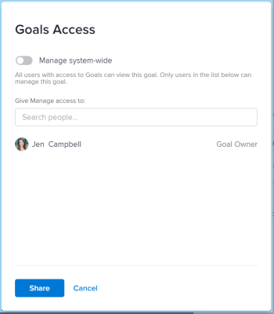

# Share a goal in Adobe Workfront Goals

When you share a goal you give Manage permissions to a goal to someone who did not create it.

## Access requirements

You must have the follwoing: 

<table style="table-layout:auto">
<col>
</col>
<col>
</col>
<tbody>
 <tr> 
   <td role="rowheader">Adobe Workfront plan*</td> 
   <td> 
   
For the new plan and license structure:
  <ul><li>An Ultimate plan </li></ul>
   

For the current plan and license structure: 
<ul><li> A Pro or higher </li>
  <li>An Adobe Workfront Goals license in addition to a Workfront license.</li></ul>

   </td> 
  </tr>
 <tr>
 <td role="rowheader">Adobe Workfront license*</td>
 <td>
 
New license: Contributor or higher

 Or
 
Current license: Request or higher
 </td>
 </tr>
 <tr>
 <td role="rowheader">Product*</td>
 <td>
 
 New product requirement, one of the following: 

<ul>
<li>A Select or Prime Adobe Workfront plan and an additional Adobe Workfront Goals license.</li>
<li>An Ultimate Workfront plan which includes Workfront Goals by default. </li></ul>
 
Or

 
Current product requirement: A Workfront plan and an additional license for Adobe Workfront Goals. 
 
For information, see <a href="../../workfront-goals/goal-management/access-needed-for-wf-goals.md" class="MCXref xref">Requirements to use Workfront Goals</a>. 
 </td>
 </tr>
 <tr>
 <td role="rowheader">Access level</td>
 <td> 
Edit access to Goals
 </td>
 </tr>
 <tr data-mc-conditions="">
 <td role="rowheader">Object permissions</td>
 <td>
  

  
View or higher permissions to the goal to view it

  
Manage permissions to the goal to edit it

  
For information about sharing goals, see <a href="../../workfront-goals/workfront-goals-settings/share-a-goal.md" class="MCXref xref">Share a goal in Workfront Goals</a>. 

  
 </td>
 </tr>
<tr>
   <td role="rowheader">
Layout template
</td>
   <td> 
All users, including Workfront administrators,  must be assigned a layout template that includes the Goals area in the Main Menu. 
  
</td>
  </tr>
</tbody>
</table>

*For more information, see [Access requirements in Workfront documentation](/help/quicksilver/administration-and-setup/add-users/access-levels-and-object-permissions/access-level-requirements-in-documentation.md).

## Considerations about sharing goals

* Users can have the following permissions to a goal:

   <table style="table-layout:auto"> 
   <col> 
   </col> 
   <col> 
   </col> 
   <tbody> 
   <tr> 
      <td role="rowheader">
<b>Goal permissions</b>
</td> 
      <td>
      
<b>Description</b>
 </td> 
   </tr> 
   <tr> 
      <td role="rowheader">
View
</td> 
      <td>
      
Users have permissions to view the goal, but they cannot edit information for the goal, they cannot add or edit information for results, or activities, update status, or delete the goal.
      
      
By default, all users with access to Goals can view all goals in the system. Users can copy the goal, if they have Edit access to Goals in their access level.
 </td> 
   </tr> 
   <tr> 
      <td role="rowheader">
Manage
</td> 
      <td> 
Users can edit all information for the goal, including for the results, or activities, including delete them.
 
      
Only goal creators or users who are specifically given Manage permissions to a goal can manage a goal.
 
      Only users with Manage permissions to a goal can share the goal with others to give them Manage permissions to the goal. 
 </td> 
   </tr> 
   </tbody> 
   </table>

* You can share the following types of goals with others:

   * A goal you created 
   * A goal created by someone else to which you were given permissions to Manage.

* If you have Manage permissions to a goal, you can change the permissions on the goal for the goal creator. By default, they have Manage permissions when they create the goal, but you can change their permissions to View.

## Share a goal

1. Click the **Main Menu** icon  > **Goals** in the upper-right corner.

   <!-- Add this when Shell is available to all: or (if available), click the **Main Menu** icon  in the upper-left corner)
   -->

   The Goal List displays. 

1. Click the name of a goal in the list. The goal page opens. 

1. Click the **More icon** next to the goal name, then click **Share**.

   

   The Goal Access box displays.

   

1. Do one of the following:

   * Select the **Manage system-wide** setting to give Manage permissions to everyone in the system who has Edit access to Goals in their access level. This is deselected by default for all new goals. 
   * Start typing the name of a user that you want to give Manage permissions to in the **Give Manage access to** box. Select the name when it appears in the list.

     >[!TIP]
     >
     >You can only share a goal with other users. You cannot share goals with groups, teams, or your company.

1. Click **Share**.

   The goal is shared with the users you specified. A "System-wide" label or the name of the users who have Manage permissions to the goal display in the Access to Manage field in the Goal Details panel.

## Goal permission options

The following table lists the permissions that you can grant when sharing a goal. For more information about the access users get based on their license, see [Grant access to Adobe Workfront Goals](../../administration-and-setup/add-users/configure-and-grant-access/grant-access-goals.md). 

<table border="1" cellspacing="15" cellpadding="1"> 
 <col> 
 </col> 
 <col> 
 </col> 
 <col> 
 </col> 
 <thead> 
  <tr> 
   <th> 
<strong>Actions</strong> 
 </th> 
   <th> 
<strong>Manage</strong> 
 </th> 
   <th> 
<strong>View</strong> 
 </th> 
  </tr> 
 </thead> 
 <tbody> 
  <tr> 
   <td> 
View goal
 </td> 
   <td> 
✓
 </td> 
   <td> 
✓
 </td> 
  </tr> 
  <tr> 
   <td> 
View results or activities
 </td> 
   <td> 
✓
 </td> 
   <td> 
✓
 </td> 
  </tr> 
  <tr> 
   <td>Copy goal* </td> 
   <td>✓ </td> 
   <td>✓</td> 
  </tr> 
  <tr data-mc-conditions=""> 
   <td>Convert results or activities into other goals*</td> 
   <td>✓</td> 
   <td>✓</td> 
  </tr> 
  <tr> 
   <td>View projects added as activities** </td> 
   <td>✓</td> 
   <td>✓</td> 
  </tr> 
  <tr> 
   <td>Edit goal</td> 
   <td>✓</td> 
   <td> </td> 
  </tr> 
  <tr> 
   <td>Edit results or activities</td> 
   <td>✓</td> 
   <td>&nbsp;</td> 
  </tr> 
  <tr> 
   <td>Add results or activities for the goal</td> 
   <td>✓</td> 
   <td>&nbsp;</td> 
  </tr> 
  <tr> 
   <td>Associate a project as an activity to the goal**</td> 
   <td>✓</td> 
   <td>&nbsp;</td> 
  </tr> 
  <tr> 
   <td> 
Delete goal
 </td> 
   <td> 
✓
 </td> 
   <td> 
&nbsp;
 </td> 
  </tr> 
  <tr> 
   <td> 
Delete results or activities
 </td> 
   <td> 
✓
 </td> 
   <td> 
&nbsp;
 </td> 
  </tr> 
  <tr> 
   <td>Disconnect projects from the goal</td> 
   <td>✓</td> 
   <td>&nbsp;</td> 
  </tr> 
 </tbody> 
</table>

*You must have Edit access to Goals in your access level to be able to convert results and activities to goals.

**You must have access to View Projects and View permission to the projects added or that you want to add to the goal to view them.

For information about project access level, see [Grant access to projects](../../administration-and-setup/add-users/configure-and-grant-access/grant-access-projects.md).

For information about project permissions, see [Share a project in Adobe Workfront](../../workfront-basics/grant-and-request-access-to-objects/share-a-project.md).

&nbsp;
