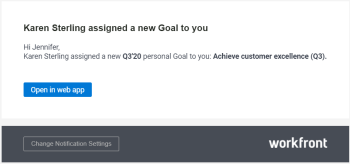

# Enable Adobe Workfront Goals notifications

Adobe Workfront Goals comes with a set of predefined event notifications that you can enable for your account. These event notifications trigger email communication every time the condition defined by the event is met.

For information about what notifications you can enable for Workfront Goals, see [Notifications: Goals](../../workfront-basics/using-notifications/notifications-goals.md).

For information about managing notifications in&nbsp;Adobe Workfront, see [Activate or deactivate your own event notifications](../../workfront-basics/using-notifications/activate-or-deactivate-your-own-event-notifications.md).

<!--
Access requirements You must have the following access to perform the actions described in this article: Adobe Workfront plan* Pro or higher Adobe Workfront license* Request or higher For more information, see Adobe Workfront licenses overview. Product You must purchase an additional license for the Adobe Workfront Goals to access functionality described in this article. For information, see Requirements to use Adobe Workfront Goals. Access level* View or higher access to Goals Note: If you still don't have access, ask your Workfront administrator if they set additional restrictions in your access level. For information on how a Workfront administrator can change your access level, see: Create or modify custom access levels Grant access to Adobe Workfront Goals Object permissions View or higher permissions on goals For information about sharing goals, see Share a goal in Adobe Workfront Goals. *To find out what plan, license type, or access you have, contact your Workfront administrator. Prerequisites: You must have the following before you can start: A Layout Template that includes the Goals area in the Main Menu. Understand Workfront Goals notifications settings Consider the following when configuring and receiving Workfront Goals notifications: They are personal notifications which means that each user can manage their own notifications. The Workfront administrator does not need to enable event notifications before each user can select which ones they want to receive. They trigger as soon as the defined events happen on goals, activities, or results and cannot be part of a daily digest. They trigger regardless of the status of the goal. They do not trigger when you are the initiator of the event described in the notification setting. Configure email notifications for Workfront Goals Log in to Workfront and ensure that your Workfront administrator gave you access to Workfront Goals. For information about access to Workfront Goals, see Requirements to use Adobe Workfront Goals. Click the Main Menu icon in the upper-right corner of your screen, then click Goals. This opens the Workfront Goals area. Click Goal Settings in the left panel. Select any of the check boxes below to enable notifications for the following events: Notification Someone created a new personal Goal for you. This is enabled by default. Tip: A personal goal is a goal where you are designated as the owner. Someone assigned a Result/ an Activity to you. This is enabled by default. Someone left a comment on your Goal Someone liked updates on your Goal Someone liked a comment you left on a Goal Someone liked your Aligned Goal Click Save Settings.
-->

## Example of Workfront Goals email notification

When the event defined by the notification you enabled occurs, you receive an email describing the event. The following is an example of email notifying you that you are assigned as the Owner of a new goal:

