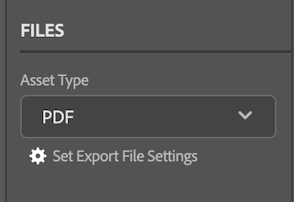

# Upload documents and proofs from the [!DNL Adobe Workfront plugin] to the [!DNL Creative Cloud]

You can upload your projects as documents for a quick review and approval or simply to store in [!DNL Adobe Workfront]. 

>[!NOTE]
>
>Uploading documents and proofs is not currently supported in Premiere Pro, and After Effects.

## Document limitations 

This section outlines known document limitations in the [!DNL Workfront for Adobe Creative Cloud plugins]. 

### New document versions accept only one file for upload 

Because [!DNL Workfront] documents cannot contain multiple files, certain settings must be disabled in order to upload new document versions to Workfront. 

>[!NOTE]
>
>If you must generate multiple files, you can create a proof instead. The new proof will not be associated with the original document.

To change your switch back to a single file in [!DNL InDesign]:

1. Open the **Set Export File Settings** dialog box. 

    

1. Find the Asset Type you wish to export, and adjust the settings as described below: 

    <table>
    <tr>
    <td><strong>PDF and PDF-PRINT</strong>
    </td>
    <td>Deselect <strong>Create Separate PDF Files</strong>.
    </td>
    </tr>
    <tr>
    <td><strong>EPS</strong>
    </td>
    <td>Select <strong>Ranges</strong> and type a single page number. 
    

    <strong>Note</strong>: If you wish to upload the full document, you must create a proof. 
    </td>
    </tr>
    <tr>
    <td><strong>EPUB and EPUB-FIXED</strong>
    </td>
    <td>No adjustments needed.
    </td>
    </tr>
    <tr>
    <td><strong>IDML</strong>
    </td>
    <td>No adjustments needed.
    </td>
    </tr>
    <tr>
    <td><strong>JPG</strong>
    </td>
    <td>Select <strong>Ranges</strong> and type a single page number. 
    

    <strong>Note</strong>: If you wish to upload the full document, you must create a proof. 
    </td>
    </tr>
    <tr>
    <td><strong>PNG</strong>
    </td>
    <td>Select <strong>Ranges</strong> and type a single page number. 
    

    <strong>Note</strong>: If you wish to upload the full document, you must create a proof. 
    </td>
    </tr>
    <tr>
    <td><strong>XML</strong>
    </td>
    <td>No adjustments needed. 
    </td>
    </tr>
    </table>
