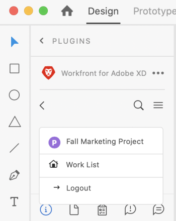

# Upload [!DNL XD] artboards as documents to [!DNL Workfront]

You can upload your artboards as documents for a quick review and approval or simply to store in [!DNL Adobe Workfront].

## Access requirements

+++ Expand to view access requirements for the functionality in this article.

You must have the following access to perform the steps in this article:

<table style="table-layout:auto"> 
 <col> 
 <col> 
 <tbody> 
  <tr> 
   <!-- <td role="rowheader">[!DNL Adobe Workfront] plan*</td> 
   <td> 
[!UICONTROL Pro] or higher
 </td> 
  </tr> 
  <tr data-mc-conditions=""> 
   <td role="rowheader">[!DNL Adobe Workfront] license*</td> 
   <td> 
[!UICONTROL Work] or [!UICONTROL Plan]
 </td> 
  </tr> 
  <tr> -->
   <td role="rowheader">Product</td> 
   <td>You must have an [!DNL Adobe Creative Cloud] license in addition to a [!DNL Workfront] license.</td> 
  </tr> 
  <tr> 
   <td role="rowheader">Access level configurations*</td> 
   <td> 
Edit access to [!UICONTROL Documents]
 
Note: If you still don't have access, ask your [!DNL Workfront] administrator if they set additional restrictions in your access level. For information on how a [!DNL Workfront] administrator can modify your access level, see <a href="../../administration-and-setup/add-users/configure-and-grant-access/create-modify-access-levels.md" class="MCXref xref">Create or modify custom access levels</a>.
 </td> 
  </tr> 
  <tr> 
   <td role="rowheader">Object permissions</td> 
   <td> 
[!UICONTROL View] access or higher to the object where you want to upload a document.
 
For information on requesting additional access, see <a href="../../workfront-basics/grant-and-request-access-to-objects/request-access.md" class="MCXref xref">Request access to objects </a>.
 </td> 
  </tr> 
 </tbody> 
</table>

&#42;To find out what plan, license type, or access you have, contact your [!DNL Workfront] administrator.

+++

## Prerequisites

* You must install the [!DNL Adobe Workfront for XD] plugin before you can upload XD art boards as documents to Workfront.

 For instructions, see [Install [!DNL Adobe Workfront for XD]](/help/quicksilver/workfront-integrations-and-apps/adobe-workfront-for-creative-cloud/wf-adobe-xd-install.md).

## Add a new document

1. Click the **[!UICONTROL Menu]** icon in the top-right corner, then select **[!UICONTROL Work List]**. You can also use the menu to navigate to parent objects.

   

1. Go to the work item where you want to upload a document. 
1. Click the **[!UICONTROL Document]** icon  in the navigation bar. 

1. Click **[!UICONTROL New File]** near the bottom of the plugin.
1. Select the artboard you wish to upload.

   >[!TIP]
   >
   >To select more than one artboard, click and drag the mouse over the artboards you want.
1. (Optional) Type a comment in the **[!UICONTROL Updates]** area. 
1. Choose the **[!UICONTROL Asset Type]** from the drop-down menu:  

   <table style="table-layout:auto">
    <col>
    <col>
    <tbody>
     <tr>
      <td colspan="2" role="rowheader">[!UICONTROL Export Format]</td>
     </tr>
     <tr>
      <td role="rowheader">PNG</td>
      <td>The artboards upload as a PNG to the work item's [!UICONTROL Documents] tab in [!DNL Workfront]. </td>
     </tr>
     <tr>
      <td role="rowheader">JPG</td>
      <td>The artboards upload as a JPG to the work item's [!UICONTROL Documents] tab in [!DNL Workfront].  </td>
     </tr>
     <tr>
      <td role="rowheader">SVG</td>
      <td>The artboards upload as an SVG to the work item's [!UICONTROL Documents] tab in [!DNL Workfront]. </td>
     </tr>
     <tr>
      <td role="rowheader">PDF</td>
      <td>Choose if you want the selected artboards to upload as a <strong>Single PDF file</strong> or <strong>Multiple PDF files</strong>. The artboards uploads as a PDF to the work item's [!UICONTROL Documents] tab in [!DNL Workfront].</td>
     </tr>
    </tbody>
   </table>

1. Click **[!UICONTROL Upload]**.  
   The document appears in the [!UICONTROL Documents] area in the plugin and the desktop app.

## Add a new version

1. Click the **[!UICONTROL Menu]** icon in the top-right corner, then select **[!UICONTROL Work List]**. You can also use the menu to navigate to parent objects.

   

1. Go to the work item where you want to upload a document. 
1. Click the **[!UICONTROL Document]** icon in the navigation bar. 

1. Click on the document you want to add a new version to.
1. Click **[!UICONTROL New version]** near the bottom of the plugin.
1. Select the artboards you wish to upload.

   >[!NOTE]
   >
   >If you want to upload a new version of an SVG, PNG, or JPG, you can upload only one artboard.

1. (Optional) Type a comment in the **[!UICONTROL Updates]** area. 

1. Choose the **[!UICONTROL Asset Type]** from the drop-down menu:  

   <table style="table-layout:auto">
    <col>
    <col>
    <tbody>
     <tr>
      <td colspan="2" role="rowheader">Export Format</td>
     </tr>
     <tr>
      <td role="rowheader">PNG</td>
      <td>The artboard uploads as a PNG to the work item's [!UICONTROL Documents] tab in [!DNL Workfront]. </td>
     </tr>
     <tr>
      <td role="rowheader">JPG</td>
      <td>The artboard uploads as a JPG to the work item's [!UICONTROL Documents] tab in [!DNL Workfront].  </td>
     </tr>
     <tr>
      <td role="rowheader">SVG</td>
      <td>The artboard uploads as an SVG to the work item's [!UICONTROL Documents] tab in [!DNL Workfront]. </td>
     </tr>
     <tr>
      <td role="rowheader">PDF</td>
      <td>
The artboards upload as a PDF to the work item's [!UICONTROL Documents] tab in [!DNL Workfront].

      
<strong>Note</strong>: You can upload only one artboard for a new document version.

      </td>
     </tr>
    </tbody>
   </table>

1. Click **[!UICONTROL Upload]**.  
   The document appears in the [!UICONTROL Documents] area in the plugin and the desktop app.
