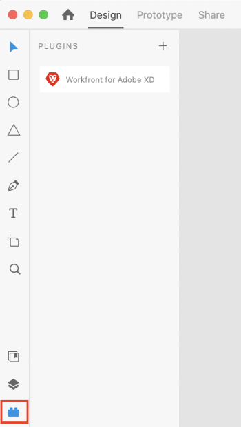

# Install and open [!DNL Adobe Workfront for XD]

You can install the [!DNL Adobe Workfront for XD] plugin from the Adobe Marketplace. The plugin supports the following languages:

* English
* French
* German
* Italian
* Spanish
* Portuguese
* Japanese
* Simplified Chinese
* Traditional Chinese
* Korean

## Access requirements

+++ Expand to view access requirements for the functionality in this article.

You must have the following access to perform the steps in this article:

<table style="table-layout:auto"> 
 <col> 
 </col> 
 <col> 
 </col> 
 <tbody> 
 <!-- <tr> 
   <td role="rowheader">[!DNL Adobe Workfront] plan*</td> 
   <td> 
[!UICONTROL Pro] or higher
 </td> 
  </tr> 
  <tr data-mc-conditions=""> 
   <td role="rowheader">[!DNL Adobe Workfront] license*</td> 
   <td> 
[!UICONTROL Work] or [!UICONTROL Plan]
 </td> 
  </tr> -->
  <tr> 
   <td role="rowheader">Product</td> 
   <td>
You must have an [!DNL Adobe Creative Cloud] license in addition to a [!DNL Workfront] license.

For more information, see <a href="https://helpx.adobe.com/support/programs/cc-support-policy.html#cce" class="MCXref xref" xrefformat="{para}">Creative Cloud Support Policy</a>.
</td> 
  </tr> 
 </tbody> 
</table>

&#42;To find out what plan, license type, or access you have, contact your [!DNL Workfront] administrator.

+++

## Prerequisites

* You must install the [!DNL Adobe XD] app before installing the Workfront plugin.

## Install the [!DNL Adobe Workfront for XD] plugin for your organization

If you are an [!DNL Adobe Admin Console] administrator, you can include the plugin in [!DNL Creative Cloud] deployment packages. For more information, see [Including plugins in your package](https://helpx.adobe.com/in/enterprise/using/manage-extensions.html).

[View a video tutorial here](https://www.youtube.com/watch?v=zzvXNLIBzrc){target=_blank}.

[!DNL Adobe Admin Console] administrators can also create plugin-only packages for distribution to users. For more information, see [Create [!UICONTROL [!DNL Adobe Workfront] for [!DNL Creative Cloud]] packages for your users in the [!DNL Adobe Admin Console]](/help/quicksilver/administration-and-setup/configure-integrations/create-plugin-only-packages.md)

## Install the [!DNL Adobe Workfront for XD] plugin individually

You can install the [!DNL Adobe Workfront for XD] plugin for yourself from the [!DNL Adobe Exchange].

1. Go to the [Adobe Workfront for XD install page](https://exchange.adobe.com/apps/cc/4c3566f9?pluginId=4c3566f9&workflow=share) on the Adobe Exchange.
1. In the dialog that appears, click **Open [!DNL Adobe Creative Cloud] desktop app**.
1. Once [!DNL Adobe XD] plugin manager opens, click **[!UICONTROL Install]**.
1. Read the information in the dialog box, then click **[!UICONTROL OK]**.
1. Continue to the following section for information on how to open the plugin.

## Open the [!DNL Adobe Workfront for XD] plugin

1. Open [!DNL Adobe XD].

1. Create a new file, or open an existing one.  

1. In the bottom-left corner, click the **Plugins** icon.

 

1. In the **[!UICONTROL Plugins Panel]**, find **[!UICONTROL Adobe Workfront for XD]**.

1. Continue to the following section for information on how to log in to the plugin.       

## Log In to [!DNL Adobe Workfront for XD]

1. Ensure the Plugin panel is open, then click **[!DNL Adobe Workfront for XD]**.
1. Enter your domain, then click **[!UICONTROL Log in]**. A browser page opens.

   >[!TIP]
   >
   >* To find your domain, open a browser, navigate to your [!DNL Workfront] instance, and copy the first part of the URL:  
   >   
   >
   > * If your Workfront instance is integrated with Experience Cloud, ask your admin to provide you with the Workfront domain found under Product > Workfront in the Admin Console.

1. In the browser, enter your [!DNL Workfront] credentials, then click **[!DNL Log in]**. If your company uses a single sign-on (SSO), you'll be directed to your SSO provider's page to log in.

   >[!NOTE]
   >
   >You may not be prompted to enter your [!DNL Workfront] credentials if you logged in recently.

   Follow the prompts to log in to [!DNL Workfront].

   >[!NOTE]
   >
   >* [!DNL Workfront] connects to [!DNL Adobe Creative Cloud] using OAuth 2.0, a secure standard used by most web-based integrations for the authentication and authorization of users.
   >* When you are prompted to enter the [domain or host] of your [!DNL Workfront] account, type it using this format: *yourCompany'sDomain.my.workfront.com*. Your company's domain is usually the name of your company.  

1. Click **[!UICONTROL Allow Access]** to finish logging in, and go back to [!DNL Adobe XD] to see your work.

&nbsp;
