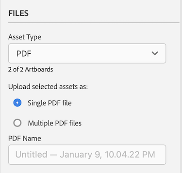
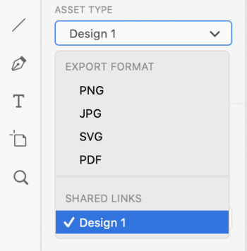
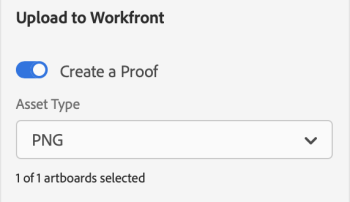

# Upload [!DNL XD] artboards as proofs to [!DNL Workfront]

You can upload your artboards as proofs directly to [!DNL Adobe Workfront] for a thorough review and approval.

## Access requirements

+++ Expand to view access requirements for the functionality in this article.

You must have the following access to perform the steps in this article:

<table style="table-layout:auto"> 
 <col> 
 <col> 
 <tbody> 
  <tr> 
   <td role="rowheader">[!DNL Adobe Workfront] plan*</td> 
   <td> 
Current plan: [!UICONTROL Pro] or Higher
 
or
 
Legacy plan: [!UICONTROL Premium]
 
For more information about proofing access with the different plans, see .
 </td> 
  </tr> 
  <tr> 
   <td role="rowheader">[!DNL Adobe Workfront] license*</td> 
   <td> 
Current plan: [!UICONTROL Work] or [!UICONTROL Proof]
 
Legacy plan: Any (You must have proofing enabled for the user)
 </td> 
  </tr> 
  <tr> 
   <td role="rowheader">Product</td> 
   <td>You must have an [!DNL Adobe Creative Cloud] license in addition to a [!DNL Workfront] license.</td> 
  </tr> 
  <tr> 
   <td role="rowheader">Proof Permission Profile </td> 
   <td>[!UICONTROL Manager] or higher</td> 
  </tr> 
  <tr> 
   <td role="rowheader">Object permissions</td> 
   <td> 
Edit access to [!UICONTROL Documents]
 
For information on requesting additional access, see <a href="../../workfront-basics/grant-and-request-access-to-objects/request-access.md" class="MCXref xref">Request access to objects </a>.
 </td> 
  </tr> 
 </tbody> 
</table>

&#42;To find out what plan, role, or Proof Permission Profile you have, contact your [!DNL Workfront] or [!DNL Workfront Proof] administrator.

+++

## Prerequisites

* You must install the [!DNL Adobe Workfront for XD] plugin before you can upload proofs in [!DNL Adobe XD].

  For instructions, see [Install [!DNL Adobe Workfront for XD]](/help/quicksilver/workfront-integrations-and-apps/adobe-workfront-for-creative-cloud/wf-adobe-xd-install.md).

## Upload a static Proof

1. Click the **[!UICONTROL Menu]** icon in the top-right corner, then select **[!UICONTROL Work List]**. You can also use the menu to navigate to parent objects.

   

1. Go to the work item where you want to upload a static proof.
1. Click the **[!UICONTROL Document]** icon  in the navigation bar. 

1. Click **[!UICONTROL New File]** near the bottom of the plugin.
1. Select the artboards you wish to upload.

   >[!TIP]
   >
   >* Artboards will appear in the proof in the order they were selected. The first selected artboard will be the first page in the proof, and so on.
   >* To quickly select more than one artboard, click and drag the mouse over the artboards you want. This does not allow you to control the order of artboards in the proof.

1. Enable **[!UICONTROL Create a Proof]**.

1. Name the proof.

1. Choose the type of proof approval you want:

   <table style="table-layout:auto"> 
    <col> 
    <col> 
    <tbody> 
     <tr> 
      <td role="rowheader">[!UICONTROL Basic]: </td> 
      <td> 
Basic approval processes are ad-hoc and can include different reviewers as needed: 
 
       <ul> 
        <li> 
(Optional) Add <strong>Approvers</strong> in the box.
 </li> 
       </ul> </td> 
     </tr> 
     <tr> 
      <td role="rowheader">[!UICONTROL Automated]</td> 
      <td> 
Automated approval processes are pre-built by administrators and include specific reviewers and stages. For more information, see <a href="../../review-and-approve-work/proofing/proofing-overview/automated-workflow.md" class="MCXref xref">Automated Workflow overview</a>.
 
       <ul> 
        <li> 
Choose a [!UICONTROL Workflow Template] from the drop-down menu.
 </li> 
       </ul> </td> 
     </tr> 
    </tbody> 
   </table>

{{adjust-proof-settings}}

1. (Optional) Type a comment in the **[!UICONTROL Updates]** area.

   

1. Choose the export format from the **[!UICONTROL Asset Type]** drop-down menu.

1. (Optional) If you select PDF as the asset type and have more than one artboard selected, choose if you want to export your artboards as **[!UICONTROL Single PDF file]s** or **M[!UICONTROL ultiple PDF files]**.

1. (Optional) Name the PDF. 

   

1. Click **[!UICONTROL Upload]**.  
   The document appears in the [!UICONTROL Documents] area in the plugin and the desktop app.

## Upload an interactive proof {#upload-an-interactive-proof}

You can create an interactive proof for your artboards with the [!DNL Workfront for Adobe] plugin. It is a 2-step process. First you need to create an interactive link, then you need to upload the proof to a work item.

### Create an interactive link for your artboard  {#create-an-interactive-link-for-your-art-board}

1. Open your artboard, then click **[!UICONTROL Share]** in the top-left area of the screen.
1. Specify the link settings:

   1. Name the link.
   1. Choose a view setting.
   1. In the **[!UICONTROL Link Access]** section, ensure **[!UICONTROL Anyone with this link]** is selected.

      You must enable this type of access in order to generate an interactive proof. 
   
   1. Click **[!UICONTROL Create Link]**.

1. Click back to **[!UICONTROL Design]** in the top-left area of the screen. Continue to the [Upload an interactive proof](#upload-an-interactive-proof) section below.

   >[!NOTE]
   >
   >You may need to reopen the plugin panel in the bottom-left corner of the screen.

### Upload an interactive proof

1. Click the **[!UICONTROL Menu]** icon in the top-right corner, then select **[!UICONTROL Work List]**. You can also use the menu to navigate to parent objects.

   

1. Go to the work item where you want to upload an interactive proof.
1. Click the **[!UICONTROL Document]** icon  in the navigation bar. 

1. Click **[!UICONTROL New File]** near the bottom of the plugin.
1. Enable **[!UICONTROL Create a Proof]**.

1. Choose the type of proof approval you want:

   <table style="table-layout:auto"> 
    <col> 
    <col> 
    <tbody> 
     <tr> 
      <td role="rowheader">[!UICONTROL Basic]: </td> 
      <td> 
Basic approval processes are ad-hoc and can include different reviewers as needed: 
 
       <ul> 
        <li> 
(Optional) Add <strong>Approvers</strong> in the box.
 </li> 
       </ul> </td> 
     </tr> 
     <tr> 
      <td role="rowheader">[!UICONTROL Automated]</td> 
      <td> 
Automated approval processes are pre-built by administrators and include specific reviewers and stages. For more information, see <a href="../../review-and-approve-work/proofing/proofing-overview/automated-workflow.md" class="MCXref xref">Automated Workflow overview</a>.
 
       <ul> 
        <li> 
Choose a [!UICONTROL Workflow Template] from the drop-down menu.
 </li> 
       </ul> </td> 
     </tr> 
    </tbody> 
   </table>

{{adjust-proof-settings}}

1. (Optional) Type a comment in the **[!UICONTROL Updates]** area.

   

1. In the **[!UICONTROL Asset Type]** drop-down menu, choose the link you just created under the **Shared links** tab. For more information, see [Create an interactive link for your artboard](#create-an-interactive-link-for-your-artboard).  
   

1. Click **[!UICONTROL Upload]**.

   The document appears in the [!UICONTROL Documents] area in the plugin and the desktop app.

   >[!IMPORTANT]
   >
   >Users must have access to the [!UICONTROL Desktop Proofing Viewer] to review and approve interactive proofs. For more information, see [Install the [!UICONTROL Desktop Proofing Viewer]](../../review-and-approve-work/proofing/use-the-desktop-proofing-viewer/installing-desktop-proofing-viewer.md).

## Upload a new proof version

You can upload a new version of a proof. The plugin remembers the proofing workflow set on the previous version, but you can change this if you wish.

1. Click the **[!UICONTROL Menu]** icon in the top-right corner, then select **[!UICONTROL Work List]**. You can also use the menu to navigate to parent objects.

   

1. Go to the work item you need to upload a document to.
1. Click the **[!UICONTROL Document]** icon in the navigation bar. 

1. Click **[!UICONTROL New Version]** near the bottom of the plugin.
1. Enable **[!UICONTROL Create a Proof]**.
1. Select the artboards you wish to upload.

   >[!NOTE]
   >
   >If you want to upload a new version of an .svg, .png, or .jpg, you can upload only one artboard.

1. Choose the type of proof approval you want:

   <table style="table-layout:auto"> 
    <col> 
    <col> 
    <tbody> 
     <tr> 
      <td role="rowheader">[!UICONTROL Basic]: </td> 
      <td> 
Basic approval processes are ad-hoc and can include different reviewers as needed: 
 
       <ul> 
        <li> 
(Optional) Add <strong>Approvers</strong> in the box.
 </li> 
       </ul> </td> 
     </tr> 
     <tr> 
      <td role="rowheader">[!UICONTROL Automated]</td> 
      <td> 
Automated approval processes are pre-built by administrators and include specific reviewers and stages. For more information, see <a href="../../review-and-approve-work/proofing/proofing-overview/automated-workflow.md" class="MCXref xref">Automated Workflow overview</a>.
 
       <ul> 
        <li> 
Choose a [!UICONTROL Workflow Template] from the drop-down menu.
 </li> 
       </ul> </td> 
     </tr> 
    </tbody> 
   </table>

{{adjust-proof-settings}}

1. Choose the export format from the **[!UICONTROL Asset Type]** drop-down menu.

   

1. (Optional) Type a comment in the **[!UICONTROL Updates]** area.

    

1. (Optional) If you select PDF as the asset type and have more than one artboard selected, choose if you want to export your artboards as **[!UICONTROL Single PDF file]s** or **M[!UICONTROL ultiple PDF files]**.

1. (Optional) Name the PDF. 

   

1. Click **[!UICONTROL Upload]**.  
   The document appears in the [!UICONTROL Documents] area in the plugin and the desktop app.
