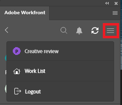
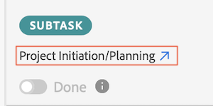
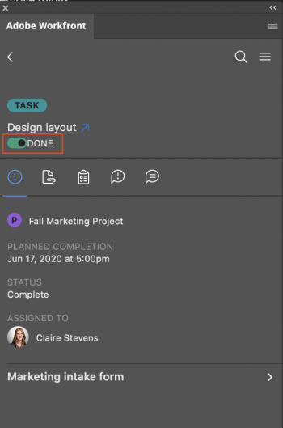

# Mark work items complete using the [!DNL Adobe Workfront] plugin

You can stay in the following [!DNL Adobe Creative Cloud] applications and seamlessly complete your work in [!DNL Adobe Workfront] with the plugin:

{{cc-app-list}}

## Access requirements

+++ Expand to view access requirements for the functionality in this article.

You must have the following access to perform the steps in this article:

<table style="table-layout:auto"> 
 <col> 
 <col> 
 <tbody> 
  <tr> 
   <!-- <td role="rowheader">[!DNL Adobe Workfront] plan*</td> 
   <td> 
[!UICONTROL Pro] or higher
 </td> 
  </tr> 
  <tr data-mc-conditions=""> 
   <td role="rowheader">[!DNL Adobe Workfront] license*</td> 
   <td> 
Work or higher
 </td> 
  </tr> --> 
  <tr> 
   <td role="rowheader">Product</td> 
   <td>You must have an [!DNL Adobe Creative Cloud] license in addition to a [!DNL Workfront] license.</td> 
  </tr> 
  <tr> 
   <td role="rowheader">Object permissions</td> 
   <td> 
[!UICONTROL Edit] access to the object you want to complete.
 
For information on requesting additional access, see <a href="../../workfront-basics/grant-and-request-access-to-objects/request-access.md" class="MCXref xref">Request access to objects </a>.
 </td> 
  </tr> 
 </tbody> 
</table>

To find out what plan, license type, or access you have, contact your [!DNL Workfront] administrator.

+++

## Prerequisites

{{cc-install-prereq}}

## Complete a work item

1. Click the **[!UICONTROL Menu]** icon in the top-right corner, then select **[!UICONTROL Work List]**. You can also use the menu to navigate to parent objects.

   

1. From the **[!UICONTROL Work List]**, select the task or issue you wish to mark complete. 
1. Click **[!UICONTROL Done]**.  If you are the only user assigned to this task or issue, this marks the item [!UICONTROL Complete] or [!UICONTROL Resolved] in [!DNL Workfront].
1. (Conditional) If multiple users are assigned to this task or issue, clicking [!UICONTROL Done] opens a dropdown. You can then:

   Click **[!UICONTROL Done with my part]** if other users must also do their work for the task or issue to be complete.

   Or

   Click **[!UICONTROL Complete]** (for tasks) or **[!UICONTROL Resolved]** (for issues) if no further work needs to be done on the task or issue. This marks the item [!UICONTROL Complete] or [!UICONTROL Resolved] in [!DNL Workfront].  

   >[!NOTE]
   >
   >If the work item has predecessors, the Done button is gray until those predecessors are marked complete. To view predecessors inside of [!DNL Workfront], click on the task name.
   >

  <!-- I dont think we need this one  -->
