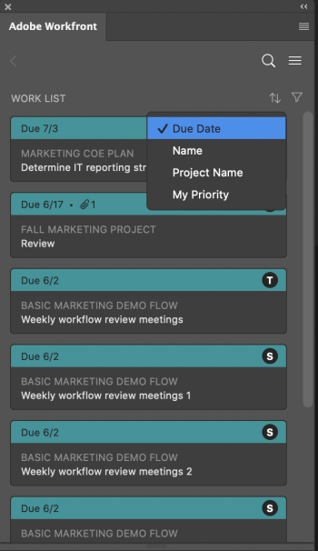
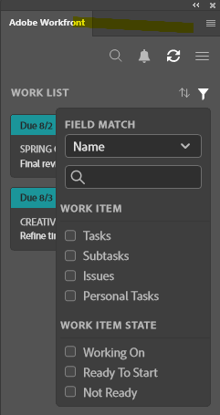
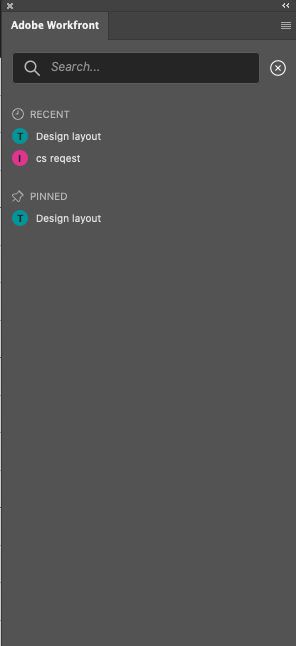

# Find your work in [!DNL Adobe Photoshop]

Find the work assigned to you in [!DNL Adobe Workfront] without leaving [!DNL Adobe Photoshop].

## Access requirements

You must have the following access to perform the steps in this article:

<table style="table-layout:auto"> 
 <col> 
 <col> 
 <tbody> 
  <tr> 
   <td role="rowheader">[!DNL Adobe Workfront] plan*</td> 
   <td> 
Pro or higher
 </td> 
  </tr> 
  <tr data-mc-conditions=""> 
   <td role="rowheader">[!DNL Adobe Workfront] license*</td> 
   <td> 
Work or Plan
 </td> 
  </tr> 
  <tr> 
   <td role="rowheader">Product</td> 
   <td>You must have an [!DNL Adobe Creative Cloud] license in addition to a [!DNL Workfront] license.</td> 
  </tr> 
 </tbody> 
</table>

&#42;To find out what plan, license type, or access you have, contact your [!DNL Workfront] administrator.

## Prerequisites

* You must install the [!DNL Workfront for Adobe Photoshop] plugin before you can find your work in Adobe Photoshop.

   For instructions, see [Install [!DNL Workfront for Adobe Photoshop]](../../workfront-integrations-and-apps/adobe-workfront-for-creative-cloud/wf-cc-install.md).

## Use the [!UICONTROL Work List] to access important information

The [!UICONTROL Work List] allows you to view all of the tasks and issues assigned to you in one place. You can use the [!UICONTROL Sort by] option to group items together and then use the Filter to focus in on work that needs to be completed.

### Group similar work items together with the [!UICONTROL Sort By] option

Use the [!UICONTROL Sort by] option to group similar items in the Work List. You can sort by:

<table style="table-layout:auto"> 
 <col> 
 <col> 
 <tbody> 
  <tr> 
   <td> 
    <ul> 
     <li>[!UICONTROL Due Date]</li> 
     <li>[!UICONTROL Name]</li> 
     <li>[!UICONTROL Project Name]</li> 
     <li>[!UICONTROL My Priority]</li> 
    </ul> </td> 
   <td>  </td> 
  </tr> 
 </tbody> 
</table>

### Narrow your focus with filters

Use the Filter to narrow your focus to specific work items. There are a couple of ways to use the filter:

&nbsp;

<table style="table-layout:auto"> 
 <col> 
 <col> 
 <tbody> 
  <tr> 
   <td> 
The first is filtering based solely on work item type or attributes:
 
    <ul> 
     <li><strong>Work item</strong>: Tasks, Subtasks, Issues, or Personal tasks</li> 
     <li><strong>Work item state</strong>: [!UICONTROL Working On], [!UICONTROL Ready to Start], or [!UICONTROL Not Ready]</li> 
    </ul> 
The second is filtering using work item and work item state together. For example, you can select [!UICONTROL Tasks] and [!UICONTROL Ready to Start] to find all of the tasks in your work list that are ready for work.
 
You can also use [!DNL Field Match] to search for a specific item within your filter set. 
 </td> 
   <td>  </td> 
  </tr> 
 </tbody> 
</table>

## Search for your work

Use the Search bar to locate projects, tasks, issues, and documents you need.

<table style="table-layout:auto"> 
 <col> 
 <col> 
 <tbody> 
  <tr> 
   <td> 
    <ul> 
     <li>See recent items: You can view up to 5 of your most recent work items accessed through [!DNL Workfront] or the [!DNL Photoshop] plugin.</li> 
     <li>Locate pinned items: You can access projects, tasks, issues, and documents you've pinned in the new [!DNL Adobe Workfront] experience.</li> 
     <li>Find your favorites: You can see any project, task, issue, or document you saved as a favorite.</li> 
    </ul> </td> 
   <td>  </td> 
  </tr> 
 </tbody> 
</table>

## Use the [!UICONTROL Menu] to navigate projects

You can use the [!UICONTROL Menu] icon to navigate to parent items in a project.

