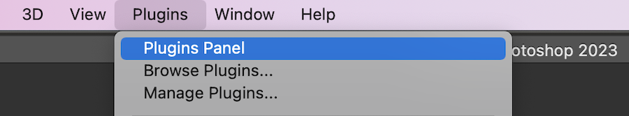
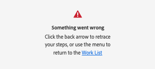
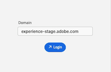

# Install and open [!DNL Adobe Workfront for Photoshop]

You can install the [!DNL Adobe Workfront for Photoshop] plugin from the [!DNL Adobe Marketplace]. The plugin supports the following languages:

* English
* French
* German
* Italian
* Spanish
* Portuguese
* Japanese
* Simplified Chinese
* Traditional Chinese
* Korean 

## Access requirements

+++ Expand to view access requirements for the functionality in this article.

<table style="table-layout:auto"> 
 <col> 
 <col> 
 <tbody> 
  <tr> 
   <td role="rowheader">Additional products</td> 
   <td>
You must have an [!DNL Adobe Creative Cloud] license in addition to a [!DNL Workfront] license.
</td> 
  </tr> 
 </tbody> 
</table>

For information, see [Access requirements in Workfront documentation](/help/quicksilver/administration-and-setup/add-users/access-levels-and-object-permissions/access-level-requirements-in-documentation.md). 

+++

## Prerequisites

* You must install the [!DNL Adobe Photoshop] app before you install the [!DNL Workfront] plugin.

## Install the [!DNL Adobe Workfront for Photoshop] plugin for your organization

If you are an [!DNL Adobe Admin Console] administrator, you can include the plugin in [!DNL Creative Cloud] deployment packages. For more information, see [Including plugins in your package](https://helpx.adobe.com/in/enterprise/using/manage-extensions.html).

[View a video tutorial here](https://www.youtube.com/watch?v=zzvXNLIBzrc){target=_blank}.

[!DNL Adobe Admin Console] administrators can also create plugin-only packages for distribution to users. For more information, see [Create [!UICONTROL [!DNL Adobe Workfront] for [!DNL Creative Cloud]] packages for your users in the [!DNL Adobe Admin Console]](/help/quicksilver/administration-and-setup/configure-integrations/create-plugin-only-packages.md)

## Install the [!DNL Adobe Workfront for Photoshop] plugin individually

You can install the [!DNL Adobe Workfront for Photoshop] plugin for yourself from the [!DNL Adobe Exchange].

1. Go to the [Adobe Workfront for Photoshop install page](https://adobe.com/go/cc_plugins_discover_plugin?pluginId=37722a55&workflow=share) on the Adobe Exchange.
1. In the dialog that appears, click **Open [!DNL Adobe Creative Cloud] desktop app**.
1. Once [!DNL Adobe Photoshop] plugin manager opens, click **[!UICONTROL Install]**.
1. Read the information in the dialog box, then click **[!UICONTROL OK]**, and follow any on-screen instructions to complete the installation.

1. Continue to the following section for information on how to open the plugin.

## Open the [!DNL Adobe Workfront for Photoshop] plugin

1. Open [!DNL Photoshop].

1. Create a new file, or open an existing one.  

1. In the top menu, click **[!UICONTROL Plugins]** > **[!UICONTROL Plugins Panel]**.

   

1. In the **[!UICONTROL Plugins Panel]**, choose the **[!UICONTROL Plugins]** tab and find **[!UICONTROL Workfront for Adobe Photoshop]**.

   >[!TIP]
   >
   >   If you don't see the plugin after opening it from the [!UICONTROL Plugins Panel], it could be behind the Photoshop app. Try minimizing the Photoshop to find the plugin.      

1. Continue to the following section for information on how to log in to the plugin.           

## Log In to [!DNL Adobe Workfront for Photoshop]

1. From the **[!UICONTROL Plugins]** menu at the top of the screen, select **[!UICONTROL Plugin Panel]**.
1. Select **[!DNL Adobe Workfront for Photoshop]**.
1. Enter your domain, then click **[!UICONTROL Log in]**. A browser page opens. You may have to give Photoshop permission to open the browser.

   >[!TIP]
   >
   >* To find your domain, open a browser, navigate to your [!DNL Workfront] instance, and copy the first part of the URL:  
   >   
   >
   >* If your Workfront instance is integrated with Experience Cloud and the domain begins with `experience.adobe.com`, ask your admin to provide you with the Workfront domain found under Product > Workfront in the Admin Console.

1. In the browser, enter your [!DNL Adobe] credentials, then click **[!UICONTROL Log in]**. If your company uses a single sign-on (SSO), you'll be directed to your SSO provider's page to log in.

   >[!NOTE]
   >
   >You may not be prompted to enter your [!DNL Workfront] credentials if you logged in recently.

1. Follow the prompts to log in to [!DNL Workfront].

   >[!NOTE]
   >
   >* [!DNL Workfront] connects to [!DNL Adobe Creative Cloud] using OAuth 2.0, a secure standard used by most web-based integrations for the authentication and authorization of users.

1. Click **[!UICONTROL Allow Access]** to finish logging in.
1. Go back to [!UICONTROL Adobe Photoshop] to see your work.

### Troubleshooting log in errors

**"Something went wrong" error displays when trying to log in**

You can't use a URL that starts with `experience.adobe.com` to log into the plugin. 

 

To fix this issue, 

1. Delete the folder that stores the domain for the plugin.

   >[!TIP]
   >
   >On a Mac, Go to Finder, press **Command+Shift+.** to display hidden folders, navigate to **/Users//Library/Application Support**, then delete the **Workfront** folder.

1. Navigate back to the plugin and enter your Workfront domain. The domain must be `company-name.my.workfront.com` and not `experience.adobe.com`.

   To [find your Workfront domain](/help/quicksilver/wf-api/tips-tricks-and-troubleshooting/locate-domain-for-api.md) if you are on the Adobe Unified Experience, go to Setup, Customer info.
