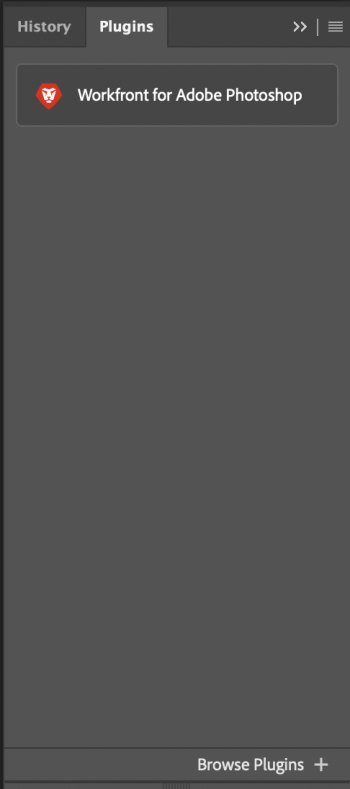

# Install [!DNL Workfront] for Adobe Photoshop

You can install the [!DNL Workfront for Adobe Photoshop] plugin from the Adobe Marketplace.

## Access requirements

You must have the following access to perform the steps in this article:

<table style="table-layout:auto"> 
 <col> 
 <col> 
 <tbody> 
  <tr> 
   <td role="rowheader">Adobe Workfront plan*</td> 
   <td> 
Pro or higher
 </td> 
  </tr> 
  <tr data-mc-conditions=""> 
   <td role="rowheader">Adobe Workfront license*</td> 
   <td> 
Work or Plan
 </td> 
  </tr> 
  <tr> 
   <td role="rowheader">Product</td> 
   <td>You must have an [!DNL Adobe Creative Cloud] license in addition to a [!DNL Workfront] license.</td> 
  </tr> 
 </tbody> 
</table>

&#42;To find out what plan, license type, or access you have, contact your [!DNL Workfront] administrator.

## Prerequisites

* You must install the [!DNL Adobe Photoshop] app before you install the [!DNL Workfront] plugin.

## Install the [!DNL Workfront for Adobe Photoshop] plugin

1. Open the Adobe Creative Cloud app.
1. Click the **[!UICONTROL Marketplace]** tab near the top of the window.
1. In the **[!UICONTROL Search] All Plugins** box, type *[!DNL Workfront]*, then press **Enter**.

   

1. When [!DNL Workfront] for Adobe Photoshop plugin appears in the search results, click **Get**.
1. Read the information in the dialog box, then click **OK**.
1. Once the plugin in installed, open [!DNL Adobe Photoshop] and locate the [!DNL Workfront] plugin in the plugin panel.

   

1. Continue to the following section for information on how to log in to the plugin.

## Log In to [!DNL Workfront] for Adobe Photoshop

1. From the **[!UICONTROL Plugins]** menu at the top of the screen, select **[!UICONTROL Plugin Panel]**.
1. Select **[!DNL Workfront for Adobe Photoshop]**.
1. Enter your domain, then click **[!UICONTROL Log in]**. A browser page opens.

   >[!TIP]
   >
   >To find your domain, open a browser, navigate to your [!DNL Workfront] instance, and copy the first part of the URL:\
   >   >

1. In the browser, enter your [!DNL Workfront] credentials, then click **Log in**. If your company uses a single sign-on (SSO), you'll be directed to your SSO provider's page to log in.

   >[!NOTE]
   >
   >You may not be prompted to enter your [!DNL Workfront] credentials if you logged in recently.

   Follow the prompts to log in to Workfront.

   >[!NOTE]
   >
   >* Workfront connects to Adobe Creative Cloud using OAuth 2.0, a secure standard used by most web-based integrations for the authentication and authorization of users.
   >* When you are prompted to enter the [domain or host] of your [!DNL Workfront] account, type it using this format: *yourCompany'sDomain.my.workfront.com*. Your company's domain is usually the name of your company.

1. Click **[!UICONTROL Allow Access]** to finish logging in.
1. Go back to Adobe Photoshop to see your work.
