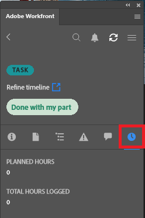

# Log time using the [!DNL Adobe Workfront] plugin

You can log time for projects, tasks, and issues you're working on directly in any of the following [!DNL Adobe Creative Cloud] applications:

{{cc-app-list}}

## Access requirements

+++ Expand to view access requirements for the functionality in this article.

You must have the following access to perform the steps in this article:

<table style="table-layout:auto"> 
 <col> 
 <col> 
 <tbody> 
  <tr> 
   <!--<td role="rowheader">[!DNL Adobe Workfront] plan*</td> 
   <td> 
[!UICONTROL Pro] or higher
 </td> 
  </tr> 
  <tr data-mc-conditions=""> 
   <td role="rowheader">[!DNL Adobe Workfront] license*</td> 
   <td> 
[!UICONTROL Work] or [!UICONTROL Plan]
 </td> 
  </tr> 
  <tr> 
   <td role="rowheader">Product</td> 
   <td>You must have an [!DNL Adobe Creative Cloud] license in addition to a [!DNL Workfront] license.</td> 
  </tr> -->
  <tr> 
   <td role="rowheader">Access level configurations*</td> 
   <td> 
[!UICONTROL Edit] access to tasks or issues
 
Note: If you still don't have access, ask your [!DNL Workfront] administrator if they set additional restrictions in your access level. For information on how a [!DNL Workfront] administrator can modify your access level, see <a href="../../administration-and-setup/add-users/configure-and-grant-access/create-modify-access-levels.md" class="MCXref xref">Create or modify custom access levels</a>.
 </td> 
  </tr> 
  <tr> 
   <td role="rowheader">Object permissions</td> 
   <td> 
[!UICONTROL Log Hours] permission to the task or issue
 
For information on requesting additional access, see <a href="../../workfront-basics/grant-and-request-access-to-objects/request-access.md" class="MCXref xref">Request access to objects </a>.
 </td> 
  </tr> 
 </tbody> 
</table>

&#42;To find out what plan, license type, or access you have, contact your [!DNL Workfront] administrator.

+++

## Prerequisites

{{cc-install-prereq}}

## Log time using the Adobe Workfront plugin

The [!DNL Workfront] administrator determines which project-specific hour types are available as described in [Manage hour types](../../administration-and-setup/set-up-workfront/configure-timesheets-schedules/hour-types.md).

To log time using the Workfront plugin:

1. Click the **[!UICONTROL Menu]** icon in the top-right corner, then select **[!UICONTROL Work List]**. You can also use the menu to navigate to parent objects.

   

1. From the **[!UICONTROL Work List]**, select the work item you need to log time to.
1. Click **[!UICONTROL Time]** in the navigation bar.

   

1. (Optional) Choose the **[!UICONTROL Hour Type]** from the drop-down menu.
1. Enter the time in hours for the day you need.

   

1. Click **[!UICONTROL Submit]**.
