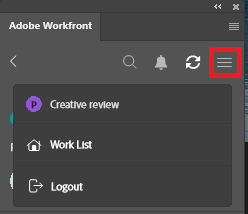

# Log time in Adobe Photoshop

You can log time for projects, tasks, and issues you're working on directly in Photoshop. The Workfront administrator determines which project-specific hour types are available as described in [Manage hour types](../../administration-and-setup/set-up-workfront/configure-timesheets-schedules/hour-types.md).

## Access requirements

You must have the following access to perform the steps in this article:

<table style="table-layout:auto"> 
 <col> 
 <col> 
 <tbody> 
  <tr> 
   <td role="rowheader">Adobe Workfront plan*</td> 
   <td> 
Pro or higher
 </td> 
  </tr> 
  <tr data-mc-conditions=""> 
   <td role="rowheader">Adobe Workfront license*</td> 
   <td> 
Work or Plan
 </td> 
  </tr> 
  <tr> 
   <td role="rowheader">Product</td> 
   <td>You must have an Adobe Creative Cloud license in addition to a Workfront license.</td> 
  </tr> 
  <tr> 
   <td role="rowheader">Access level configurations*</td> 
   <td> 
Edit access to tasks or issues
 
Note: If you still don't have access, ask your Workfront administrator if they set additional restrictions in your access level. For information on how a Workfront administrator can modify your access level, see <a href="../../administration-and-setup/add-users/configure-and-grant-access/create-modify-access-levels.md" class="MCXref xref">Create or modify custom access levels</a>.
 </td> 
  </tr> 
  <tr> 
   <td role="rowheader">Object permissions</td> 
   <td> 
Log Hours permission to the task or issue
 
For information on requesting additional access, see <a href="../../workfront-basics/grant-and-request-access-to-objects/request-access.md" class="MCXref xref">Request access to objects </a>.
 </td> 
  </tr> 
 </tbody> 
</table>

&#42;To find out what plan, license type, or access you have, contact your Workfront administrator.

## Prerequisites

* You must install the Workfront for Adobe Photoshop plugin before you can log time in Adobe Photoshop.

  For instructions, see [Install Workfront for Adobe Photoshop](../../workfront-integrations-and-apps/adobe-workfront-for-creative-cloud/wf-cc-install.md).

## Log time in Adobe Photoshop

1. Click the **Menu** icon in the top-right corner, then select **Work List**. You can also use the menu to navigate to parent objects.

   

1. From the **Work List**, select the work item you need to log time to.
1. Click **Time** in the navigation bar.

   

1. (Optional) Choose the **Hour Type** from the drop-down menu.
1. Enter the time in hours for the day you need.

   

1. Click **Submit**.

