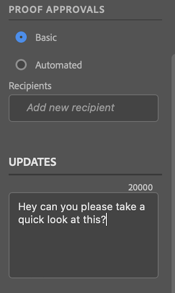
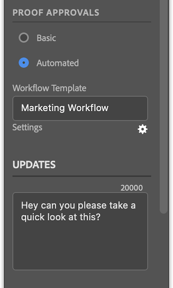

# Upload proofs from [!DNL Photoshop]

You can upload your art boards as proofs directly to [!DNL Adobe Workfront] for a thorough review and approval.

## Access requirements

You must have the following access to perform the steps in this article:

<table style="table-layout:auto"> 
 <col> 
 <col> 
 <tbody> 
  <tr> 
   <td role="rowheader">[!DNL Adobe Workfront] plan*</td> 
   <td> 
Current plan: [!UICONTROL Pro] or Higher
 
or
 
Legacy plan: [!UICONTROL Premium]
 
For more information about proofing access with the different plans, see .
 </td> 
  </tr> 
  <tr> 
   <td role="rowheader">[!DNL Adobe Workfront] license*</td> 
   <td> 
Current plan: [!UICONTROL Work] or [!UICONTROL Proof]
 
Legacy plan: Any (You must have proofing enabled for the user)
 </td> 
  </tr> 
  <tr> 
   <td role="rowheader">Product</td> 
   <td>You must have an [!DNL Adobe Creative Cloud] license in addition to a [!DNL Workfront] license.</td> 
  </tr> 
  <tr> 
   <td role="rowheader">Proof Permission Profile </td> 
   <td>[!UICONTROL Manager] or higher</td> 
  </tr> 
  <tr> 
   <td role="rowheader">Object permissions</td> 
   <td> 
Edit access to [!UICONTROL Documents]
 
For information on requesting additional access, see <a href="../../workfront-basics/grant-and-request-access-to-objects/request-access.md" class="MCXref xref">Request access to objects</a>.
 </td> 
  </tr> 
 </tbody> 
</table>

&#42;To find out what plan, role, or Proof Permission Profile you have, contact your Workfront or Workfront Proof administrator.

## Prerequisites

* You must install [!DNL Adobe Workfront for Photoshop] before you can upload proofs from [!DNL Adobe Photoshop].

  For instructions, see [Install [!DNL Adobe Workfront for Photoshop]](../../workfront-integrations-and-apps/adobe-workfront-for-creative-cloud/wf-cc-install-ps.md).

## Upload a Basic Proof

1. Click the **[!UICONTROL Menu]** icon in the top-right corner, then select **[!UICONTROL Work List]**. You can also use the menu to navigate to parent objects.

   

1. Go to the work item where you want to upload a proof.
1. Click the **[!UICONTROL Document]** icon  in the navigation bar. 
1. Click **[!UICONTROL New File]** near the bottom of the [!DNL Workfront] panel.
1. Enable the **[!UICONTROL Create a proof]** toggle.
1. (Optional) Type a name for the proof in the **[!UICONTROL Proof Name]** text box.
1. In the **[!UICONTROL Proof Approvals]** section, select **[!UICONTROL Basic]**.
1. (Optional) Add approvers.
1. (Optional) Type a comment in the **[!UICONTROL Updates]** area.

   

1. Choose the **[!UICONTROL Asset Type]** from the drop-down menu.

1. (Optional) Select **[!UICONTROL Add outside file]** to add a file from your computer.
1. Click **[!UICONTROL Upload]**, then configure any desired export options based on the asset type chosen above. 

      
   The document appears in the [!UICONTROL Documents] area in the [!DNL Workfront] panel in [!DNL Photoshop] and in the [!DNL Workfront] desktop app.

## Upload an Automated Proof

1. Click the **[!UICONTROL Menu]** icon in the top-right corner, then select **[!UICONTROL Work List]**. You can also use the menu to navigate to parent objects.

   

1. Go to the work item where you want to upload a proof.
1. Click the **[!UICONTROL Document]** icon  in the navigation bar. 

1. Click **[!UICONTROL New File]** near the bottom of the [!DNL Workfront] panel.
1. Enable the **[!UICONTROL Create a proof]** toggle.
1. (Optional) Type a name for the proof in the **[!UICONTROL Proof Name]** text box.
1. In the **[!UICONTROL Proof Approvals]** section, select **[!UICONTROL Automated]**.
1. (Optional) In the **[!UICONTROL Workflow Template]** box, type the name of a proof workflow template.

{{adjust-proof-settings}}

>[!NOTE]
>
> If there are any blank required fields in the workflow template, the automated proof settings open automatically, and you are required to populate those fields in order to upload the proof.

1. (Optional) Type a comment in the **[!UICONTROL Updates]** area.

    

1. Choose the **[!UICONTROL Asset Type]** from the drop-down menu.
1. (Optional) Select **[!UICONTROL Add outside file]** to add a file from your computer.
1. Click **[!UICONTROL Upload]**, then configure any desired export options based on the asset type chosen above. 
   The document appears in the [!UICONTROL Documents] area in the [!DNL Workfront] panel in [!DNL Photoshop] and in the [!DNL Workfront] desktop app.

## Upload a new proof version

You can upload a new version of a proof. The plugin remembers the proofing workflow set on the previous version, but you can change this if you wish.

1. Click the **[!UICONTROL Menu]** icon in the top-right corner, then select **[!UICONTROL Work List]**. You can also use the menu to navigate to parent objects.

   

1. Go to the work item you need to upload a document to.
1. Click the **[!UICONTROL Document]** icon in the navigation bar. 

1. Click **[!UICONTROL New Version]** near the bottom of the [!DNL Workfront] panel.
1. Enable the **[!UICONTROL Create a proof]** toggle.

1. In the *[!UICONTROL *Proof approvals]** section, choose **[!UICONTROL Basic]** or **[!UICONTROL Automated]**.

1. Add **[!UICONTROL Reviewers]** or a **[!UICONTROL Workflow template]** based on the approval type you selected in step 7.

1. (Optional) Type a comment in the **[!UICONTROL Updates]** area.
1. Choose the **[!UICONTROL Asset Type]** from the drop-down menu.
1. Click **[!UICONTROL Upload]**, then configure any desired export options based on the asset type chosen above. 
   The document appears in the [!UICONTROL Documents] area in the [!DNL Workfront] panel in [!DNL Photoshop] and in the [!DNL Workfront] desktop app.
