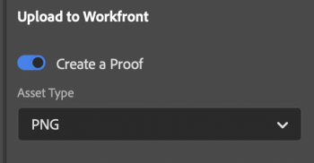
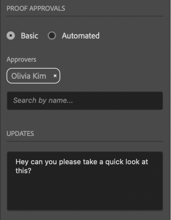

# Upload proofs from Adobe Photoshop

You can upload your art boards as proofs directly to Adobe Workfront for a thorough review and approval.

## Access requirements

You must have the following access to perform the steps in this article:

<table style="table-layout:auto"> 
 <col> 
 <col> 
 <tbody> 
  <tr> 
   <td role="rowheader">Adobe Workfront plan*</td> 
   <td> 
Current plan: Pro or Higher
 
or
 
Legacy plan: Premium
 
For more information about proofing access with the different plans, see .
 </td> 
  </tr> 
  <tr> 
   <td role="rowheader">Adobe Workfront license*</td> 
   <td> 
Current plan: Work or Proof
 
Legacy plan: Any (You must have proofing enabled for the user)
 </td> 
  </tr> 
  <tr> 
   <td role="rowheader">Product</td> 
   <td>You must have an Adobe Creative Cloud license in addition to a Workfront license.</td> 
  </tr> 
  <tr> 
   <td role="rowheader">Proof Permission Profile </td> 
   <td>Manager or higher</td> 
  </tr> 
  <tr> 
   <td role="rowheader">Object permissions</td> 
   <td> 
Edit access to Documents
 
For information on requesting additional access, see <a href="../../workfront-basics/grant-and-request-access-to-objects/request-access.md" class="MCXref xref">Request access to objects </a>.
 </td> 
  </tr> 
 </tbody> 
</table>

&#42;To find out what plan, role, or Proof Permission Profile you have, contact your Workfront or Workfront Proof administrator.

## Prerequisites

* You must install the Workfront for Adobe Photoshop plugin before you can upload proofs from Adobe Photoshop.

  For instructions, see [Install Workfront for Adobe Photoshop](../../workfront-integrations-and-apps/adobe-workfront-for-creative-cloud/wf-cc-install.md).

## Upload a Basic Proof

1. Click the **Menu** icon in the top-right corner, then select **Work List**. You can also use the menu to navigate to parent objects.

   

1. Go to the work item where you want to upload a proof.
1. Click the **Document** icon  in the navigation bar. 
1. Click **New File** near the bottom of the plugin.
1. Enable the **Create a proof** toggle.
1. Choose the **Asset Type** from the drop-down menu.

   

1. In the **Proof Approvals** section, select **Basic**.
1. (Optional) Add approvers.
1. (Optional) Type a comment in the **Updates** area.

   

1. (Optional) Type a name for the proof in the**Proof Name** text box.
1. (Optional) Select **Add outside file** to add a file from your computer.
1. Click **Upload**.

      
   The document appears in the Documents area in the plugin and the desktop app.

## Upload an Automated Proof

1. Click the **Menu** icon in the top-right corner, then select **Work List**. You can also use the menu to navigate to parent objects.

   

1. Go to the work item where you want to upload a proof.
1. Click the **Document** icon  in the navigation bar. 

1. Click **New File** near the bottom of the plugin.
1. Enable the **Create a proof** toggle, then choose the **Asset Type** from the drop-down menu.

   

1. In the **Proof Approvals** section, select **Automated**.
1. (Optional) In the **Workflow Template** box, type the name of a proof workflow template.
1. (Optional) Type a comment in the **Updates** area.

   

1. (Optional) Type a name for the proof in the**Proof Name** text box.
1. (Optional) Select **Add outside file** to add a file from your computer.
1. Click **Upload**.

      
   The document appears in the Documents area in the plugin and the desktop app.

## Upload a new proof version

You can upload a new version of a proof. The plugin remembers the proofing workflow set on the previous version, but you can change this if you wish.

1. Click the **Menu** icon in the top-right corner, then select **Work List**. You can also use the menu to navigate to parent objects.

   

1. Go to the work item you need to upload a document to.
1. Click the **Document** icon in the navigation bar. 

1. Click **New Version** near the bottom of the plugin.
1. Choose the **Asset Type** from the drop-down menu.
1. Enable the **Create a proof** toggle, then choose the **Asset Type** from the drop-down menu.

   

1. In the **Proof approvals** section, choose **Basic**or **Automated**.

1. Add **Reviewers**or a **Workflow template** based on the approval type you selected in step 7.

1. (Optional) Type a comment in the **Updates** area.
1. Click **Upload**.  
   The document appears in the Documents area in the plugin and the desktop app.

