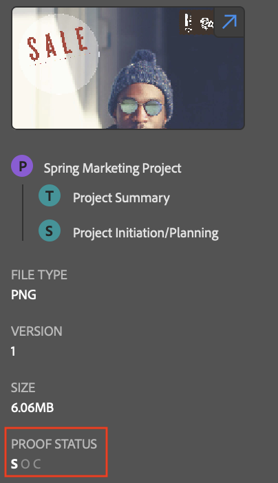

# View work item information using the [!DNL Adobe Workfront] plugin

You can see information about projects, tasks, issues, and documents from the following [!DNL Adobe Creative Cloud] applications:

{{cc-app-list}}

## Access requirements

+++ Expand to view access requirements for the functionality in this article.

<table style="table-layout:auto"> 
 <col> 
 </col> 
 <col> 
 </col> 
 <tbody> 
  <!--
  <tr> 
   <td role="rowheader">[!DNL Adobe Workfront] package</td> 
   <td> 
Any
 </td> 
  </tr> 
  <tr data-mc-conditions=""> 
   <td role="rowheader">[!DNL Adobe Workfront] license</td> 
   <td> 
   
Standard

   
Work or higher
 </td> 
  </tr>
  -->
  <tr> 
   <td role="rowheader">Additional products</td> 
   <td>You must have an [!DNL Adobe Creative Cloud] license in addition to a [!DNL Workfront] license.</td> 
  </tr> 
  <tr> 
   <td role="rowheader">Access level configurations</td> 
   <td> 
[!UICONTROL View] access to Projects, Tasks, or Issues
  </td> 
  </tr> 
  <tr> 
   <td role="rowheader">Object permissions</td> 
   <td> 
View access to the object you want to view. 
</td> 
  </tr> 
 </tbody> 
</table>

For information, see [Access requirements in Workfront documentation](/help/quicksilver/administration-and-setup/add-users/access-levels-and-object-permissions/access-level-requirements-in-documentation.md). 

+++

## Prerequisites

{{cc-install-prereq}}

## View details and custom form data

1. Click the **[!UICONTROL Menu]** icon in the top-right corner, then select **[!UICONTROL Work List]**. You can also use the menu to navigate to parent objects.

   

1. Select the work item you want to view.

   >[!TIP]
   >
   >Use the **[!UICONTROL Menu]** icon to go to the parent objects of the work item.

1. Click the **[!UICONTROL Details]** icon  in the navigation bar to view:

   * [!UICONTROL Description]
   * [!UICONTROL Planned Completion Date]
   * [!UICONTROL Status] 
   * [!UICONTROL Assigned to]
   * [!UICONTROL Project Owner] (Projects only)
   * Custom form data

## View Document Details

1. Click the **[!UICONTROL Menu]** icon in the top-right corner, then select **[!UICONTROL Work List]**. You can also use the menu to navigate to parent objects.

   

1. Select the work item you want to view.

   >[!TIP]
   >
   >Use the **[!UICONTROL Menu]** icon to go to the parent objects of the work item.

1. Click the **[!UICONTROL Document]** icon  in the navigation bar, then double-click on a document to view:

   * [!UICONTROL Description]
   * [!UICONTROL File Type]
   * [!UICONTROL Proof Status] (only available for proofs)
   * [!UICONTROL Version]
   * [!UICONTROL Size]
   * Custom Form data

## View Proof Details

1. Click the **[!UICONTROL Menu]** icon in the top-right corner, then select **[!UICONTROL Work List]**. You can also use the menu to navigate to parent objects.

   

1. Select the work item you want to view.

   >[!TIP]
   >
   >Use the **[!UICONTROL Menu]** icon to go to the parent objects of the work item.

1. Click the **[!UICONTROL Document]** icon  in the navigation bar, then double-click on a proof.

1. Click the arrow icon in the top-right corner of the thumbnail to open the proof details in [!DNL Workfront].

## View a proof's status

1. Click the **[!UICONTROL Menu]** icon in the top-right corner, then select **[!UICONTROL Work List]**. You can also use the menu to navigate to parent objects.

   

1. Select the work item you want to view.

   >[!TIP]
   >
   >Use the **[!UICONTROL Menu]** icon to go to the parent objects of the work item.

1. Click the **[!UICONTROL Document]** icon  in the navigation bar, then double-click on a proof.

1. Scroll to the bottom to view the proof's current status. For more information about Sent, Opened, Comment, Decision (SOCD) details, see [Document Details overview](/help/quicksilver/documents/managing-documents/document-details-overview.md).

## View subtasks and issues

1. Click the **[!UICONTROL Menu]** icon in the top-right corner, then select **[!UICONTROL Work List]**. You can also use the menu to navigate to parent objects.

   

1. Select the work item you want to view.

   >[!TIP]
   >
   >Use the **[!UICONTROL Menu]** icon to go to the parent objects of the work item.

1. Click the **[!UICONTROL Issue]** icon  or **Subtask** icon . 

1. Select the task or issue, then click the **[!UICONTROL Details]** icon  in the navigation bar to view:

   * [!UICONTROL Planned Completion Date]
   * [!UICONTROL Status] 
   * [!UICONTROL Assigned to]
   * Custom Form data
