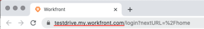

# Install Workfront for Adobe XD

You can install the Workfront for Adobe XD plugin from the Adobe Marketplace.

## Access requirements

You must have the following access to perform the steps in this article:

<table cellspacing="0"> 
 <col> 
 </col> 
 <col> 
 </col> 
 <tbody> 
  <tr> 
   <td role="rowheader">Adobe Workfront plan*</td> 
   <td> <p>Pro or higher</p> </td> 
  </tr> 
  <tr data-mc-conditions=""> 
   <td role="rowheader">Adobe Workfront license*</td> 
   <td> <p>Work or Plan</p> </td> 
  </tr> 
  <tr> 
   <td role="rowheader">Product</td> 
   <td>You must have an Adobe Creative Cloud license in addition to a Workfront license.</td> 
  </tr> 
 </tbody> 
</table>

&#42;To find out what plan, license type, or access you have, contact your Workfront administrator.

## Prerequisites

* You must install the Adobe XD app before installing the Workfront plugin.

To install the Workfront for Adobe XD plugin:

1. Open the Adobe Creative Cloud app.
1. Click the **Marketplace**tab near the top of the window.
1. In the **Search All Plugins** box, type *Workfront*, then press **Enter**.

   

1. When Workfront for Adobe XD plugin appears in the search results, click **Get**.
1. Read the information in the dialog box, then click **OK**.
1. Once the plugin in installed, open Adobe XD and locate the Workfront plugin in the plugin window.

   

1. Continue to the following section for information on how to log in to the plugin.

## Log In to Workfront for Adobe XD

1. Ensure the Plugin panel is open, then click ```Workfront for Adobe XD```.
1. Enter your domain, then click **Log in**. A browser page opens.

   >[!TIP]
   >
   >To find your domain, open a browser, navigate to your Workfront instance, and copy the first part of the URL:  
   >   >
   >

1. In the browser, enter your Workfront credentials, then click **Log in**. If your company uses a single sign-on (SSO), you'll be directed to your SSO provider's page to log in.

   >[!NOTE]
   >
   >You may not be prompted to enter your Workfront credentials if you logged in recently.

   Follow the prompts to log in to Workfront.

   >[!NOTE]
   >
   >
   >  
   >  
   >  * Workfront connects to Adobe Creative Cloud using OAuth 2.0, a secure standard used by most web-based integrations for the authentication and authorization of users.
   >  * When you are prompted to enter the [domain or host] of your Workfront account, type it using this format: *yourCompany'sDomain.my.workfront.com*. Your company's domain is usually the name of your company.  

   >  
   >

1. Click **Allow Access** to finish logging in, and go back to Adobe XD to see your work.

&nbsp; 