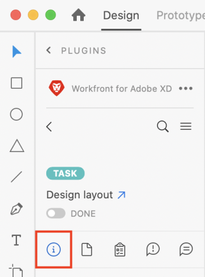

# View work item information in [!DNL Adobe XD]

You can see information about projects, tasks, issues, and documents from [!DNL Adobe XD].

## Access requirements

You must have the following access to perform the steps in this article:

<table style="table-layout:auto"> 
 <col> 
 </col> 
 <col> 
 </col> 
 <tbody> 
  <tr> 
   <td role="rowheader">[!DNL Adobe Workfront] plan*</td> 
   <td> 
[!UICONTROL Pro] or higher
 </td> 
  </tr> 
  <tr data-mc-conditions=""> 
   <td role="rowheader">[!UICONTROL Adobe Workfront] license*</td> 
   <td> 
Work or Plan
 </td> 
  </tr> 
  <tr> 
   <td role="rowheader">Product</td> 
   <td>You must have an [!DNL Adobe Creative Cloud] license in addition to a [!DNL Workfront] license.</td> 
  </tr> 
  <tr> 
   <td role="rowheader">Access level configurations*</td> 
   <td> 
View access to Projects, Tasks, or Issues
 
Note: If you still don't have access, ask your [!DNL Workfront] administrator if they set additional restrictions in your access level. For information on how a [!DNL Workfront] administrator can modify your access level, see <a href="../../administration-and-setup/add-users/configure-and-grant-access/create-modify-access-levels.md" class="MCXref xref">Create or modify custom access levels</a>.
 </td> 
  </tr> 
  <tr> 
   <td role="rowheader">Object permissions</td> 
   <td> 
View access to the object you want to view. 
 
For information on requesting additional access, see <a href="../../workfront-basics/grant-and-request-access-to-objects/request-access.md" class="MCXref xref">Request access to objects </a>.
 </td> 
  </tr> 
 </tbody> 
</table>

&#42;To find out what plan, license type, or access you have, contact your [!DNL Workfront] administrator.

## Prerequisites

* You must install the [!DNL Workfront for Adobe XD] plugin before you can view work item information in Adobe XD.

   For instructions, see [Install [!DNL Workfront for Adobe XD]](../../workfront-integrations-and-apps/adobe-workfront-for-xd/wf-adobe-xd-install.md).

## View details and custom form data

1. Click the **[!UICONTROL Menu]** icon in the top-right corner, then select **[!UICONTROL Work List]**. You can also use the menu to navigate to parent objects.

   

1. Select the work item you want to view.

   >[!TIP]
   >
   >Use the **[!UICONTROL Menu]** icon to go to the parent objects of the work item.

1. Click the **[!UICONTROL Details]** icon  in the navigation bar to view:

   * [!UICONTROL Description]
   * [!UICONTROL Planned Completion Date]
   * [!UICONTROL Status]
   * [!UICONTROL Assigned to]
   * Project Owner (Projects only)
   * Custom f[!UICONTROL ]orm data

   

## View Document Details

1. Click the **[!UICONTROL Menu]** icon in the top-right corner, then select **[!UICONTROL Work List]**. You can also use the menu to navigate to parent objects.

   

1. Select the work item you want to view.

   >[!TIP]
   >
   >Use the **[!UICONTROL Menu]** icon to go to the parent objects of the work item.

1. Click the **[!UICONTROL Document]** icon  in the navigation bar, then double-click on a document to view:

   * Description
   * File Type
   * Proof Status (only available for proofs)
   * Version
   * Size
   * Custom Form data

## View subtasks and issues

1. Click the **[!UICONTROL Menu]** icon in the top-right corner, then select **[!UICONTROL Work List]**. You can also use the menu to navigate to parent objects.

   

1. Select the work item you want to view.

   >[!TIP]
   >
   >Use the **[!UICONTROL Menu]** icon to go to the parent objects of the work item.

1. Click the **[!UICONTROL Issue]** icon  or **[!UICONTROL Subtask]** icon .

1. Select the task or issue, then click the **[!UICONTROL Details]** icon  in the navigation bar to view:

   * [!UICONTROL Planned Completion Date]
   * [!UICONTROL Status]
   * [!UICONTROL Assigned to]
   * Custom Form data

   
