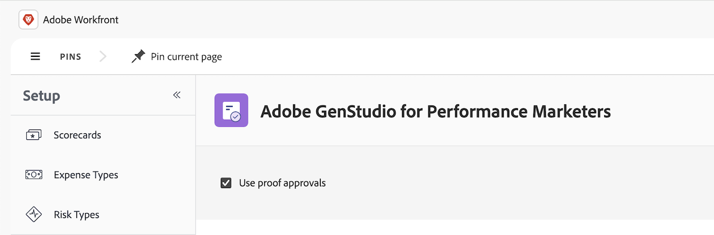

# Get started with the proofing and GenStudio for Performance Marketing integration

We are excited to introduce a new integration between Proofing and GenStudio for Performance Marketing. With this integration, you can 

* Use Workfront approval templates to define approval workflows

* Review GenStudio draft content in the proofing viewer

* See review decisions in GenStudio for final approval and publishing

## Access requirements

+++ Expand to view access requirements for the functionality in this article.

<table style="table-layout:auto"> 
 <col> 
 <col> 
 <tbody> 
 <tr> 
   <td role="rowheader">Adobe Workfront plan</td> 
   <td> 
   
Any
 
   </td> 
  </tr> 
  <tr> 
   <td role="rowheader">Adobe Workfront license</td> 
   <td> 
   
Current: Standard 
 
   
Legacy: Plan 
</td> 
  </tr> 
  <tr> 
   <td role="rowheader">Product</td> 
   <td> 
   
 You must have GenStudio for Performance Marketing, and you must be added to the product as a user in the Admin Console. 
 </td> 
  </tr> 
  <tr> 
   <td role="rowheader">Access level configurations</td> 
   <td> 
Edit access to Projects
 </td> 
  </tr> 
  <tr> 
   <td role="rowheader">Object permissions</td> 
   <td> 
Manage or higher permissions on the project
 </td> 
  </tr> 
 </tbody> 
</table>

For more detail about the information in this table, see [Access requirements in Workfront documentation](/help/quicksilver/administration-and-setup/add-users/access-levels-and-object-permissions/access-level-requirements-in-documentation.md).

 +++

## Prerequisites

* Workfront and GenStudio for Performance Marketing must be deployed to the same IMS Org.

* A user can be active and enabled in only one Workfront instance within the IMS org in order for the integration to work.

* Workfront instance needs to be enabled on the Adobe Unified Experience.

* Workfront Setup section is toggled to connect to proof. 

## Integration requirements 

Workfront and GenStudio for Performance Marketing must be deployed to the same IMS Org.

## Enable the integration in Workfront

1. Click the **[!UICONTROL Main Menu]** icon  in the upper-left corner, then click **[!UICONTROL Setup]** .
1. In the left panel, click **Review and Approval** > **Adobe GenStudio**.
1. Enable **Use proof approvals**. 

## Use Workfront approval templates to define approval workflows

You can use approval templates to automate review and approval workflows in GenStudio. 

For more information, see .

## Review GenStudio draft content in the proofing viewer

You can review GenStudio draft content in the proofing viewer. 

For more information about review and approval in GenStudio, see .

## See review decisions in GenStudio for final approval and publishing

Once the asset has gone through the review and approval process, you can view the review decision directly in GenStudio.

For more information, see .