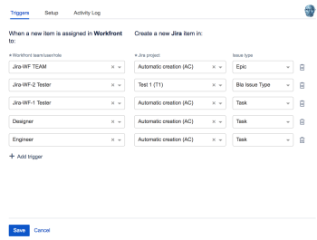
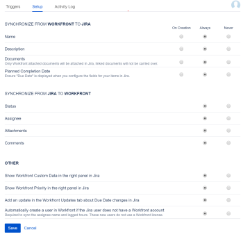

# Configure Adobe Workfront for Jira

You can use Adobe Workfront for Jira to integrate your Jira and Workfront systems.

After installing the add-on, you can define workflows that create Jira issues automatically when Workfront work items are created. The items in both applications become linked, and some of their information automatically updates in both systems.

All users in Workfront and Jira can benefit from this integration. They only need a license for the system in which they work the most, and not for both systems.&nbsp;

This add-on is available for both the Server and OnDemand (or Cloud) versions of Jira Software.

For a list of Jira versions that Workfront for Jira currently supports, see [Workfront for Jira](https://marketplace.atlassian.com/apps/1218653/workfront-for-jira?hosting=cloud&tab=overview) at the Atlassian Marketplace.

## Access requirements

You must have the following:

<table style="table-layout:auto"> 
 <col> 
 <col> 
 <tbody> 
  <tr> 
   <td role="rowheader"><a href="https://www.workfront.com/plans" target="_blank">Adobe Workfront plan</a>*</td> 
   <td> 
Pro or higher
 </td> 
  </tr> 
  <tr> 
   <td role="rowheader"><a href="../../administration-and-setup/add-users/access-levels-and-object-permissions/wf-licenses.md" class="MCXref xref">Adobe Workfront licenses overview</a>*</td> 
   <td> 
Plan
 </td> 
  </tr> 
  <tr> 
   <td role="rowheader">Jira access</td> 
   <td> 
System administrator access
 
Important:  We recommend that you create separate system administrator accounts in Jira and Workfront to dedicate to this integration, rather than using existing ones that might be attached to users.
 </td> 
  </tr> 
  <tr> 
   <td role="rowheader">Access level configurations*</td> 
   <td> 
You must be a Workfront administrator. For information on Workfront administrators, see <a href="../../administration-and-setup/add-users/configure-and-grant-access/grant-a-user-full-administrative-access.md" class="MCXref xref">Grant a user full administrative access</a>.
 
Note: If you still don't have access, ask your Workfront administrator if they set additional restrictions in your access level. For information on how a Workfront administrator can modify your access level, see <a href="../../administration-and-setup/add-users/configure-and-grant-access/create-modify-access-levels.md" class="MCXref xref">Create or modify custom access levels</a>.
 </td> 
  </tr> 
 </tbody> 
</table>

&#42;To find out what plan, license type, or access you have, contact your Workfront administrator.

## Prerequisites

Before you can configure Workfront for Jira, you must

* Install Workfront for Jira  
  For instructions on installing Workfront for Jira, see [Install Adobe Workfront for Jira](../../workfront-integrations-and-apps/use-workfront-with-jira/install-workfront-for-jira.md).

## Configure Workfront for Jira

By configuring Workfront for Jira you can:

* Define triggers that will create Jira items when Workfront items are created.
* Specify which fields should synchronize between items linked between Jira and Workfront.

>[!NOTE]
>
>* After you configure Workfront for Jira on your Jira environment, all Jira users see a Workfront right panel on all Jira items. The panel contains information about the items that might be linked from Workfront or specifies that no Workfront items are linked to Jira items.&nbsp;
>* When using the Jira Server installation, only the issues that are associated with projects identified as triggers for the Workfront integration display the Workfront panel.&nbsp;For more information about setting up triggers for the Workfront to Jira workflow, see [Configure triggers for automatically linking items between Jira and Workfront](#configure-triggers-for-automatically-linking-items-between-jira-and-workfront).
>

To configure Workfront for Jira:

1. Log into Jira as a Jira administrator.
1. Click **Settings** in the main Jira menu.
1. Click **Add-ons**, then click **Manage add-ons**.

1. Expand the **Workfront** add-on.
1. Click **Configure**.
1. Follow the prompts to log in to Workfront.

   >[!NOTE]
   >
   >Workfront connects to Jira using OAuth 2.0, a standard used by most web-based integrations for the authentication and authorization of users.

   You must log in to Workfront as a Workfront administrator to continue the configuration.

   >[!NOTE]
   >
   >* When you are prompted to enter the domain of your Workfront account, type it using this format: *yourCompany'sDomain.my.workfront.com*. Your company's domain is usually the name of your company.
   >* Enhanced Authentication is not available until a Workfront administrator enables it for this integration. 

1. Select the **Triggers** tab to configure the automatic creation of Jira items as new Workfront items are created.

   For more information about setting up triggers for the Workfront to Jira workflow, see [Configure triggers for automatically linking items between Jira and Workfront](#configure-triggers-for-automatically-linking-items-between-jira-and-workfront).

1. Select the **Setup** tab to configure the synchronization of fields between linked Jira and Workfront items.

   For more information about setting up the synchronization of fields between Jira and Workfront, see [Configure field synchronization between Jira and Workfront Items](#configure-field-synchronization-between-jira-and-workfront-items).

   >[!NOTE]
   >
   >After you defined the triggers and the synchronization of fields between the two applications, any Workfront user who can create tasks or issues could potentially trigger the creation of an item in Jira. The user can create an item if the criteria on the item they create match the triggers in Jira, even if the user does not have a Jira license. Also, any Jira user can immediately start working on the Jira item, and their updates are visible in Workfront, without them having a Workfront license. Any updates in Workfront are also visible on the Jira items.&nbsp;

1. (Optional) Select the **Activity Log** tab to review any errors that might have occurred during the integration.

   For more information about the Activity Log, see [View the Jira Activity Log](../../workfront-integrations-and-apps/use-workfront-with-jira/view-the-jira-activity-log.md).

## Configure triggers for automatically linking items between Jira and Workfront {#configure-triggers-for-automatically-linking-items-between-jira-and-workfront}

As the Jira system administrator, you can define triggers that would automatically create issues in Jira when an item in Workfront meets certain criteria.

>[!NOTE]
>
>It could take up to 10 minutes for the integration to create new issues in Jira.

Consider the following when configuring triggering the creation of Jira items as Workfront items are created:

* The integration is unidirectional: You can only trigger items that you create in Workfront to be automatically created in Jira. You cannot trigger items that you create in Jira to automatically be created in Workfront.&nbsp;
* There is no limit to how many triggers you can have.&nbsp;
* If an item that you create in Workfront matches more than one of the triggers, only one item is created in Jira. The item is created in Jira according to the first trigger (in the order that they have been defined in Jira). All other triggers are ignored.&nbsp;
* Only one item in Workfront can be linked to one item in Jira. You can never link one Workfront item to multiple Jira issues, or one Jira issue to multiple Workfront items.&nbsp;

To configure triggers for automatically creating items in Jira:&nbsp;

1. Log into Jira as a system administrator.
1. Click **Settings** in the main Jira menu.
1. Click **Add-ons**, then **Manage add-ons**.

1. Expand the **Workfront** add-on.
1. Click **Configure**.
1. Log in to Workfront as a system administrator.

   The&nbsp;**Triggers** tab is selected by default.

   

1. Click **Add trigger** to add a new trigger.
1. In the **Workfront team/user/role** field, specify the name of a Workfront team, user, or job role, then click to select it when it displays in the list.&nbsp;

   >[!NOTE]
   >
   >You cannot have multiple triggers for the same team, user, or role.

   When someone creates a task or an issue and assigns it to one of these entities, an issue is automatically created in Jira.

1. In the **Jira project** field, start typing the name of a Jira project, then click to select it when it displays in the list.

   When the Jira issue is created, it is placed on the project you specify here.

1. Select an **Issue type** from the drop-down menu.

   This indicates the issue type that is created in Jira when the conditions of this trigger are met, based on your settings for that specific project in Jira.

1. Click **Save**.&nbsp;

   With this configuration, every time a Workfront user creates an item that matches the specified triggers, a new issue is created in Jira.

## Configure field synchronization between Jira and Workfront Items {#configure-field-synchronization-between-jira-and-workfront-items}

As the Jira administrator, you can define what fields should automatically synchronize on items that are linked between Workfront and Jira. Certain fields can synchronize from the Workfront to the Jira item, and others synchronize from Jira to Workfront.&nbsp;

To define what fields should automatically synchronize on items linked between the two applications:

1. Log into Jira as a Jira administrator.
1. Click **Settings** in the main Jira menu.
1. Click **Add-ons**, then **Manage add-ons**.

1. Expand the **Workfront** add-on.
1. Click **Configure**.
1. Log in to Workfront as a Workfront administrator.
1. Click the **Setup** tab.

   

1. In the **Synchronize from Jira to Workfront**&nbsp;section, select the fields that you want to update in Jira when they are updated in Workfront.&nbsp;

   1. Select any of the following frequencies with which the fields are synchronized:

      <table style="table-layout:auto">
         <tr>
              <td>On Creation</td>
              <td>The fields you specify are synchronized between the linked Workfront and Jira items when the item is created in Workfront.</td>
          </tr>
          <tr>
              <td>Always</td>
              <td>The fields you specify are synchronized between the linked Workfront and Jira items when the fields are updated in Workfront.&amp;nbsp;</td>
          </tr>
          <tr>
              <td>Never</td>
              <td>The fields you specify are never synchronized between the linked Workfront and Jira items. There is no indication in Jira that the field was updated in Workfront.&amp;nbsp;</td>
          </tr>
      </table>

   1. Select to synchronize any of the following fields from Workfront to Jira:&nbsp;

      <table style="table-layout:auto">
       <col>
       <col>
       <tbody>
        <tr>
         <td role="rowheader">Name</td>
         <td>
The name of a task or an issue in Workfront becomes the name of the issue to which it is linked in Jira.

Note: When new items are created in Jira automatically, the Workfront Name always updates on the Jira item, regardless of whether this field is enabled here or not. When a Jira item is manually linked to a Workfront item, the Name of the Workfront item only updates in Jira when you select to&nbsp;<strong>Always</strong>&nbsp;synchronize this field.&nbsp;For more information about linking items manually or automatically, see <a href="../../workfront-integrations-and-apps/use-workfront-with-jira/link-items-between-wf-jira.md" class="MCXref xref">Link items between Adobe Workfront and Jira</a>.
</td>
        </tr>
        <tr>
         <td role="rowheader">Description</td>
         <td>The description of a task or an issue in Workfront becomes the description of the issue to which it is linked in Jira.</td>
        </tr>
        <tr>
         <td role="rowheader">Documents</td>
         <td>
Documents attached to a task or an issue in Workfront are also attached to the issue to which it is linked in Jira. New document versions from Workfront are added as separate documents to Jira and are appended with <i>_v&lt;version number&gt;</i> to indicate the numbered version in Workfront. 

For example, if the name of a document in Workfront is <strong>Main Ad</strong>, and you add a new version to it in Workfront, the new version is transferred to Jira as a new document with the name <strong>Main Ad_v2</strong>.

Important: 
Consider the following when syncing documents:

           <ul>
            <li>
Documents larger than 5MB do not sync. If a document sync fails because the document is too large, an error is logged in the Activity log, 

For more information on the activity log, see <a href="../../workfront-integrations-and-apps/use-workfront-with-jira/view-the-jira-activity-log.md" class="MCXref xref">View the Jira Activity Log</a>.
</li>
            <li>
Documents that are linked to tasks and issues from external servers are not transferred to the Jira items. Only documents uploaded directly on the task or the issue in Workfront are transferred to the linked issue in Jira.
</li>
            <li>
To create a proof from a document, you must generate the proof in Workfront. 

For more information on generating a proof, see <a href="../../review-and-approve-work/proofing/creating-proofs-within-workfront/generate-proof-for-a-document.md#create" class="MCXref xref">Create a proof for an existing document </a>in <a href="../../review-and-approve-work/proofing/creating-proofs-within-workfront/generate-proof-for-a-document.md" class="MCXref xref">Create a proof for a document</a>. 
</li>
           </ul>
</td>
        </tr>
        <tr>
         <td role="rowheader">Planned Completion Date</td>
         <td>
The Planned Completion Date of a task or an issue in Workfront becomes the Due Date of the issue to which it is linked in Jira.

Note: Ensure that you display <strong>Due Date</strong>&nbsp;on Jira issues, for this value to synchronize.
</td>
        </tr>
       </tbody>
      </table>

1. In the **Synchronize from Jira to Workfront**&nbsp;section, select the fields that you want to update in Workfront when they are updated in Jira.&nbsp;

   1. Select any of the following frequencies with which the fields are synchronized:

      <table style="table-layout:auto">
       <col>
       <col>
       <tbody>
        <tr>
         <td role="rowheader">Always</td>
         <td>The fields you specify are always synchronized between the linked Workfront and Jira items when the fields are updated in Jira.&nbsp;</td>
        </tr>
        <tr>
         <td role="rowheader">Never</td>
         <td>
The fields you specify are never synchronized between the linked Workfront and Jira items. There is no indication in Workfront that the field was updated in Jira.&nbsp;

Note: When you select Never, Workfront fields can still be manually updated from Jira in the left Workfront panel of the Jira issue. Those updates appear only on Workfront items in Jira and Workfront and not on Jira items.
</td>
        </tr>
       </tbody>
      </table>

   1. Select to synchronize any of the following fields from Jira to Workfront:

      <table style="table-layout:auto">
       <col>
       <col>
       <tbody>
        <tr>
         <td role="rowheader">Status</td>
         <td>The Status of an issue in Jira becomes the Status of the task or issue to which it is linked in Workfront. For more information about Workfront statuses, see <a href="../../administration-and-setup/customize-workfront/creating-custom-status-and-priority-labels/create-or-edit-a-status.md" class="MCXref xref">Create or edit a status</a>.</td>
        </tr>
        <tr>
         <td role="rowheader">Assignee</td>
         <td>
The Assignee of an issue in Jira becomes the Assignee of the task or issue to which it is linked in Workfront.
<!--
           
(NOTE:&nbsp;the information in the Important below is also in the Updating Linked Items article.)

          -->
Important: When you assign an item in Jira to a user who does not have a Workfront account, the integration creates a new active user in Workfront only when the <strong>Automatically create a user in</strong> Workfront<strong>if the Jira user does not have a</strong> Workfront<strong>account</strong> is set to <strong>Always</strong>. This user does not occupy a Workfront license.&nbsp;Active users can be assigned to work items in Workfront, but cannot be included in updates. 
</td>
        </tr>
        <tr>
         <td role="rowheader">Attachments</td>
         <td>Attachments of an issue in Jira are also attached to the task or issue to which it is linked in Workfront.&nbsp;</td>
        </tr>
        <tr>
         <td role="rowheader">Comments</td>
         <td>
A comment on a Jira issue is also posted on the linked Workfront item in the Updates area. Conversely, a comment posted in the Updates area for a Workfront task or issue syncs to Jira's native comment stream for the linked issue. 

This is set to <strong>Always</strong> by default. If you select <strong>Never</strong> here, you can still post comments manually on a linked item either in Workfront or in Jira.
</td>
        </tr>
       </tbody>
      </table>

1. In the **OTHER** section, select what additional fields should be updated between linked items.&nbsp;

   1. Select an option to determine whether the fields you specify **Always** or **Never** update in Jira or Workfront when they are modified.
   
   1. Select from the following fields and updates:

      <table style="table-layout:auto">
       <col>
       <col>
       <tbody>
        <tr>
         <td role="rowheader">Copy Workfront Custom Data in the right panel in Jira</td>
         <td>
Displays the Workfront Custom Data of an item in the Workfront right panel.

Note:  Custom Form sections are displayed in the Workfront right panel with the access level of the Workfront System Administrator.
</td>
        </tr>
        <tr>
         <td role="rowheader">Copy Workfront Priority in the right panel in Jira</td>
         <td>Displays the Workfront Priority of an item in the Workfront right panel.</td>
        </tr>
        <tr>
         <td role="rowheader">Add an update in the Workfront Updates tab about Due Date changes in Jira</td>
         <td>Adds a comment in the Update tab of the Workfront item when the Due Date changes in linked Jira item.</td>
        </tr>
        <tr>
         <td role="rowheader">Automatically create a user in Workfront if the&nbsp;Jira user does not have a Workfront account</td>
         <td>
The following scenarios exist:

          <ul>
           <li>When you select <strong>Always</strong> you enable the integration to create a new Workfront user every time a Jira user without a Workfront account performs the following actions on a linked Jira issue:
            <ul>
             <li>Is assigned to a Jira issue</li>
             <li>
Logs time to a Jira issue

This new user does not occupy a Workfront license. The default setting is Always.&nbsp;The user created this way in Workfront has "Jira" added to their name.

</li>
            </ul></li>
           <li>When you select <strong>Never</strong>, the following things happen:
            <ul>
             <li>You are not able to see any Jira assignments on the Workfront items. In this case, only assignments made in Workfront display on the Workfront items.</li>
             <li>The time logged to a linked Jira issue by a user without a Workfront account does not automatically transfer to the linked Workfront item. You can still log time on the Workfront item in the right panel of the Jira issue.</li>
            </ul></li>
          </ul></td>
        </tr>
       </tbody>
      </table>

1. Click **Save**.

   Now, every time a user updates any of the fields specified in this configuration on an item in either Jira or Workfront, the linked item in the other application is updated as well.&nbsp;

## Troubleshooting

### Items cannot be created in Jira because of trigger fields marked "Couldn't be found"

#### Problem

When an error occurs with our Workfront for Jira application, Workfront disables the triggers to prevent further complications. When those triggers are disabled, they display as "Couldn't be found".

#### Solution

Locate the error that disabled the triggers. You can find the error in the Workfront for Jira "Activity Log".

The most common cause of this behavior is the error "Field 'duedate' cannot be set. It is not on the appropriate screen, or unknown."

This error means that you are&nbsp;attempting to sync the "planned completion date" from Workfront to Jira. In order to do this, you must ensure that your Jira objects have a field called "Due Date". If they do not have this field, Workfront is unable to sync the planned completion date from Workfront and disables your triggers.

To resolve this error, try one of the following:

* Ask your Jira administrator to update the affected Jira objects to ensure that they have a due date field.
* Disable the synchronization of Workfront's planned completion date in the Workfront "Setup" page

