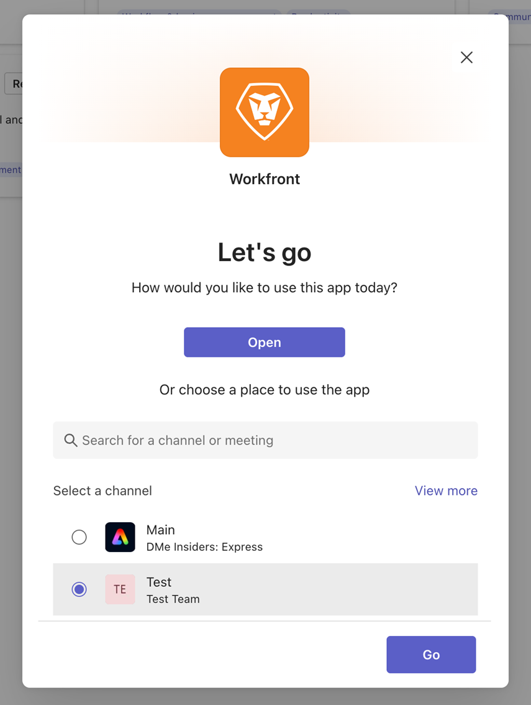

# Install [!DNL Adobe Workfront] for Microsoft Teams

<!-- Audited: 1/2024 -->

>[!IMPORTANT]
>
>As Microsoft transitions to the New Teams client, the Classic Teams client will no longer be available after July 1, 2025. In preparation, we are developing a new version of the Microsoft Teams integration that will be fully compatible with the New Teams client and available before July 1 to ensure a smooth transition.
>
>Instructions on how to download and install the integration in the New Teams client will appear here after the integration is available.

The [!DNL Adobe Workfront for Microsoft Teams] app allows you to perform basic actions in [!DNL Workfront] without leaving your [!DNL Microsoft Teams] chat channels.

>[!NOTE]
>
>[!DNL Microsoft Teams] no longer supports [!DNL Internet Explorer]. To use the [!DNL Adobe Workfront for Microsoft Teams integration], you must use a web browser other than [!DNL Internet Explorer].

## Access requirements

+++ Expand to view access requirements for the functionality in this article.

You must have the following access to perform the steps in this article:

<table style="table-layout:auto"> 
 <col> 
 <col> 
 <tbody> 
  <tr> 
   <td role="rowheader">[!DNL Adobe Workfront] plan</td> 
   <td> 
Any
 </td> 
  </tr> 
  <tr> 
   <td role="rowheader">[!DNL Adobe Workfront] license</td> 
   <td>
New: Standard

    
Current: [!UICONTROL Work], [!UICONTROL Plan]
 </td> 
  </tr> 
 </tbody> 
</table>

For more detail about the information in this table, see [Access requirements in Workfront documentation](/help/quicksilver/administration-and-setup/add-users/access-levels-and-object-permissions/access-level-requirements-in-documentation.md).

+++

## Prerequisites

You must be a team owner in [!DNL Microsoft Teams] to install [!DNL Workfront] for [!DNL Microsoft Teams].

## Install [!DNL Workfront for Microsoft Teams]

As a team owner in [!DNL Microsoft Teams], you can install the [!DNL Workfront for Microsoft Teams] app for each of your teams either from the [!DNL Microsoft] Store or from a file provided by [!DNL Workfront].

### Install [!DNL Workfront for Microsoft Teams] from the [!DNL Microsoft] Store 

1. Log in to [!DNL Microsoft Teams] as a team owner.
1. Select the team for whom you want to install the [!DNL Workfront for Microsoft Teams] app. 
1. Click **[!UICONTROL More]** icon for the team for which you want to install the Workfront for Microsoft Teams integration
1. Click **[!UICONTROL Apps]** tab.
1. In the **[!UICONTROL Search apps and more]** box, type *[!DNL Workfront]*.
1. Click **Add**.
1. Click **Add** in the dialog that opens.
1. In the Select a channel section, select the team you would like to add the Workfront app to, and click **Go**. 

   
1. Click **Log in** to Workfront to access Workfront for Microsoft Teams.

   For information about logging in to [!DNL Workfront], see the [Log in to Workfront from Microsoft Teams](#log-in-to-workfront-from-microsoft-teams) section in this article. 

### Install [!DNL Workfront for Microsoft Teams] from a private file

If your organization restricts the access to downloading apps from the [!DNL Microsoft] Store, you must contact our Support Team and request a private file of the [!DNL Workfront for Microsoft Teams] app to install the app.

For information about contacting our Support Team, see [Contact Customer Support](../../workfront-basics/tips-tricks-and-troubleshooting/contact-customer-support.md).

To install [!DNL Workfront for Microsoft Teams] from a private file:

1. Save the private file that you have received from [!DNL Workfront] on your computer.
1. Log in to [!DNL Microsoft Teams] as a [!DNL Microsoft] team owner.
1. Click the **[!UICONTROL More]** icon for the team for which you want to install [!DNL Workfront for Microsoft Teams].

1. Click **[!UICONTROL Manage Team]**.
1. Select the Apps tab, then click Upload an app in the top left corner of the screen.
1. Browse for the private file that you saved on your computer, then follow the installation steps to install [!DNL Workfront for Microsoft Teams].
1. When the install completes, a notification that the install was successful appears in the General channel of the team you selected. All members of the team can see this notification.

## Log in to [!DNL Workfront] from [!DNL Microsoft] Teams 

As a [!DNL Microsoft Teams] team owner, you must install the [!DNL Workfront for Microsoft Teams] app for your team before you or anyone on the team can log in to [!DNL Workfront from Microsoft Teams].

When you are logged in to [!DNL Workfront] from [!DNL Microsoft Teams], you can receive [!DNL Workfront] notifications in the [!DNL Workfront] bot channel or you can perform certain actions in [!DNL Workfront] from [!DNL Microsoft Teams]. 

For information about installing the [!DNL Workfront] app, see the [Install [!DNL Workfront for Microsoft Teams]](#install-workfront-for-microsoft-teams) section in this article.

For information about accessing [!DNL Workfront] from [!DNL Microsoft Teams] to perform certain actions, see [Access [!DNL Adobe Workfront] from [!DNL Microsoft Teams]](../../workfront-integrations-and-apps/using-workfront-with-microsoft-teams/access-workfront-from-ms-teams.md).

To log in to [!DNL Workfront] from [!DNL Microsoft Teams]:

1. Go to the **[!UICONTROL General]** channel of the team where the [!DNL Workfront for Microsoft Teams] app has been installed and click **[!UICONTROL Log in to Workfront]**.

   The [!DNL Workfront] bot chat channel is added to your [!DNL Microsoft Teams] chat channels.

1. Go to the [!DNL Workfront] bot chat channel in [!DNL Microsoft Teams] and type *[!UICONTROL log in]* in the **[!UICONTROL Type your questions here]** or **Type a message** field.

   Or

   Click **[!UICONTROL Log in]**.

   A new browser tab opens.

1. Follow the prompts to log in to [!DNL Workfront] using Enhanced Authentication, OAuth 2.0, or your Security Assertion Markup Language (SAML) URL.

   >[!NOTE]
   >
   >* When you are prompted to enter the domain of your [!DNL Workfront] account, type it using this format: *yourCompany'sDomain.my.workfront.com*. Your company's domain is usually the name of your company.
   >* Enhanced Authentication is not available until a [!DNL Workfront] administrator enables it for this integration.
   >* Workfront for Microsoft Teams is not compatible with Workfront sandbox environments.

1. Close the browser tab you used to log in and return to [!DNL Microsoft Teams].

   A notification displays in the [!DNL Workfront] bot chat channel to confirm that you logged in to [!DNL Workfront] successfully.
