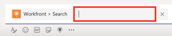

# Search for and share [!DNL Adobe Workfront] items in [!DNL Microsoft Teams]

>[!IMPORTANT]
>
>As [Microsoft transitions to the New Teams client](https://learn.microsoft.com/en-us/microsoftteams/teams-classic-client-end-of-availability), the Classic Teams client will no longer be available after July 1, 2025. To continue using Microsoft Teams and integrated apps like Workfront, customers must transition to the New Teams client before this date. 
>
>The updated Workfront integration is now available and fully compatible with the New Teams experience. In most cases, Workfront will appear automatically once users have transitioned. If it does not, the integration can be manually installed from the Microsoft Teams App Store. To install or verify the Workfront integration in the New Teams client, see [Install [!DNL Adobe Workfront] for Microsoft Teams](/help/quicksilver/workfront-integrations-and-apps/using-workfront-with-microsoft-teams/install-workfront-ms-teams.md). 

You can search for [!DNL Workfront] items in any [!DNL Adobe Workfront] channel in [!DNL Microsoft Teams] and share these items with members of your teams. 

* [Prerequisites for sharing [!DNL Workfront] items in [!DNL Microsoft Teams]](#prerequisites-for-sharing-workfront-items-in-microsoft-teams-prerequisites-for-sharing-workfront-items-in-microsoft-teams)
* [Search for and share [!DNL Workfront] items in [!DNL Microsoft Teams]](#search-for-and-share-adobe-workfront-items-in-microsoft-teams)

## Access requirements

+++ Expand to view access requirements for the functionality in this article.

<table style="table-layout:auto"> 
 <col> 
 <col> 
 <tbody> 
  <tr> 
   <td role="rowheader">Adobe Workfront package</td> 
   <td> 
Any
 </td> 
  </tr> 
  <tr> 
   <td role="rowheader">Adobe Workfront license</td> 
   <td> 
Standard

   
Work or higher
 </td> 
  </tr> 
 </tbody> 
</table>

For information, see [Access requirements in Workfront documentation](/help/quicksilver/administration-and-setup/add-users/access-levels-and-object-permissions/access-level-requirements-in-documentation.md). 

+++

## Prerequisites for sharing [!DNL Workfront] items in [!DNL Microsoft Teams] {#prerequisites-for-sharing-workfront-items-in-microsoft-teams}

You can search for and share [!DNL Workfront] items in [!DNL Microsoft Teams] if the following conditions are met:

* A team owner has installed and configured [!DNL Workfront for Microsoft Teams] for your team.
* You are logged into [!DNL Workfront] from [!UICONTROL Microsoft Teams].

For information about installing [!UICONTROL Workfront for Microsoft Teams] and logging in to [!UICONTROL Workfront] from [!DNL Microsoft Teams], see [Install Adobe Workfront for Microsoft Teams](../../workfront-integrations-and-apps/using-workfront-with-microsoft-teams/install-workfront-ms-teams.md).

>[!NOTE]
>
>[!DNL Microsoft Teams] no longer supports [!DNL Internet Explorer]. To use the [!DNL Adobe Workfront for Microsoft Teams integration], you must use a web browser other than [!DNL Internet Explorer].

## Search for and share [!DNL Workfront] items in [!DNL Microsoft Teams] {#search-for-and-share-workfront-items-in-microsoft-teams}

You can search for the following [!DNL Workfront] items from a [!DNL Microsoft Teams] channel:

* Projects
* Tasks

   >[!NOTE]
   >
   >You cannot search for personal tasks. 

* Issues

After you have found the items you searched for you can share them with other users in [!DNL Microsoft Teams]. 

To search for a [!DNL Workfront] item from [!DNL Microsoft Teams] and share it with others:

1. In [!DNL Microsoft Teams], go to any chat channel and click the **[!DNL Workfront]** icon.
1. Search for the [!DNL Workfront] item by doing one of the following:

   * Click the [!DNL Workfront] icon under the conversation field.\

      \
      Depending on your settings, this icon might display under the **[!UICONTROL More]** icon instead.\
      \
      The **[!UICONTROL Search]** box appears by default.

   * Type *@[!DNL Workfront]* from any channel, select Workfront and then select **[!UICONTROL Search].**

      

1. In the [!UICONTROL search] box provided, start typing the name or reference number of a project, task, or issue and click it when it appears in the list.\
   \
   This adds a card with the [!DNL Workfront] item in the chat field. Some information about the item is included on the card, including the name of the item, the parent object, status, priority, percent complete.

1. (Optional) Add a comment underneath the [!DNL Workfront] card, then click **[!UICONTROL Send]** or press Enter.\
   This sends the message including the [!DNL Workfront] item to your channel.\
   All members of the channel can see this message, including the information on the [!DNL Workfront] card.

1. Click **[!UICONTROL View in Workfront]** to view the item in [!DNL Workfront].\
   Only users who have a [!DNL Workfront] license can view an item in [!DNL Workfront]. 
