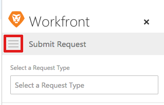

# Add an Outlook email as a task to your work list

You can convert Outlook emails to Adobe Workfront tasks. After an email is converted, the task is&nbsp;available in your Work List in the Home area.

## Access requirements

You must have the following access to perform the steps in this article:

<table style="table-layout:auto"> 
 <col> 
 <col> 
 <tbody> 
  <tr> 
   <td role="rowheader">Adobe Workfront plan*</td> 
   <td> 
Any
 </td> 
  </tr> 
  <tr> 
   <td role="rowheader">Adobe Workfront license*</td> 
   <td> 
Work, Plan
 </td> 
  </tr> 
 </tbody> 
</table>

&#42;To find out what plan, license type, or access you have, contact your Workfront administrator.

## Prerequisites

Your Workfront administrator must enable Outlook for Office with Workfront before you can use this integration.

## Add an Outlook email as a task to your work list

1. Select the email within Outlook that you want to convert to a task.
1. Click the&nbsp;**Workfront**&nbsp;icon in the upper-right corner of the email message to display the Workfront add-in.  
   You might need to click the down-pointing arrow in the upper right of your email to access the Workfront icon.

1. Click the **Menu** icon to display the list of available Workfront options.  
   

1. Click **Add to Work**.  
   

1. Deselect the **Add to Project** field.&nbsp;
1. (Optional) You can update the following information from the email before it is saved as a task:

   * **Task Name:** By default, the task name is the same as the email Subject. You can modify the task name as desired.
   * **Description:** By default, the description is the same as the email Body. You can modify the description&nbsp;as desired.
   * **Attachments:** Any email attachments are saved to the Documents area of the task. You can delete any attachments before saving&nbsp;the email as a task.

1. Click **Add**.  
   The task is added to the Work List in your Home area with no commit date.

1. (Optional) Click **View in Workfront**&nbsp;to display the task within the&nbsp;Workfront application in a new tab.  

1. (Optional) Navigate back to Outlook, and select the original email.  
   At the top of the Workfront add-in panel, notice the confirmation with a link that the email was added to Workfront as a task. The link includes the date on which it was converted.  
   

