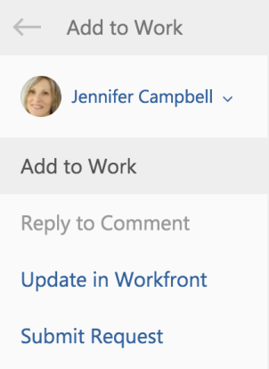

# Add an Outlook email to a project as a task or an issue

You can convert emails to Adobe Workfront tasks or issues. After an email is converted, the task or issue appears on the project that is selected as you are converting it.&nbsp;

## Access requirements

You must have the following access to perform the steps in this article:

<table style="table-layout:auto"> 
 <col> 
 <col> 
 <tbody> 
  <tr> 
   <td role="rowheader">Adobe Workfront plan*</td> 
   <td> 
Any
 </td> 
  </tr> 
  <tr> 
   <td role="rowheader">Adobe Workfront license*</td> 
   <td> 
Work, Plan
 </td> 
  </tr> <!--
   <tr data-mc-conditions="QuicksilverOrClassic.Draft mode"> 
    <td role="rowheader">Access level configurations*</td> 
    <td> 
[Insert any access level configurations needed]
       <MadCap:conditionalText data-mc-conditions="QuicksilverOrClassic.Draft mode">
        Example: Edit access to Documents
       </MadCap:conditionalText>
      
 
Note: If you still don't have access, ask your Workfront administrator if they set additional restrictions in your access level. For information on how a Workfront administrator can modify your access level, see <a href="../../administration-and-setup/add-users/configure-and-grant-access/create-modify-access-levels.md" class="MCXref xref">Create or modify custom access levels</a>.

      
 You must be a Workfront administrator. For information on Workfront administrators, see <a href="../../administration-and-setup/add-users/configure-and-grant-access/grant-a-user-full-administrative-access.md" class="MCXref xref">Grant a user full administrative access</a>.

      
You must be a group administrator. For more information on group administrators, see <a href="../../administration-and-setup/manage-groups/group-roles/group-administrators.md" class="MCXref xref">Group administrators</a>.

      </td> 
   </tr>
   <tr data-mc-conditions="QuicksilverOrClassic.Draft mode"> 
    <td role="rowheader">Object permissions</td> 
    <td> 
[Insert permissions needed and specify the object]
       <MadCap:conditionalText data-mc-conditions="QuicksilverOrClassic.Draft mode">
        Example: View access or higher on Documents
       </MadCap:conditionalText>
      
 
For information on requesting additional access, see <a href="../../workfront-basics/grant-and-request-access-to-objects/request-access.md" class="MCXref xref">Request access to objects </a>.
 </td> 
   </tr>
  --> 
 </tbody> 
</table>

&#42;To find out what plan, license type, or access you have, contact your Workfront administrator.

## Prerequisites

Your Workfront administrator must enable Outlook for Office with Workfront before you can use this integration.

## Add an Outlook email to a project as a task or issue

1. Select the email within Outlook that you want to convert to a task or an issue.
1. Click the&nbsp;**Workfront**&nbsp;icon in the upper-right corner of the email message to display the Workfront add-in.

   You might need to click the down-pointing arrow in the upper right of your email to access the Workfront icon.

1. Click the **Menu** icon to display the list of available Workfront options.

   

1. Click **Add to Work**.

   

1. Select the **Add to Project** field.
1. Start typing the name of a project in the **Project** field, then select it when it appears in the list.&nbsp;
1. Select the **Task** radio button if you want to add a task to the selected project.

   Or

   Select the **Issue** radio button if you want to add an issue to the selected project.

1. (Optional) Specify who this task or issue is assigned to in the **Assign this to field**.&nbsp;
1. (Optional) Specify the **Due by date**. This becomes the Planned Completion Date of the task or issue.
1. (Optional) Update the following information from the email before it is saved as a task or issue ( required fields are preceded by an asterisk).

    <table style="table-layout:auto">
      <tr>
        <td>Task or Issue Name</td>
        <td>By default, the task name is the same as the email Subject. You can modify the task name as desired.</td>
        <td></td>
      </tr>
      <tr>
        <td></td>
        <td>Description</td>
        <td>By default, the description is the same as the email Body. You can modify the description&amp;nbsp;as desired.</td>
      </tr>
      <tr>
        <td></td>
        <td>Attachments</td>
        <td>Any email attachments are saved to the Documents area of the task or issue. You can delete any attachments before saving&amp;nbsp;the email as a task or issue.</td>
      </tr>
   </table>

1. Click **Add**.

   The task or issue is added to the specified project

1. (Optional) Click **View in Workfront**&nbsp;to display the task within the&nbsp;Workfront application in a new tab.  

1. (Optional) Go back to Outlook, and select the converted email.

   At the top of the Workfront add-in panel, notice the confirmation with a link that the email was added to Workfront as a task or an issue. The link includes the date on which it was converted.

   

