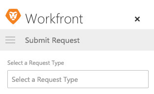
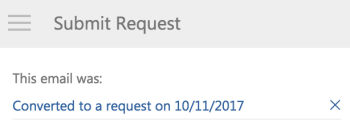

# Create an Adobe Workfront request from an Outlook email

You can create a Adobe Workfront request from an email in Outlook.

When you create a Workfront request based on an email, the&nbsp;content of the email (including the subject and body) are included in the request by default.

>[!NOTE]
>
>You can not create a Workfront request from a shared Outlook mailbox.

## Access requirements

You must have the following access to perform the steps in this article:

<table cellspacing="0"> 
 <col> 
 <col> 
 <tbody> 
  <tr> 
   <td role="rowheader">Adobe Workfront plan*</td> 
   <td> 
Any
 </td> 
  </tr> 
  <tr> 
   <td role="rowheader">Adobe Workfront license*</td> 
   <td> 
Work, Plan
 </td> 
  </tr> <!--
   <tr data-mc-conditions="QuicksilverOrClassic.Draft mode"> 
    <td role="rowheader">Access level configurations*</td> 
    <td> 
[Insert any access level configurations needed]
       <MadCap:conditionalText data-mc-conditions="QuicksilverOrClassic.Draft mode">
        Example: Edit access to Documents
       </MadCap:conditionalText>
      
 
Note: If you still don't have access, ask your Workfront administrator if they set additional restrictions in your access level. For information on how a Workfront administrator can modify your access level, see <a href="../../administration-and-setup/add-users/configure-and-grant-access/create-modify-access-levels.md" class="MCXref xref">Create or modify custom access levels</a>.

      
 You must be a Workfront administrator. For information on Workfront administrators, see <a href="../../administration-and-setup/add-users/configure-and-grant-access/grant-a-user-full-administrative-access.md" class="MCXref xref">Grant a user full administrative access</a>.

      
You must be a group administrator. For more information on group administrators, see <a href="../../administration-and-setup/manage-groups/group-roles/group-administrators.md" class="MCXref xref">Group administrators</a>.

     </td> 
   </tr>
   <tr data-mc-conditions="QuicksilverOrClassic.Draft mode"> 
    <td role="rowheader">Object permissions</td> 
    <td> 
[Insert permissions needed and specify the object]
       <MadCap:conditionalText data-mc-conditions="QuicksilverOrClassic.Draft mode">
        Example: View access or higher on Documents
       </MadCap:conditionalText>
      
 
For information on requesting additional access, see <a href="../../workfront-basics/grant-and-request-access-to-objects/request-access.md" class="MCXref xref">Request access to objects </a>.
 </td> 
   </tr>
  --> 
 </tbody> 
</table>

&#42;To find out what plan, license type, or access you have, contact your Workfront administrator.

## Prerequisites

Your Workfront administrator must enable Outlook for Office with Workfront before you can use this integration.

## Create a request from an Outlook email

To create a Workfront Request from Outlook:

1. Select the email that contains the information you want to include in&nbsp;a Workfront request.&nbsp;
1. Click the&nbsp;**Workfront**&nbsp;icon in the upper-right corner of the email message to display the Workfront add-in.  
   You might need to click the down-pointing arrow in the upper right of your email to access the Workfront icon.

1. Click the **Menu** icon to display the list of available Workfront options.

   

1. Click **Submit Request**.
1. In the **Select a Request Type** field, select the request queue where you want to submit the request.

   

1. Specify the following information:  
   Depending on how the request queue was set up, available fields might vary. For a complete list and description of possible fields, see [Create and submit Adobe Workfront requests](../../manage-work/requests/create-requests/create-submit-requests.md) article.

   * **Subject:** Specify a subject for the request. By default, the email subject is used.
   * **Description:** Specify a description for the request. By default, the email body is used.
   * **Documents:** Attach any documents that you want to include in the request. You can attach documents via drag and drop, or by clicking **Select File** and browsing to and selecting the document.  
     By default, any documents attached to the email are included in the request.

1. Click **Submit Request**.  
   The Request is submitted to Workfront, in the specified request queue.&nbsp;

1. (Optional) Navigate back to Outlook, and select the original email.  
   At the top of the Workfront add-in panel, notice the confirmation with a link that the email was added to Workfront as a request. The link includes the date on which it was converted.  
   

