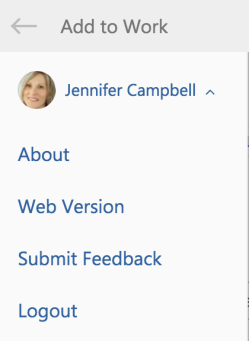

# View additional information about [!DNL Adobe Workfront for Outlook] and log out

You can view details about the version of the [!DNL Adobe Workfront] add-in for [!DNL Outlook], navigate directly to the web version, submit feedback, or log out.

## Access requirements

You must have the following access to perform the steps in this article:

<table style="table-layout:auto"> 
 <col> 
 <col> 
 <tbody> 
  <tr> 
   <td role="rowheader">[!DNL Adobe Workfront] plan*</td> 
   <td> 
Any
 </td> 
  </tr> 
  <tr> 
   <td role="rowheader">[!DNL Adobe Workfront] license*</td> 
   <td> 
[!UICONTROL Work], [!UICONTROL Plan]
 </td> 
  </tr> 
 </tbody> 
</table>

&#42;To find out what plan, license type, or access you have, contact your [!DNL Workfront] administrator.

## Prerequisites

Your [!DNL Workfront] administrator must enable [!DNL Outlook for Office] with [!DNL Workfront] before you can use this integration.

## View additional information about [!DNL Adobe Workfront for Outlook] and log out

1. Select an email in [!DNL Outlook].&nbsp;
1. Click **[!DNL Workfront]** icon to display the Workfront add-in.
1. Click the drop-down arrow next to your user name.

   

1. Click one of the following options:

   * **[!UICONTROL About]:** View information about the Workfront add-in, including the current version, what's new, and a link to how-to information on the Workfront Help site.
   * **[!UICONTROL Web Version]:** Launch the full Workfront application in a new browser window.
   * **Submit Feedback:** Submit feedback to [!DNL Workfront] regarding the Workfront Add-In.
   * **[!UICONTROL Logout]:** Log out of the [!DNL Workfront] add-in.

     This option&nbsp;does not log you out of&nbsp;[!DNL Outlook].
