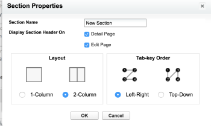
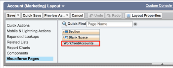
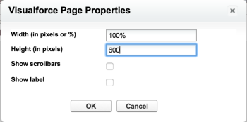
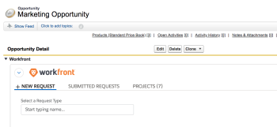
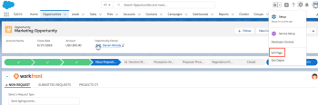
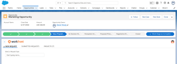

# Configure the Adobe Workfront section for Salesforce users

A Pro Workfront Plan is required to use this feature. For more information about the various plans available, see [Workfront Plans.](https://www.workfront.com/plans)

After you install Adobe Workfront for Salesforce as a Workfront administrator, you can make it available to your users by adding it in a new section to their Opportunity and Account page layouts in Salesforce.&nbsp;

For information about installing Workfront for Salesforce, see [Install Adobe Workfront for Salesforce](../../workfront-integrations-and-apps/using-workfront-with-salesforce/install-workfront-for-salesforce.md).

For users to have Workfront available in both the Classic and Lightening Experience frameworks, you must add the WorkfrontOpportunities and the WorkfrontAccounts Visualforce pages to the Opportunity and Accounts page layouts, respectively.

## Access requirements

You must have the following access to use the functionality described in this article:

<table cellspacing="0"> 
 <col> 
 <col> 
 <tbody> 
  <tr> 
   <td role="rowheader">Adobe Workfront plan*</td> 
   <td> 
Pro or higher
 </td> 
  </tr> 
  <tr> 
   <td role="rowheader">Adobe Workfront license*</td> 
   <td> 
Plan
 </td> 
  </tr> <!--
   <tr data-mc-conditions="QuicksilverOrClassic.Draft mode"> 
    <td role="rowheader">Access level configurations*</td> 
    <td> 
[Insert any access level configurations needed] <!--
       <MadCap:conditionalText data-mc-conditions="QuicksilverOrClassic.Draft mode">
        Example: Edit access to Documents
       </MadCap:conditionalText>
      -->
 
Note: If you still don't have access, ask your Workfront administrator if they set additional restrictions in your access level. For information on how a Workfront administrator can modify your access level, see <a href="../../administration-and-setup/add-users/configure-and-grant-access/create-modify-access-levels.md" class="MCXref xref">Create or modify custom access levels</a>.
 <!--
      
You must be a Workfront administrator. For information on Workfront administrators, see <a href="../../administration-and-setup/add-users/configure-and-grant-access/grant-a-user-full-administrative-access.md" class="MCXref xref">Grant a user full administrative access</a>.

     --> <!--
      
You must be a group administrator. For more information on group administrators, see <a href="../../administration-and-setup/manage-groups/group-roles/group-administrators.md" class="MCXref xref">Group administrators</a>.

     --> </td> 
   </tr>
  --> <!--
   <tr data-mc-conditions="QuicksilverOrClassic.Draft mode"> 
    <td role="rowheader">Object permissions</td> 
    <td> 
[Insert permissions needed and specify the object] <!--
       <MadCap:conditionalText data-mc-conditions="QuicksilverOrClassic.Draft mode">
        Example: View access or higher on Documents
       </MadCap:conditionalText>
      -->
 
For information on requesting additional access, see <a href="../../workfront-basics/grant-and-request-access-to-objects/request-access.md" class="MCXref xref">Request access to objects in Adobe Workfront</a>.
 </td> 
   </tr>
  --> 
 </tbody> 
</table>

&#42;To find out what plan, license type, or access you have, contact your Workfront administrator.

## Prerequisites

* You must have a Salesforce instance with access to a system administrator account.
* You must have a Workfront instance with access to a system administrator account.

## Configure the Workfront section in the Salesforce Classic framework

1. Log in to Salesforce as a Workfront administrator.
1. Click **Setup.**
1. In the **Build** section, expand **Customize.**

1. Expand **Opportunities**, then click **Page Layouts**to add the Workfront section to an **Opportunity**.

   Or

   Expand **Accounts**, then click **Page Layouts**to add the Workfront section to an Account.

1. Click **Edit** on an existing layout.

   Or

   Click **New** to add a new layout.&nbsp;

1. (Optional) Drag the **Section** component to the layout and drop it in the desired position.  
     

1. (Optional) Specify a name for the new section.

   We recommend that you name this section **Workfront**.

1. (Optional) Specify the desired **Layout** and **Tab-key Order**for the new section.

   We recommend that you select&nbsp;**1-Column** layout for the Workfront section.&nbsp;

1. Click **OK**.
1. In the **Layout** area, click **Visualforce Pages.**

1. Drag and drop the **WorfrontOpportunities** component to the new section in the&nbsp;**Opportunities**&nbsp;**Layout**.

   Or

   Drag and drop the **WorkfrontAccounts** component to the new section in the&nbsp;**Account**&nbsp;**Layout**.  
   

1. Click the **Properties** icon in the upper right of the newly added component.  
     

1. To achieve an optimal display, specify the following properties for the Workfront Visualforce page:

   * **Width (in pixels or %)**: 100%
   * **Height (in pixels)**: 600
   * Select **Show scrollbars**.

1. Click **OK**.&nbsp;
1. Click **Save** to save your layout.

   All users who have this layout assigned to them are now able to see the Workfront section on their Opportunities or Accounts objects.

   Users see a Workfront login screen on the Workfront section. If they do not have a Workfront account, they can collapse the section, but not remove it from their layout.&nbsp;

   

## Configure the Workfront section in the Salesforce Lightning Experience framework

You can add the Workfront section to the layout of a Salesforce Opportunity or Account in the Salesforce Lightning Experience framework either by accessing the Setup area, or from an Account or Opportunity object.&nbsp;

* [Configure the Workfront section at the Setup level](#lightning-setup-level) 
* [Configure the Workfront Section at the Opportunity or Account level](#lighting-account-opportunity-level)

### Configure the Workfront section at the Setup level

1. Log into Salesforce as a system administrator.&nbsp; 
1. Click the **Setup** icon, then click **Setup**. 

1. Expand **Object and Fields**, then click **Object Manager**. 

1. Click **Opportunity**to customize the layout of an Opportunity.

   Or

   Click **Account**to customize the layout of an Account. 

1. Click **Page Layouts**. 
1. Click the name of an existing page layout to edit it.

   Or

   Click **New** to create a new page layout. 

1. Continue with [Configure the Workfront Section at the Opportunity or Account level](#lighting-account-opportunity-level) below.

### Configure the Workfront Section at the Opportunity or Account level

1. Log in to Salesforce as a system administrator.&nbsp; 
1. Go to an **Opportunity** or **Account**. 

1. Click the **Setup** icon, then click **Edit Page**.  
     

1. Expand the **Custom-Managed** section. 
1. Drag and drop the **Workfront** component on your Opportunity or Account page.

   We recommend using the full width of the page for the Workfront section instead of one of the columns of the layout.

   

1. Click **Save**.

   All users who have this layout assigned to them are now able to see the Workfront section on their Opportunities or Accounts objects.

   >[!NOTE]
   >
   >Users see a Workfront login screen on the Workfront section. If they do not have a Workfront account, they can collapse the section, but not remove it from their layout. Users can log in using the authentication method you have enabled: Enhanced Authentication or your Security Assertion Markup Language (SAML) URL.

   

