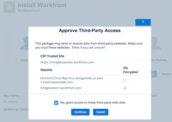
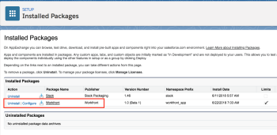

# Install [!DNL Adobe Workfront] for [!DNL Salesforce]

To install the app before it becomes available in the [!DNL Salesforce] AppExchange, see [Installing [!DNL Workfront] for Salesforce before It Becomes Available in the AppExchange Marketplace](#installing-workfront-for-salesforce-before-it-becomes-available-in-the-appexchange-marketplace).

As a [!DNL Salesforce] and [!DNL Adobe Workfront] administrator, you can install [!DNL Workfront] for Salesforce to allow your Salesforce users to submit Workfront requests and automatically create projects without ever leaving Salesforce.

For a general understanding about what you can expect by installing [!DNL Workfront] for Salesforce, see [Adobe Workfront for Salesforce overview](../../workfront-integrations-and-apps/using-workfront-with-salesforce/workfront-for-salesforce-overview.md).

* [Prerequisites for Installing and Using [!DNL Workfront] for Salesforce](#prerequisites-for-installing-and-using-workfront-for-salesforce)
* [Installing [!DNL Workfront] for Salesforce](#installing-workfront-for-salesforce)

## Access requirements

You must have the following access to use the functionality described in this article:

<table style="table-layout:auto"> 
 <col> 
 <col> 
 <tbody> 
  <tr> 
   <td role="rowheader">Adobe Workfront plan*</td> 
   <td> 
[!UICONTROL Pro] or higher
 </td> 
  </tr> 
  <tr> 
   <td role="rowheader">Adobe Workfront license*</td> 
   <td> 
Plan
 </td> 
  </tr>  </tbody> 
</table>

&#42;To find out what plan, license type, or access you have, contact your [!DNL Workfront] administrator.

## Prerequisites for Installing and Using [!DNL Workfront] for Salesforce {#prerequisites-for-installing-and-using-workfront-for-salesforce}

* You must have a [!DNL Salesforce] instance with access to a system administrator account in order to install the app.
* You must have a [!DNL Workfront] instance with access to a system administrator account in order to configure the integration.
* Salesforce users must have a [!DNL Workfront] account in order to be able to

   * Create [!DNL Workfront] requests from [!DNL Salesforce] or
   * View [!DNL Workfront] requests or projects in Salesforce.

## Installing [!DNL Workfront] for Salesforce {#installing-workfront-for-salesforce}

You must be a [!DNL Salesforce] and a [!DNL Workfront] system administrator to install and configure [!DNL Workfront] for Salesforce.&nbsp;

The following subsections describe how to install [!DNL Workfront] for your [!DNL Salesforce] Production environment. You can follow the same steps to install [!DNL Workfront] for your [!DNL Salesforce] Sandbox environment.

* [Installing [!DNL Workfront] for [!DNL Salesforce] before It Becomes Available in the AppExchange Marketplace](#installing-workfront-for-salesforce-before-it-becomes-available-in-the-appexchange-marketplace)
* [Installing [!DNL Workfront] for [!DNL Salesforce] in the Salesforce Classic Framework](#installing-workfront-for-salesforce-in-the-salesforce-classic-framework)
* [Installing [!DNL Workfront] for [!DNL Salesforce] in the Salesforce Lightning Experience Framework](#installing-workfront-for-salesforce-in-the-salesforce-lightning-experience-framework)

### Installing [!DNL Workfront] for [!DNL Salesforce] before It Becomes Available in the AppExchange Marketplace {#installing-workfront-for-salesforce-before-it-becomes-available-in-the-appexchange-marketplace}

Workfront for [!DNL Salesforce] will be available in the [!DNL Salesforce] AppExchange soon.

To install the app before it's available:

1. In your Production environment, go to

   `https://login.salesforce.com/packaging/installPackage.apexp?p0=04t4K000002aUZY`

   In your Sandbox environment, go to

   `https://test.salesforce.com/packaging/installPackage.apexp?p0=04t4K000002aUZY`

1. Check the **[!UICONTROL Yes, grant access to these third-party web sites]** box.

   

   A loading screen displays and the installation might take a while.

1. Click **[!UICONTROL Done]** when the installation completes.

1. Navigate to **[!UICONTROL Setup>Security Controls>Remote Site Settings]**.
1. (Conditional) If you do not see your [!DNL Workfront] URL listed in the **All Remote Sites** list, click **New Remote Site**.

1. Specify the **Remote Site Name**.

   For example, *Workfront*.

1. Specify the **Remote Site URL**.

   For example, *yourDomain.my.workfront.com*.

1. Click **Save**.

   The [!DNL Workfront] app is now installed on your [!DNL Salesforce] instance and the **WorkfrontOpportunities** and **WorkfrontAccounts** Visualforce Pages have been created in your environment.

   Salesforce users can use the app once you add the [!DNL Workfront] section to their Opportunity or Account page layouts.\
   For information about configuring the Workfront section for users, see [Configure the Adobe Workfront section for Salesforce users](../../workfront-integrations-and-apps/using-workfront-with-salesforce/configure-wf-section-for-salesforce-users.md).

### Installing [!DNL Workfront] for [!DNL Salesforce] in the Salesforce Classic Framework  {#installing-workfront-for-salesforce-in-the-salesforce-classic-framework}

1. Log in to [!DNL Salesforce] as a system administrator.
1. Go to **Setup.**
1. In the **Build** section, click **AppExchange Marketplace**.

1. In the **Search AppExchange Apps** box, type **Workfront**.

1. Click the app when you find it, then click **Get It Now**.
1. Click **[!UICONTROL Install in Production]** to install the [!DNL Workfront] app in your [!DNL Salesforce] Production environment.&nbsp;(recommended)
1. Select the **[!UICONTROL I have read and agree to the terms and conditions]** field after you have read and agreed with the terms and conditions.
1. Click **Confirm and Install**.
1. Select **Install for All Users** (recommended), then click **Install**.&nbsp;

1. (Conditional) If asked if you want to approve a third party access, you must select&nbsp;**Yes, grant access to these third-party web sites**, then click **Continue**.&nbsp;

1. Click **[!UICONTROL Done]** when the installation completes.&nbsp;

   The [!DNL Workfront] app is listed under **Installed Packages**.

   

1. Navigate to **[!UICONTROL Setup>Security Controls>Remote Site Settings]**.
1. (Conditional) If you do not see your [!DNL Workfront] URL listed in the **All Remote Sites** list, click **New Remote Site**.\
   

1. Specify the **Remote Site Name**.\
   For example,&nbsp;*Workfront*.

1. Specify the **Remote Site URL**.\
   For example, *yourDomain.my.workfront.com*.

1. Click **Save**.\
   The [!DNL Workfront] app is now installed on your [!DNL Salesforce] instance and the **WorkfrontOpportunities** and **WorkfrontAccounts** Visualforce Pages have been created in your environment.\
   Salesforce users cannot yet use the app until you add the [!DNL Workfront] section to their Opportunity or Account page layouts.\
   For information about configuring the Workfront section for users, see [Configure the Adobe Workfront section for Salesforce users](../../workfront-integrations-and-apps/using-workfront-with-salesforce/configure-wf-section-for-salesforce-users.md).

### Installing [!DNL Workfront] for [!DNL Salesforce] in the Salesforce Lightning Experience Framework  {#installing-workfront-for-salesforce-in-the-salesforce-lightning-experience-framework}

1. Log in to [!DNL Salesforce] as a system administrator.
1. Click the&nbsp;**Setup icon**, then click **Setup**.

1. In the **PLATFORM TOOLS** section, expand **Apps.**

1. Click **AppExchange Marketplace**.
1. In the **Search AppExchange Apps** box, type **Workfront**.

1. Click the app when you find it, then click **Get It Now**.
1. Click **Open Login Screen**.\
   You must sign in with your [!DNL Workfront administrator] account for Salesforce.

1. Click **Allow**.
1. In the **Install in This Org** box, click **Install Here** to install [!DNL Workfront] in your [!DNL Salesforce] Production environment.&nbsp;(recommended)

1. Select the **[!UICONTROL I have read and agree to the terms and conditions]** field after you have read and agreed with the terms and conditions.
1. Click **Confirm and Install**.
1. Select **Install for All Users** (recommended), then click **Install**.&nbsp;

1. (Conditional) If asked if you want to approve a third party access, you must select **Yes, grant access to these third-party web sites**, then click **[!UICONTROL Continue]**.

1. Click **[!UICONTROL Done]** when the installation completes.&nbsp;

   The [!DNL Workfront] app is listed under **Installed Packages**.

   &nbsp; 

1. Navigate to **Setup.**
1. In the **[!UICONTROL SETTINGS]** section, expand&#x200B;**Security.**

1. Click **Remote Site Settings**.
1. (Conditional) If you do not see your [!DNL Workfront] URL listed in the **All Remote Sites** list, click **New Remote Site**.

   

1. Specify the **Remote Site Name**.

   For example,&nbsp;*Workfront*.

1. Specify the **Remote Site URL**.

   For example, *yourDomain.my.workfront.com*.

1. Click **Save**.

   The [!DNL Workfront] app is now installed on your [!DNL Salesforce] instance, and the **[!DNL Workfront]** component is now added to your environment.

   Salesforce users can use the [!DNL Workfront] app once you add the [!DNL Workfront] section to their Opportunity or Account page layouts.\
   For information about configuring the Workfront section for users, see [Configure the Adobe Workfront section for Salesforce users](../../workfront-integrations-and-apps/using-workfront-with-salesforce/configure-wf-section-for-salesforce-users.md).&nbsp;
